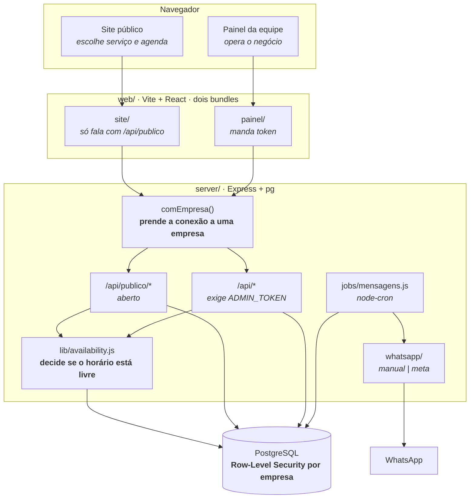
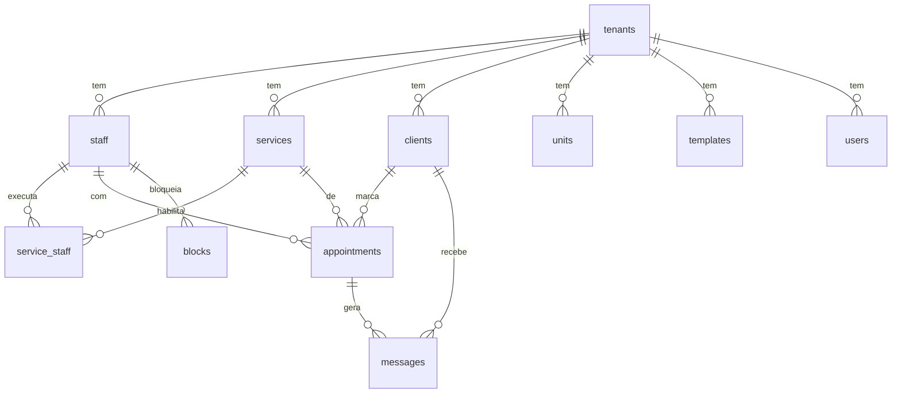

# Arquitetura

Como o sistema é montado hoje, e por quê. Para o que ainda vai mudar, veja
`ROADMAP.md`; para as regras de quem programa aqui, `CLAUDE.md`.

## Visão geral



**Site e painel são dois bundles separados**, com entradas próprias no Vite
(`index.html` e `painel.html`). O site carrega ~20 kB e conversa só com
`/api/publico/*`; o painel carrega ~47 kB e é o único que manda token. Antes os
dois saíam do mesmo `App.jsx`, então abrir o site baixava o financeiro junto e
levava a credencial do painel para o navegador de quem só queria marcar
horário.

## Pastas

```
server/            Express + PostgreSQL (driver `pg`). Fonte da verdade.
  db/migrations/   Esquema em migrations numeradas, versionadas em tabela.
  src/db.js        Pool de conexões, migrations no boot, linha ↔ objeto da API.
  src/reset.js     Zera o banco em desenvolvimento. Recusa rodar fora de localhost.
  src/senha-app.js Define a senha do papel vital_app a partir do .env (dev).
  src/lib/         availability.js (horários), templates.js (mensagens),
                   dates.js (datas como texto), migrate.js (migrations),
                   rota.js (erro em handler async), contexto.js (conexão da
                   requisição), tenant.js (resolve a empresa + config padrão)
  src/routes/      catalogo | clientes | agendamentos | publico | mensagens | relatorios
  src/jobs/        geração e despacho da fila de WhatsApp (node-cron)
  src/whatsapp/    provider trocável: 'manual' (links wa.me) ou 'meta' (Cloud API)
web/               Vite + React, sem framework de UI. CSS à mão.
  index.html       entrada do site da cliente
  painel.html      entrada do painel da equipe
  src/site/        App.jsx, styles.css e tema.js (aplica a marca em runtime)
  src/painel/      App.jsx e styles.css do painel
  src/shared/      publico.js (API sem token) e painel-api.js (API com token)
```

## Decisões estruturais

**Datas são texto, não `Date`.** `'YYYY-MM-DD'` e `'HH:MM'` em todo lugar, banco
incluso. O negócio opera num fuso só; usar `Date` com UTC só cria bug de agenda
virando o dia. Helpers em `server/src/lib/dates.js`.

**Conflito de horário se valida no servidor, dentro da transação que grava.**
`lib/availability.js` é o único lugar que decide se um horário está livre. O
front tem uma cópia simplificada só para desenhar a grade rápido — ela nunca
autoriza gravação. Duas clientes clicam no mesmo horário no mesmo segundo, e a
conferência precisa acontecer na *mesma* transação do `INSERT`: fora dela, as
duas leriam "livre" antes de qualquer uma gravar, e as duas gravariam. Por isso
`conflita()` aceita o cliente da transação como argumento.

**Todo handler assíncrono passa por `lib/rota.js`.** O Express 4 não trata
Promise rejeitada: sem o embrulho, uma falha de banco vira "unhandled rejection"
no log e a requisição fica pendurada até o navegador desistir — sem status, sem
mensagem. Cai fora quando atualizarmos para o Express 5.

**Nada é apagado se tem histórico.** Excluir serviço ou profissional com
agendamentos vinculados apenas desativa (`ativo = 0`). O relatório do mês
passado precisa do nome.

**A fila de mensagens é uma tabela, não um efeito colateral.** `gerarFila()`
decide quem recebe o quê e grava em `messages` com `dedupe_key`. `despachar()`
entrega. Separado de propósito: dá para revisar antes de disparar, e nada se
perde se a API da Meta cair no meio.

**O front recarrega o estado inteiro depois de cada mutação.** `GET /api/estado`
devolve tudo numa chamada. Simples e sempre correto. Se um dia ficar lento, o
lugar de otimizar é aqui — não vale complicar antes.

## As duas telas

**Site da cliente** (`web/src/site/`) — capa, logo, nome, chamada para agendar e
os serviços por categoria, cada um com botão próprio. Agendar é um fluxo de
passos: serviço → profissional → dia e hora → WhatsApp → confirmação. Mobile
primeiro, porque quase todo agendamento sai do celular.

Quem decide os horários livres é o servidor, por `/api/publico/horarios`. O
front tem noção de jornada só para desenhar a grade; se ele adivinhasse a
disponibilidade, mostraria horário já vendido e a cliente só descobriria ao
tentar confirmar.

**Painel da equipe** (`web/src/painel/`) — navegação lateral agrupada em
Calendário/Financeiro, Cadastros e Configurações. No computador a lateral é
fixa; no celular vira gaveta. A equipe abre isto do balcão e do próprio
telefone.

**A marca vem do banco, não do CSS.** `site/tema.js` recebe a config da empresa
e escreve as variáveis CSS em runtime — cor primária, fundo, texto, e uma
derivada de contraste para o texto sobre a cor da marca. Um CSS, N marcas,
nenhum rebuild por cliente. É o que vai permitir a empresa escolher a própria
paleta na tela de Aparência (Bloco 6).

**A vitrine publica campos escolhidos a dedo, não a config inteira.** Na config
também moram horários de disparo de mensagem e chave Pix; `/api/publico/vitrine`
monta um objeto explícito para não vazar nada por descuido quando um campo novo
aparecer.

## Banco

**PostgreSQL**, um banco só. Local para desenvolver (grátis, mesma versão da
produção), gerenciado quando for para o ar — a única diferença entre os dois é
`DATABASE_URL` no `.env`, nunca código.

Migrations numeradas em `server/db/migrations/`, aplicadas por `lib/migrate.js`
no boot da API e registradas na tabela `schema_migrations`. Cada arquivo roda uma
vez, na ordem do nome, dentro de uma transação — e o Postgres faz DDL
transacional, então migration que falha no meio não deixa tabela pela metade.
**Nunca edite uma migration já aplicada — crie a próxima.**

**Dinheiro é `NUMERIC`, nunca float.** `0.1 + 0.2` em ponto flutuante não dá
`0.3`, e isso vira centavo errado em comissão e fechamento de caixa. O `pg`
devolve `NUMERIC` e `COUNT()` como texto por padrão; `db.js` registra
conversores para os dois, senão preço voltaria como `"85.00"` e quebraria a
soma na tela.

**As consultas usam `?` como marcador, não `$1`.** `db.js` traduz antes de
enviar. Veio da troca de motor — permitiu manter as consultas do projeto
inteiro intactas — e continua valendo porque `?` é mais legível quando são seis
parâmetros.



### Isolamento entre empresas

Um banco só, várias empresas, separadas por `tenant_id` **mais uma política que
o próprio Postgres aplica** (Row-Level Security). A coluna sozinha dependeria de
alguém lembrar do `WHERE` em toda consulta; a política fecha isso no banco.

Três peças fazem funcionar:

1. **A aplicação não conecta como superusuário.** O Postgres ignora RLS para
   superusuário e para o dono da tabela — então existe o papel `vital_app`,
   sem `SUPERUSER` e sem `BYPASSRLS`, e as tabelas usam `FORCE ROW LEVEL
   SECURITY`. Migrations continuam saindo por uma conexão de administrador
   (`DATABASE_ADMIN_URL`), que precisa criar tabela.
2. **A empresa vive na conexão, não na consulta.** O middleware `comEmpresa()`
   pega uma conexão, marca `app.tenant_id` nela e roda a requisição inteira ali
   dentro, via `AsyncLocalStorage` (`lib/contexto.js`). Por isso `db.get/all/run`
   acham a conexão certa sozinhos e nenhuma rota precisa saber que isso existe.
   A conexão é devolvida ao pool **com `RESET`** — sem isso a próxima requisição
   herdaria o acesso da anterior.
3. **`tenant_id` se preenche sozinho.** O default da coluna é
   `current_setting('app.tenant_id', true)`. Nenhum `INSERT` informa a empresa,
   e não dá para informar a errada. Sem empresa na conexão o valor vira `NULL` e
   o `NOT NULL` derruba a gravação: falha fechada, que é o lado certo para
   errar.

Consequência prática: **fora de uma requisição HTTP não existe empresa**. Os
jobs de cron e o seed precisam de `db.comEmpresa(id, fn)` explícito — o cron
percorre as empresas ativas uma a uma.

O que **não** tem RLS: o schema `plataforma` (`tenants`, `usuarios`,
`auditoria`), que é cadastro da Vital, não dado de negócio de ninguém.

**A config da empresa mora em `plataforma.tenants.config`.** É JSON, e o banco guarda só o
que foi alterado: `getConfig()` mescla por cima de `configPadrao`. Campo novo de
personalização não precisa de migration. As chaves operacionais (`passoAgenda`,
`horaLembreteVespera`...) são planas porque o código já as lê assim; o que é
novo vem agrupado em `marca`, `textos`, `vocabulario` e `exibir`.

`units` (unidades), `blocks` (bloqueio de horário), `users` (equipe da empresa)
e o schema `plataforma` inteiro existem no esquema mas ainda não têm tela — foram
criados cedo para não exigir migração depois.

## Autenticação hoje

Um `ADMIN_TOKEN` único no `.env` protege tudo sob `/api/*`; `/api/publico/*`
fica aberto. Se o token estiver vazio, o painel roda sem senha — aceitável em
desenvolvimento, e a API avisa no boot. Não serve para produção nem para mais de
uma pessoa; substituir por login real é item do `ROADMAP.md`.

## WhatsApp

Dois modos, trocados por variável de ambiente:

- **`manual`** (padrão) — monta a mensagem e gera um link `wa.me`; o atendente
  clica e o WhatsApp abre com o texto pronto. Sem custo, sem conta aprovada.
- **`meta`** — Cloud API oficial. Exige conta aprovada e cada template cadastrado
  no WhatsApp Manager, com o nome em `templates.meta_template_name`. Fora da
  janela de 24h desde a última mensagem da cliente, só sai template aprovado;
  texto livre é rejeitado.

Telefone é guardado só com dígitos, sem `+55`. A conversão para o formato da API
acontece em `foneE164()`.

## LGPD

O sistema guarda nome, telefone, endereço e data de nascimento — dado pessoal.
`clients.optin` controla mensagens de marketing (aniversário, campanhas) e é
respeitado em `jobs/mensagens.js` e nas campanhas. Lembretes de agendamento são
comunicação transacional e não dependem de opt-in. Ao adicionar qualquer disparo
novo, decida em qual das duas categorias ele cai.
