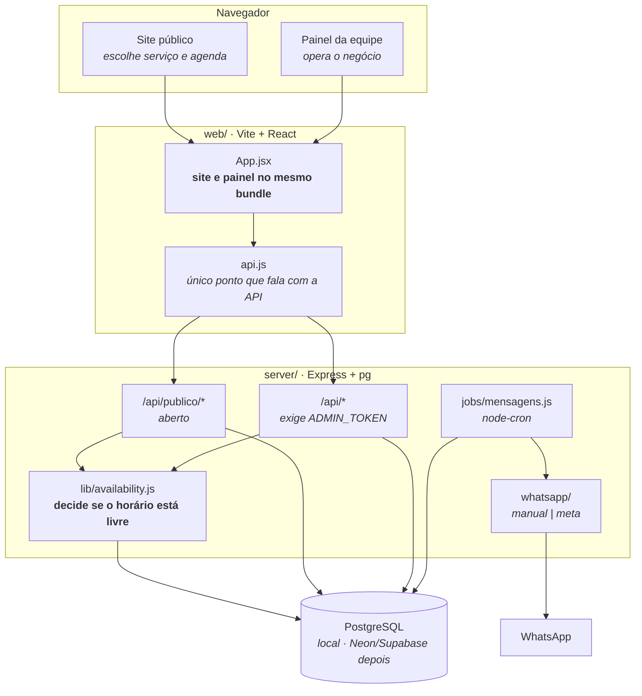
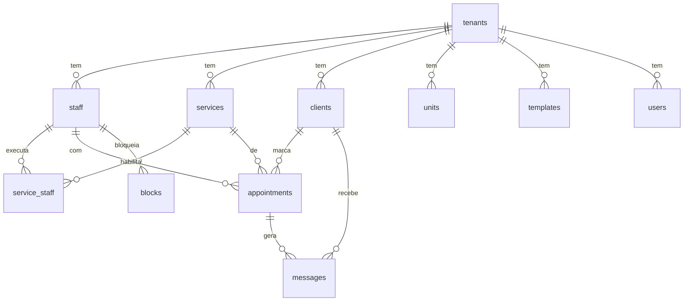

# Arquitetura

Como o sistema é montado hoje, e por quê. Para o que ainda vai mudar, veja
`ROADMAP.md`; para as regras de quem programa aqui, `CLAUDE.md`.

## Visão geral



O ponto que mais importa nesse desenho: **site e painel saem do mesmo bundle**
(`App.jsx`) e ambos hoje carregam `/api/estado`, que exige token. É o motivo de
ainda não dar para publicar o front na internet, e o primeiro item que o
`ROADMAP.md` resolve.

## Pastas

```
server/            Express + PostgreSQL (driver `pg`). Fonte da verdade.
  db/migrations/   Esquema em migrations numeradas, versionadas em tabela.
  src/db.js        Pool de conexões, migrations no boot, linha ↔ objeto da API.
  src/reset.js     Zera o banco em desenvolvimento. Recusa rodar fora de localhost.
  src/lib/         availability.js (horários), templates.js (mensagens),
                   dates.js (datas como texto), migrate.js (migrations),
                   rota.js (erro em handler async), tenant.js (empresa + config)
  src/routes/      catalogo | clientes | agendamentos | publico | mensagens | relatorios
  src/jobs/        geração e despacho da fila de WhatsApp (node-cron)
  src/whatsapp/    provider trocável: 'manual' (links wa.me) ou 'meta' (Cloud API)
web/               Vite + React, sem framework de UI. CSS à mão em styles.css.
  src/api.js       único ponto que fala com a API; traduz nomes servidor ↔ tela
  src/App.jsx      site público e painel no mesmo bundle
```

## Decisões estruturais

**Datas são texto, não `Date`.** `'YYYY-MM-DD'` e `'HH:MM'` em todo lugar, banco
incluso. O negócio opera num fuso só; usar `Date` com UTC só cria bug de agenda
virando o dia. Helpers em `server/src/lib/dates.js`.

**Conflito de horário se valida no servidor, dentro da transação que grava.**
`lib/availability.js` é o único lugar que decide se um horário está livre. O
front tem uma cópia simplificada só para desenhar a grade rápido — ela nunca
autoriza gravação. Duas clientes clicam no mesmo horário no mesmo segundo, e a
conferência precisa acontecer na *mesma* transação do `INSERT`: fora dela, as
duas leriam "livre" antes de qualquer uma gravar, e as duas gravariam. Por isso
`conflita()` aceita o cliente da transação como argumento.

**Todo handler assíncrono passa por `lib/rota.js`.** O Express 4 não trata
Promise rejeitada: sem o embrulho, uma falha de banco vira "unhandled rejection"
no log e a requisição fica pendurada até o navegador desistir — sem status, sem
mensagem. Cai fora quando atualizarmos para o Express 5.

**Nada é apagado se tem histórico.** Excluir serviço ou profissional com
agendamentos vinculados apenas desativa (`ativo = 0`). O relatório do mês
passado precisa do nome.

**A fila de mensagens é uma tabela, não um efeito colateral.** `gerarFila()`
decide quem recebe o quê e grava em `messages` com `dedupe_key`. `despachar()`
entrega. Separado de propósito: dá para revisar antes de disparar, e nada se
perde se a API da Meta cair no meio.

**O front recarrega o estado inteiro depois de cada mutação.** `GET /api/estado`
devolve tudo numa chamada. Simples e sempre correto. Se um dia ficar lento, o
lugar de otimizar é aqui — não vale complicar antes.

## Banco

**PostgreSQL**, um banco só. Local para desenvolver (grátis, mesma versão da
produção), gerenciado quando for para o ar — a única diferença entre os dois é
`DATABASE_URL` no `.env`, nunca código.

Migrations numeradas em `server/db/migrations/`, aplicadas por `lib/migrate.js`
no boot da API e registradas na tabela `schema_migrations`. Cada arquivo roda uma
vez, na ordem do nome, dentro de uma transação — e o Postgres faz DDL
transacional, então migration que falha no meio não deixa tabela pela metade.
**Nunca edite uma migration já aplicada — crie a próxima.**

**Dinheiro é `NUMERIC`, nunca float.** `0.1 + 0.2` em ponto flutuante não dá
`0.3`, e isso vira centavo errado em comissão e fechamento de caixa. O `pg`
devolve `NUMERIC` e `COUNT()` como texto por padrão; `db.js` registra
conversores para os dois, senão preço voltaria como `"85.00"` e quebraria a
soma na tela.

**As consultas usam `?` como marcador, não `$1`.** `db.js` traduz antes de
enviar. Veio da troca de motor — permitiu manter as consultas do projeto
inteiro intactas — e continua valendo porque `?` é mais legível quando são seis
parâmetros.



**Toda linha de negócio tem `tenant_id`.** Hoje é sempre `'default'` e é um
deploy por empresa. A coluna existe assim mesmo porque acrescentá-la depois, com
agenda cheia, é a migração cara. Quem decide de quem é o dado é `lib/tenant.js`
— nunca escreva `'default'` na mão numa consulta.

**A config da empresa mora em `tenants.config`.** É JSON, e o banco guarda só o
que foi alterado: `getConfig()` mescla por cima de `configPadrao`. Campo novo de
personalização não precisa de migration. As chaves operacionais (`passoAgenda`,
`horaLembreteVespera`...) são planas porque o código já as lê assim; o que é
novo vem agrupado em `marca`, `textos`, `vocabulario` e `exibir`.

`units` (unidades), `blocks` (bloqueio de horário) e `users` (login com papel)
existem no esquema mas ainda não têm tela nem uso no código — foram criadas no
Bloco 0 para não exigir migração depois.

## Autenticação hoje

Um `ADMIN_TOKEN` único no `.env` protege tudo sob `/api/*`; `/api/publico/*`
fica aberto. Se o token estiver vazio, o painel roda sem senha — aceitável em
desenvolvimento, e a API avisa no boot. Não serve para produção nem para mais de
uma pessoa; substituir por login real é item do `ROADMAP.md`.

## WhatsApp

Dois modos, trocados por variável de ambiente:

- **`manual`** (padrão) — monta a mensagem e gera um link `wa.me`; o atendente
  clica e o WhatsApp abre com o texto pronto. Sem custo, sem conta aprovada.
- **`meta`** — Cloud API oficial. Exige conta aprovada e cada template cadastrado
  no WhatsApp Manager, com o nome em `templates.meta_template_name`. Fora da
  janela de 24h desde a última mensagem da cliente, só sai template aprovado;
  texto livre é rejeitado.

Telefone é guardado só com dígitos, sem `+55`. A conversão para o formato da API
acontece em `foneE164()`.

## LGPD

O sistema guarda nome, telefone, endereço e data de nascimento — dado pessoal.
`clients.optin` controla mensagens de marketing (aniversário, campanhas) e é
respeitado em `jobs/mensagens.js` e nas campanhas. Lembretes de agendamento são
comunicação transacional e não dependem de opt-in. Ao adicionar qualquer disparo
novo, decida em qual das duas categorias ele cai.
