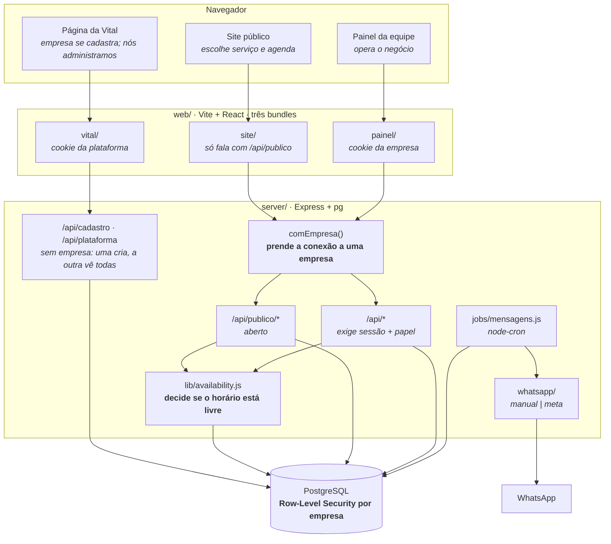
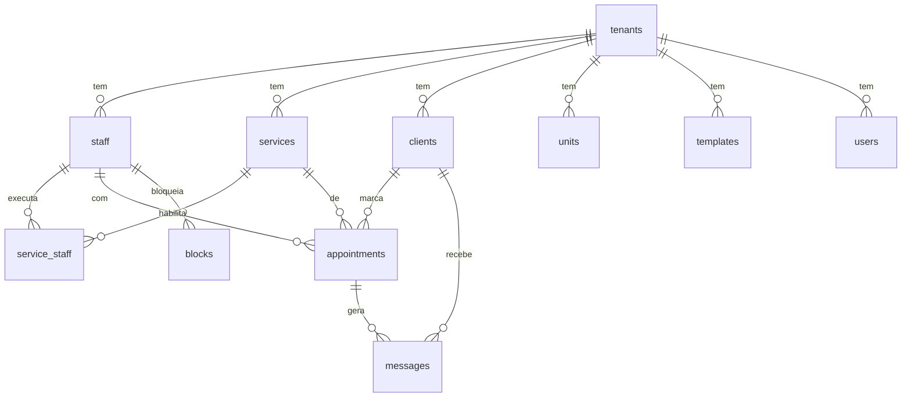

# Arquitetura

Como o sistema é montado hoje, e por quê. Para o que ainda vai mudar, veja
`ROADMAP.md`; para as regras de quem programa aqui, `CLAUDE.md`.

**Por onde começar.** Se você nunca viu este projeto: leia *Visão geral* e
*Decisões estruturais*, nesta ordem, e pare. Elas explicam as três telas, o
isolamento entre empresas e por que as datas são texto — que é o que faz o resto
do código parecer óbvio. O resto desta página é referência: leia a seção do que
você for mexer.

| Seção | Responde |
|---|---|
| [Visão geral](#visão-geral) | Como as peças se ligam, num diagrama |
| [Pastas](#pastas) | Onde mora cada coisa |
| [Decisões estruturais](#decisões-estruturais) | Por que Postgres, por que data é texto, por que três bundles |
| [As três telas](#as-três-telas) | Site, painel e página da Vital |
| [Banco](#banco) | Esquema, migrations e Row-Level Security |
| [Autenticação e papéis](#autenticação-e-papéis) | Login, sessão, dono × funcionário |
| [De quem é a requisição](#de-quem-é-a-requisição) | Como o endereço decide a empresa |
| [Como nasce uma empresa](#como-nasce-uma-empresa) | Cadastro self-service e o assistente |
| [Combos e promoções](#combos-e-promoções) | Pacote fechado e o rateio da comissão |
| [O que se vende junto](#o-que-se-vende-junto) | Adicionais e o ranking do financeiro |
| [Formulários de intake](#formulários-de-intake) | Anamnese, ficha, dado sensível |
| [A agenda do painel](#a-agenda-do-painel) | Semana, faixas e arrastar para remarcar |
| [Unidades](#unidades) | A empresa com mais de um endereço |
| [O registro do painel](#o-registro-do-painel) | Quem fez o quê, dentro da empresa |
| [O back-office da Vital](#o-back-office-da-vital) | Ver todas as empresas sem ver o dado de nenhuma |
| [Testes](#testes) | O que a suíte cobre e como ela roda |
| [WhatsApp](#whatsapp) | Fila, provider manual e Cloud API |
| [LGPD](#lgpd) | Dado pessoal, optin, dado sensível |

## As migrations, em uma linha cada

Nunca se edita uma já aplicada — cria-se a próxima. O histórico abaixo é o que
elas fizeram, e cada arquivo explica o porquê no próprio cabeçalho.

| | O que mudou |
|---|---|
| `001_esquema_inicial` | Todas as tabelas de negócio, em PostgreSQL |
| `002_isolamento_por_empresa` | Row-Level Security, schema `plataforma`, papel `vital_app` |
| `003_servicos_adicionais` | Extras por serviço e por categoria |
| `004_sessoes` | Sessão em tabela, para dar para derrubar um acesso |
| `005_papeis_dono_funcionario` | Só dois papéis; o meio-termo saiu |
| `006_combos` | Pacote com preço fechado; agendamentos ligados por grupo |
| `007_cadastro_self_service` | A aplicação passa a poder criar empresa |
| `008_painel_da_plataforma` | Sessões da nossa equipe e a função de contagem |
| `009_vender_so_como_adicional` | O extra que não se vende sozinho |
| `010_registro_do_painel` | `logs`: quem fez o quê na empresa |
| `011_registro_e_so_leitura` | `REVOKE` no registro — GRANT adiciona, nunca tira |
| `012_formularios` | Intake: perguntas, respostas e o vínculo com serviços |
| `013_bloqueio_repetido` | `serie` em `blocks`: férias de três semanas são três linhas |
| `014_suporte` | `plataforma.tickets`: a empresa fala com a Vital de dentro do produto |

## Visão geral



**Cada tela é um bundle separado**, com entrada própria no Vite
(`index.html`, `painel.html`, `vital.html`). O site carrega cerca de um terço do
painel e conversa só com `/api/publico/*`; o painel e a página da Vital têm
cookies de nomes diferentes e nunca se aceitam. Antes site e painel saíam do
mesmo `App.jsx`, então abrir o site baixava o financeiro junto e levava a
credencial do painel para o navegador de quem só queria marcar horário.

## Pastas

```
server/            Express + PostgreSQL (driver `pg`). Fonte da verdade.
  db/migrations/   Esquema em migrations numeradas, versionadas em tabela.
  src/app.js       Monta o Express: middlewares, guardas e rotas. Não sobe nada.
  src/index.js     Roda as migrations, abre a porta, liga o cron.
  src/db.js        Pool de conexões, migrations no boot, linha ↔ objeto da API.
  src/reset.js     Zera o banco em desenvolvimento. Recusa rodar fora de localhost.
  src/senha-app.js Define a senha do papel vital_app a partir do .env (dev).
  src/lib/         availability.js (horários), combos.js (pacotes e rateio),
                   formularios.js (intake), registro.js (auditoria do painel),
                   provisionar.js (empresa nova nasce aqui),
                   templates.js (mensagens),
                   dates.js (datas como texto), migrate.js (migrations),
                   rota.js (erro em handler async), contexto.js (conexão da
                   requisição), tenant.js (resolve a empresa + config padrão)
  src/routes/      catalogo | clientes | agendamentos | publico | mensagens |
                   relatorios | uploads (imagens da empresa) | bloqueios
                   (horário fechado) | cadastro e plataforma (as duas rotas
                   sem empresa definida)
  test/            suíte automatizada (`npm test`), banco próprio
  src/jobs/        geração e despacho da fila de WhatsApp (node-cron)
  src/whatsapp/    provider trocável: 'manual' (links wa.me) ou 'meta' (Cloud API)
  uploads/         imagens enviadas, uma pasta por empresa. Fora do Git.
web/               Vite + React, sem framework de UI. CSS à mão.
  index.html       entrada do site da cliente
  painel.html      entrada do painel da equipe
  vital.html       entrada da página da Vital (cadastro + back-office)
  src/site/        App.jsx (home), Agendar.jsx (a janela de agendamento),
                   datas.js, tema.js (aplica a marca em runtime), styles.css
  src/painel/      App.jsx, styles.css, Entrar.jsx (login e primeiro acesso),
                   ConfigSite.jsx (a empresa edita o site),
                   Combos.jsx (promoções), Unidades.jsx (endereços),
                   Usuarios.jsx (acesso),
                   Comecar.jsx (assistente de primeira configuração),
                   Formularios.jsx (monta), Ficha.jsx (responde no balcão),
                   Registro.jsx (quem fez o quê)
  src/vital/       Cadastro.jsx (empresa nova), Equipe.jsx (back-office),
                   api.js (cookie próprio), styles.css (a marca da Vital)
  src/shared/      publico.js (API sem token), painel-api.js (API com token),
                   imagem.js (reduz a foto antes de subir), formato.js (moeda)
```

## Decisões estruturais

**Datas são texto, não `Date`.** `'YYYY-MM-DD'` e `'HH:MM'` em todo lugar, banco
incluso. O negócio opera num fuso só; usar `Date` com UTC só cria bug de agenda
virando o dia. Helpers em `server/src/lib/dates.js`.

**Jornada diz quando se atende; bloqueio diz quando, excepcionalmente, não.**
São as duas perguntas que o motor faz antes de oferecer qualquer vaga. A
jornada é a regra semanal do profissional; `blocks` guarda a exceção — almoço,
folga, feriado, reforma. Com `staff_id` nulo, o bloqueio fecha a equipe inteira,
que é como se marca feriado sem repetir a linha para cada pessoa.

Bloqueio e agendamento são tabelas separadas de propósito. Um agendamento pode
ser remarcado e sai da agenda; um bloqueio é a empresa dizendo que ali não se
atende. Guardar "almoço" como se fosse atendimento faria cancelar o almoço
aparecer como cancelamento no relatório.

**A tela monta antes de criar, e manda as datas prontas.** O primeiro desenho
pedia uma data e uma repetição, e não dava conta do caso mais comum: "fecho
segunda e quarta, das 8 às 10, pelas próximas seis semanas" — eram dois
bloqueios criados separadamente, com a conta do calendário feita de cabeça duas
vezes. Hoje se monta uma lista de faixas (dias da semana + horas), a repetição
vale para o conjunto, e só então se cria.

Por isso o `POST` aceita `datas: [...]` além de `data` + `repetir`: o calendário
já foi calculado na tela para a pessoa conferir na prévia, e refazer a conta no
servidor seria uma segunda versão da mesma regra, livre para divergir do que ela
viu antes de clicar. O servidor valida cada data, recusa a criação inteira se
uma estiver torta (metade gravada seria pior que nada) e descarta repetidas.

**Bloquear não desmarca ninguém.** Se já havia cliente no intervalo, a rota
devolve a lista e a tela avisa — cancelar sozinho o atendimento de alguém seria
decidir pela empresa uma coisa que ela precisa saber que aconteceu.

**Conflito de horário se valida no servidor, dentro da transação que grava.**
`lib/availability.js` é o único lugar que decide se um horário está livre. O
front tem uma cópia simplificada só para desenhar a grade rápido — ela nunca
autoriza gravação. Duas clientes clicam no mesmo horário no mesmo segundo, e a
conferência precisa acontecer na *mesma* transação do `INSERT`: fora dela, as
duas leriam "livre" antes de qualquer uma gravar, e as duas gravariam. Por isso
`conflita()` aceita o cliente da transação como argumento.

**Todo handler assíncrono passa por `lib/rota.js`.** O Express 4 não trata
Promise rejeitada: sem o embrulho, uma falha de banco vira "unhandled rejection"
no log e a requisição fica pendurada até o navegador desistir — sem status, sem
mensagem. Cai fora quando atualizarmos para o Express 5.

**Nada é apagado se tem histórico.** Excluir serviço ou profissional com
agendamentos vinculados apenas desativa (`ativo = 0`). O relatório do mês
passado precisa do nome.

**A fila de mensagens é uma tabela, não um efeito colateral.** `gerarFila()`
decide quem recebe o quê e grava em `messages` com `dedupe_key`. `despachar()`
entrega. Separado de propósito: dá para revisar antes de disparar, e nada se
perde se a API da Meta cair no meio.

**O front recarrega o estado inteiro depois de cada mutação.** `GET /api/estado`
devolve tudo numa chamada. Simples e sempre correto. Se um dia ficar lento, o
lugar de otimizar é aqui — não vale complicar antes.

## As três telas

Um público cada, e três bundles separados: quem abre o site não baixa o código
do painel, e nem o da nossa página.

**Site da cliente** (`web/src/site/`) — capa, logo, nome, chamada para agendar e
os serviços por categoria, cada um com botão próprio. Mobile primeiro, porque
quase todo agendamento sai do celular.

**O agendamento é uma janela sobre a home**, não uma troca de tela — a cliente
não perde de vista onde estava. Os passos são categoria → serviço → adicionais
→ profissional → data → dados, e **passo sem o que perguntar é pulado**: uma
função só (`util`) decide isso, e a navegação anda por ela nos dois sentidos.
Com três passos opcionais, decidir com `if` espalhado já tinha produzido o bug
de "voltar" cair num passo que a ida havia pulado.

**A janela sempre abre no começo do fluxo**, mesmo quando a cliente clicou em
"Agendar" num serviço específico — o serviço apenas já vem marcado e a lista
abre filtrada na categoria dele. Antes ela pulava direto para o primeiro passo
com pergunta pendente, e sem adicionais cadastrados nem escolha de profissional
isso caía no calendário com as bolinhas quase cheias: parecia que a janela
tinha continuado de onde parou. A janela também remonta a cada abertura, então
não há estado sobrando de uma escolha anterior. Três colunas: em que passo está, o passo atual,
e o resumo do que já escolheu com o total. O resumo não é enfeite: é ele que dá
segurança para confirmar. No celular vira uma coluna só, com o resumo numa
barra no rodapé que mostra o total e abre ao toque.

Quem decide os horários livres é o servidor. São **duas rotas, de propósito**:
`/api/publico/dias-livres?mes=` diz quais dias do mês têm vaga, e
`/api/publico/horarios?data=` lista as horas de um dia. O calendário precisa de
trinta dias de uma vez; a lista de horas, de um dia só. Juntar as duas faria o
desenho do mês carregar horário que ninguém pediu — e pedir dia a dia seriam
trinta idas ao banco para pintar uma tela. `diasComVaga()` resolve o mês com uma
consulta e o resto em memória.

O front tem noção de jornada só para desenhar; se ele adivinhasse a
disponibilidade, mostraria horário já vendido e a cliente só descobriria ao
tentar confirmar.

**Painel da equipe** (`web/src/painel/`) — navegação lateral agrupada em
Calendário/Financeiro, Cadastros e Configurações. No computador a lateral é
fixa; no celular vira gaveta. A equipe abre isto do balcão e do próprio
telefone.

Em **Configurações → Site da cliente** (`painel/ConfigSite.jsx`) a empresa muda
identidade, cor, logo, capa, textos, contato e o que aparece ou não — tudo sem
programador. Grava no mesmo JSON que a vitrine lê, então salvar muda o site na
hora.

**A marca vem do banco, não do CSS.** `site/tema.js` recebe a config da empresa
e escreve as variáveis CSS em runtime — cor primária, fundo, texto, e uma
derivada de contraste para o texto sobre a cor da marca. Um CSS, N marcas,
nenhum rebuild por cliente. É o que permite a empresa escolher a própria paleta
em Configurações → Site da cliente.

**A home é uma pilha de blocos, cada um com o próprio fundo.** Separa os
assuntos sem linha divisória e dá ritmo à rolagem. O bloco de serviços usa um
tom bem lavado da cor da marca (`--marca-fundo`, 94% em direção ao branco): a
cor varia de cliente para cliente, e um tom saturado quebraria o contraste do
texto escuro para metade das marcas possíveis. O token também tem valor padrão
no CSS, porque `tema.js` só roda depois que a vitrine responde — sem isso o
bloco pisca sem fundo no primeiro quadro.

**A barra do topo flutua sobre a capa e se firma ao rolar.** Sobre a foto ela é
transparente com um véu escuro por baixo do texto: não dá para saber que imagem
a empresa vai subir, e texto branco sobre capa clara seria ilegível. Passados
120px, vira sólida. O acesso à conta da cliente entra aqui quando o login do
Bloco 5 existir — um botão que não leva a lugar nenhum seria pior que a
ausência dele.

**As linhas da grade são montadas no código, não deixadas para o navegador.**
`flex-wrap` enche cada linha até acabar o espaço e joga o resto na última: 13
itens onde cabem 6 viram 6 + 6 + 1, com um círculo sozinho no fim. Varrendo
larguras de 300 a 1400px e de 2 a 60 itens, a quebra automática deixa item
solitário em 547 de 3.304 combinações — não é caso raro.

`site/Grade.jsx` mede a largura disponível, escolhe o **menor número de linhas**
que comporta todos e divide os itens **por igual** entre elas, sobra nas
primeiras. Com espaço para 6: 7 → 4+3, 13 → 5+4+4, 17 → 6+6+5. Cada linha é
centralizada, inclusive a última. Um `ResizeObserver` refaz a conta quando a
janela muda ou o celular gira.

**Serviços em grade de círculos, com a foto na frente.** A foto é o que a
pessoa reconhece antes de ler — "unhas", "sobrancelha" — e reconhecer é mais
rápido que ler uma lista de nomes. Sem foto, entra a inicial sobre a cor da
marca, para o círculo não ficar vazio e a grade não desalinhar. A seção de
serviços é a única que usa o contêiner largo (`.env-largo`): a grade respira
melhor, e o resto do site continua estreito, que é o que se lê bem.

**Serviços adicionais: um extra vendido junto do principal.** Um adicional não
é entidade nova — é um `service` comum, marcado como extra de outro. Assim já
tem preço, duração, foto e quem executa, sem duplicar cadastro: depilação de
nariz pode ser vendida sozinha e como extra da limpeza de pele, com o mesmo
registro.

Consequência a saber: **o extra também aparece sozinho na vitrine**, porque é
um serviço como outro qualquer. Vender algo só como adicional ainda não é
possível — está anotado no `ROADMAP.md`.

A oferta vem de dois lugares e o site mostra a **união**. O cadastro é feito nas
duas direções, porque a empresa pensa das duas formas conforme o serviço que
tem na frente:

- Editando o **principal**: "quais extras a limpeza de pele oferece".
- Editando o **extra**: "em quais grupos a depilação de buço é oferecida".

As duas escrevem na mesma tabela `category_addons`, só que por lados opostos —
e cada uma apaga apenas as próprias linhas ao salvar, senão marcar um extra
derrubaria os outros do mesmo grupo. A segunda direção é a que serve para o que
quase nunca se vende sozinho, e foi a que faltava na primeira versão da tela.

Como categoria é texto livre na tabela `services`, renomear uma deixa as regras
dela órfãs — o estrago é uma oferta que some, não dado perdido.

Duas armadilhas resolvidas:

- **A duração soma os extras.** Sem isso a cadeira é reservada por menos tempo
  do que o atendimento leva e a agenda estoura em cima da próxima cliente. Por
  isso `/publico/horarios` e `/publico/dias-livres` aceitam a lista de extras:
  escolher adicionais muda o que cabe na agenda.
- **Preço e disponibilidade nunca vêm do site.** A lista escolhida é conferida
  contra a oferta real e os valores saem do banco. Sem isso, bastaria mandar o
  id de um serviço caro como "extra" para levá-lo por outro preço.

`appointments.service_id` continua sendo o serviço principal, e `valor` e
`duracao` já somam os extras. Foi de propósito: o motor de horários lê
`duracao` e o financeiro lê `valor`, então os dois continuam corretos sem uma
linha de mudança. Os itens ficam em `appointment_addons`, com nome e preço
congelados — o relatório do mês passado precisa do valor cobrado na época.

**A cliente pode deixar um recado no agendamento.** Campo opcional no último
passo, que grava em `appointments.obs` e aparece para a equipe no painel — "sou
alérgica a acetona", "vou levar minha filha". É texto livre vindo da internet:
o servidor corta em 500 caracteres em vez de recusar, porque devolver erro por
causa de um recado longo perderia o agendamento inteiro.

**A cliente escolhe a categoria antes de ver a lista.** Um estúdio com quarenta
serviços numa página só é uma parede de texto. A home mostra só as categorias,
na grade redonda, com a foto de um dos serviços do grupo; **tocar numa delas
abre a janela de agendamento já na lista daquele grupo**. A home não repete
essa lista — antes ela abria os serviços da categoria e a janela pedia o
serviço de novo logo depois, a mesma lista duas vezes com um toque a mais no
meio. A empresa desliga o agrupamento em Configurações → Site da cliente, se
tiver poucos serviços.

**Imagens: reduzidas no navegador, servidas pelo Express.** A foto que sai da
câmera tem 4000px e 8 MB, e vai aparecer num quadrado de 60px. `shared/imagem.js`
redimensiona por canvas antes de subir — economiza o pacote de dados de quem
cadastra, o disco do servidor e o carregamento do site. Sobe como data URL em
JSON, o que dispensa a dependência de multipart e já entrega o tamanho sob
controle.

O nome do arquivo é **sempre gerado no servidor**: nome vindo do cliente é
caminho para `../../` e para sobrescrever arquivo de outra empresa. Cada empresa
tem sua pasta em `server/uploads/<tenant>/` (disco) ou seu prefixo
`<tenant>/` (bucket) — mesma estrutura nos dois destinos, então apagar tudo de
um cliente que saiu é apagar uma pasta ou um prefixo.

**Disco por padrão, bucket quando configurado.** `POST /api/uploads`
(`routes/uploads.js`) grava em `server/uploads/<tenant>/` sempre que
`R2_ACCOUNT_ID`/`R2_ACCESS_KEY_ID`/`R2_SECRET_ACCESS_KEY`/`R2_BUCKET` não
existirem todas as quatro no ambiente — é o caso de `npm run dev` numa máquina
sem nenhuma credencial de nuvem, e o único motivo de o produto ainda depender
de disco persistir entre deploys (ver ROADMAP.md, "Hospedagem"). Com as quatro
presentes, `lib/r2.js` sobe direto para o bucket (R2 fala o protocolo do S3,
via `@aws-sdk/client-s3`) e a rota devolve `UPLOADS_BASE_URL/<tenant>/<arquivo>`
em vez de `/uploads/<tenant>/<arquivo>` — o resto do sistema não distingue os
dois: é sempre uma URL absoluta ou relativa que vai direto num ``.
`npm run uploads:subir` faz a migração de uma vez só do que já está em disco
para o bucket, na mesma chave — existe porque o adaptador só cobre o que sobe
*depois* de configurado.

**A vitrine publica campos escolhidos a dedo, não a config inteira.** Na config
também moram horários de disparo de mensagem e chave Pix; `/api/publico/vitrine`
monta um objeto explícito para não vazar nada por descuido quando um campo novo
aparecer.

## Banco

**PostgreSQL**, um banco só. Local para desenvolver (grátis, mesma versão da
produção), gerenciado quando for para o ar — a única diferença entre os dois é
`DATABASE_URL` no `.env`, nunca código.

Migrations numeradas em `server/db/migrations/`, aplicadas por `lib/migrate.js`
no boot da API e registradas na tabela `schema_migrations`. Cada arquivo roda uma
vez, na ordem do nome, dentro de uma transação — e o Postgres faz DDL
transacional, então migration que falha no meio não deixa tabela pela metade.
**Nunca edite uma migration já aplicada — crie a próxima.**

**Dinheiro é `NUMERIC`, nunca float.** `0.1 + 0.2` em ponto flutuante não dá
`0.3`, e isso vira centavo errado em comissão e fechamento de caixa. O `pg`
devolve `NUMERIC` e `COUNT()` como texto por padrão; `db.js` registra
conversores para os dois, senão preço voltaria como `"85.00"` e quebraria a
soma na tela.

**As consultas usam `?` como marcador, não `$1`.** `db.js` traduz antes de
enviar. Veio da troca de motor — permitiu manter as consultas do projeto
inteiro intactas — e continua valendo porque `?` é mais legível quando são seis
parâmetros.



### Isolamento entre empresas

Um banco só, várias empresas, separadas por `tenant_id` **mais uma política que
o próprio Postgres aplica** (Row-Level Security). A coluna sozinha dependeria de
alguém lembrar do `WHERE` em toda consulta; a política fecha isso no banco.

Três peças fazem funcionar:

1. **A aplicação não conecta como superusuário.** O Postgres ignora RLS para
   superusuário e para o dono da tabela — então existe o papel `vital_app`,
   sem `SUPERUSER` e sem `BYPASSRLS`, e as tabelas usam `FORCE ROW LEVEL
   SECURITY`. Migrations continuam saindo por uma conexão de administrador
   (`DATABASE_ADMIN_URL`), que precisa criar tabela.
2. **A empresa vive na conexão, não na consulta.** O middleware `comEmpresa()`
   pega uma conexão, marca `app.tenant_id` nela e roda a requisição inteira ali
   dentro, via `AsyncLocalStorage` (`lib/contexto.js`). Por isso `db.get/all/run`
   acham a conexão certa sozinhos e nenhuma rota precisa saber que isso existe.
   A conexão é devolvida ao pool **com `RESET`** — sem isso a próxima requisição
   herdaria o acesso da anterior.
3. **`tenant_id` se preenche sozinho.** O default da coluna é
   `current_setting('app.tenant_id', true)`. Nenhum `INSERT` informa a empresa,
   e não dá para informar a errada. Sem empresa na conexão o valor vira `NULL` e
   o `NOT NULL` derruba a gravação: falha fechada, que é o lado certo para
   errar.

Consequência prática: **fora de uma requisição HTTP não existe empresa**. Os
jobs de cron e o seed precisam de `db.comEmpresa(id, fn)` explícito — o cron
percorre as empresas ativas uma a uma.

O que **não** tem RLS: o schema `plataforma` (`tenants`, `usuarios`,
`auditoria`), que é cadastro da Vital, não dado de negócio de ninguém.

**A config da empresa mora em `plataforma.tenants.config`.** É JSON, e o banco guarda só o
que foi alterado: `getConfig()` mescla por cima de `configPadrao`. Campo novo de
personalização não precisa de migration. As chaves operacionais (`passoAgenda`,
`horaLembreteVespera`...) são planas porque o código já as lê assim; o que é
novo vem agrupado em `marca`, `textos`, `vocabulario` e `exibir`.

`units` (unidades), `blocks` (bloqueio de horário), `users` (equipe da empresa)
e o schema `plataforma` inteiro existem no esquema mas ainda não têm tela — foram
criados cedo para não exigir migração depois.

## Autenticação e papéis

**São dois logins diferentes, e é fácil confundi-los.**

| | Quem | Como entra | Existe hoje? |
|---|---|---|---|
| **Painel** | Equipe da empresa: dono e funcionário | E-mail e senha | Sim |
| **Site** | A cliente que agenda | Não entra: informa o WhatsApp na hora de marcar | Não há login |

A cliente **não cria conta** — mas o primeiro agendamento **pede três dados, uma
vez só**: nome, WhatsApp e nascimento. Sem nome não dá para atender; sem
nascimento não existe mensagem de aniversário, que é uma das campanhas do CRM.
Os três são exigidos no servidor também, porque validação de front se contorna.

Quem já agendou antes só digita o WhatsApp e é reconhecida pelo número. É aí que
mora o "sem burocracia": a segunda vez em diante não pede nada. Exigir conta e
confirmação de e-mail para marcar horário perderia agendamento, e o retorno
seria zero — a pessoa quer marcar unha, não virar usuária de um sistema.

**Número errado é o risco desse desenho.** Digitar o número de outra pessoa
levaria a agendar no cadastro dela, e o lembrete iria para o WhatsApp dela. Por
isso, ao reconhecer um cadastro, a tela mostra o primeiro nome e pede
confirmação — "Encontramos um cadastro em Amanda. É você?" — em vez de seguir
em silêncio. O nome exposto é o preço de conseguir conferir; a solução completa
é código por WhatsApp, que custa por mensagem e está anotada no `ROADMAP.md`.

**O login com Google é para a cliente, não para a equipe** — e ainda não existe
(Bloco 5). Quando existir, será um atalho para ela ver histórico e remarcar, e
não uma exigência: agendar só com o WhatsApp continua funcionando ao lado. A
equipe nunca entra por Google; o painel é e-mail e senha.

**Ninguém da equipe se cadastra sozinho.** O primeiro acesso cria o dono, e daí
em diante é o dono que convida os outros, em Configurações → Acesso ao painel.
Um painel onde
qualquer um cria conta é um painel aberto.

Login com senha (argon2id) e sessão em cookie `httpOnly`. Três decisões e o
motivo de cada uma:

**A senha nunca é guardada** — `users.senha_hash` guarda um hash argon2id, lento
de propósito: quem levar o banco embora não testa bilhões de senhas por segundo.

**O cookie é `httpOnly`**, então o JavaScript da página não o lê e um XSS não
consegue roubar a sessão. É por isso que o token não vai para `localStorage`.
`sameSite: lax` corta CSRF vindo de outro site.

**Sessão em tabela, não token assinado (JWT).** A Vital precisa conseguir
*derrubar* um acesso: suspender empresa que não pagou, tirar funcionária
demitida na hora, encerrar sessão de aparelho perdido. Token assinado vale até
expirar, aconteça o que acontecer; linha em tabela some quando a gente apaga. O
custo é uma consulta por requisição — barata e indexada. A tabela guarda o
**hash** do token, nunca o token.

`sessaoDe()` consulta pela conexão da requisição, não pelo pool cru: a consulta
faz `JOIN users`, que tem RLS, e numa conexão sem empresa definida o join volta
vazio — toda sessão pareceria inválida. Sessão de uma empresa também não vale em
outra, o que importa no dia do subdomínio.

**Primeiro acesso é aberto e se fecha sozinho.** Enquanto a empresa não tiver
nenhum usuário, a tela oferece criar o dono; havendo um, a rota passa a recusar.
É a única forma de a primeira pessoa entrar sem semear senha no código.

### Papéis

Dois, de propósito. Um "gerente" existiu como meio-termo e saiu: estúdio pequeno
não tem essa pessoa, e cada papel a mais é uma regra a manter coerente entre
tela e rota. Voltar a criar um é barato se o caso aparecer.

| | dono | funcionário |
|---|---|---|
| Configurar o site | sim | não |
| Cadastros, equipe e acesso | sim | não |
| Agenda | de todos | **a própria** |
| Financeiro | do negócio | **o próprio** |

**Funcionário TEM financeiro — o dele.** A própria produção e a própria
comissão, não o caixa da empresa. É informação que ele tem direito de
acompanhar sem ver o faturamento alheio, e negar isso empurraria a conversa
para o WhatsApp toda vez.

Quem decide o recorte é `escopoDe(usuario)`, num lugar só: devolve `null` para
quem vê tudo, ou o id do profissional para quem vê só o próprio. As rotas de
agenda e de relatório passam por ele em vez de decidir cada uma. Um funcionário
sem vínculo com a equipe recebe um id impossível — **falha fechada**: devolver
`null` ali abriria o negócio inteiro por um cadastro incompleto.

**Cada regra vale na tela e na rota.** Esconder o botão evita erro feio para
quem não pode; recusar na rota é o que impede a chamada direta. Um sem o outro
é enganoso — e o teste pegou exatamente isso duas vezes: a funcionária acessando
`/api/relatorios/resumo` sem ver o menu, e depois `/api/estado` devolvendo a
agenda inteira que a rota filtrada escondia. Rota nova que devolve dado de
agenda ou de dinheiro precisa passar por `escopoDe`.

## De quem é a requisição

`lib/tenant.js` é o único lugar que decide isso. Três caminhos, nesta ordem:
domínio próprio (`agenda.laurafaust.com.br`), subdomínio nosso
(`laurafaust.vital.app`), e por último a empresa padrão — que é o caso de `localhost`
e do apex.

**Endereço que nomeia empresa inexistente devolve 404, não cai no padrão.**
Cair seria servir o site de uma empresa no endereço de outra. E empresa
suspensa para de responder na porta, no middleware, e não em cada rota: assim
não há rota nova nascendo sem a checagem.

O host resolvido fica num cache de 60 segundos — sem ele, cada imagem do site
consultaria `plataforma.tenants`. O prazo é curto porque suspender uma empresa
precisa surtir efeito sem reiniciar nada.

**Atrás de proxy é preciso `TRUST_PROXY`.** Vercel e nginx entregam o host real
em `X-Forwarded-Host`; sem a variável, o Express lê o host do proxy e toda
requisição vira a empresa padrão. Ela fica desligada por padrão de propósito:
ligada sem proxy na frente, qualquer cliente manda o cabeçalho e escolhe de qual
empresa quer ser.

### A armadilha do `plataforma.tenants`

É a única tabela do sistema **sem** Row-Level Security — é cadastro nosso, não
dado de negócio de ninguém, e a consulta que resolve a empresa acontece antes de
existir empresa definida na conexão. O preço é que ali o banco não protege
ninguém: uma consulta que erre a empresa lê e escreve a linha errada calada.

Foi o que aconteceu enquanto havia uma empresa só. `getConfig()` e `setConfig()`
tinham `TENANT_PADRAO` como valor padrão do argumento, e nenhum chamador passava
nada; `listarServicos()`, `listarUnidades()` e `listarBloqueios()` traziam
`WHERE tenant_id = ?` escrito à mão, com o mesmo padrão. Inofensivo com um
cliente. Com dois, o site da segunda empresa mostraria a marca da primeira e
**zero serviços** — porque o RLS já recortava para ela e o filtro escrito
recortava de novo para a outra —, e `PUT /api/config` de uma reescreveria o site
da outra.

Hoje a config vem da empresa da conexão (`empresaAtual()`), e a falta dela é
erro em vez de palpite. É também a razão da regra do `CLAUDE.md`: `tenant_id`
não se escreve em consulta. Quem filtra é o banco.

Nada disso deu erro em momento algum — o teste de isolamento é que achou, e por
isso ele existe.

## Como nasce uma empresa

`lib/provisionar.js`. Antes, isso morava dentro do `seed.js`, misturado com o
estúdio de exemplo — o que significa que empresa nova nascia com serviço de
manicure ou não nascia.

O que ela recebe: a linha em `plataforma.tenants`, o endereço (slug tirado do
nome, com sufixo quando já existe outro igual), a config com o nome, os textos
de WhatsApp e o dono. **Catálogo, equipe e clientes ficam de fora de propósito.**
Serviço inventado por nós é serviço que a empresa vai ter de apagar antes de
cadastrar o dela — e, enquanto não apagar, está no ar, no site, para agendarem.

`POST /api/cadastro` é a única rota montada **antes** do middleware de empresa:
todas as outras precisam saber de quem é a requisição antes de tocar no banco, e
esta é a que decide isso. Ela não abre sessão — cookie é preso ao host que o
emitiu, e um cookie de `vital.app` não chega a `lume.vital.app`. Dar domínio
amplo ao cookie resolveria e faria o token de uma empresa trafegar pelo endereço
de todas as outras; não vale o troco por poupar um login que a pessoa acabou de
digitar a senha para fazer. A resposta traz o endereço do painel dela.

Criar empresa também esquece o cache de resolução de host. Sem isso, quem espia
o endereço antes de cadastrar guarda um 404, e o próprio site responderia "não
existe uma agenda neste endereço" pelo primeiro minuto de vida.

### A porta do painel

A tela de entrada mostra **o nome da empresa** em que se está entrando. Passou a
importar quando cada empresa ganhou endereço próprio: abrir o endereço errado e
cair numa empresa vazia, sem entender por que a tela pede para criar uma conta,
virou um erro fácil de cometer.

Quando a empresa daquele endereço ainda não tem ninguém, a tela abre no primeiro
acesso — mas oferece o caminho de volta para o login, e avisa que nenhuma senha
vai funcionar ali porque a empresa está vazia. Assim que existir um usuário, o
primeiro acesso se fecha e a troca some: oferecer um caminho que o servidor
recusa é pior do que não oferecer.

### O preço da tela vazia, e quem paga

Nascer sem nada é a decisão certa e tem um custo: a primeira tela não tem o que
mostrar, e fala em "profissional", "serviço" e "cliente" — palavras que uma
clínica, um petshop e uma oficina não usam do mesmo jeito.

`Comecar.jsx` paga esse custo. Três perguntas — nome, ramo, e o primeiro
atendente e serviço — e nenhuma resposta é definitiva. O ramo sugere um
vocabulário pronto, porque preencher seis campos de vocabulário à mão é coisa
que ninguém faz, e aí o produto fala errado para sempre. A lista de ramos é
sugestão, não escolha fechada: o campo continua sendo texto livre.

O serviço criado ali já nasce vinculado a quem acabou de entrar. Serviço sem
ninguém que o execute não aparece no site, e a empresa sairia do assistente
achando que configurou, com a agenda vazia.

O assistente aparece enquanto `config.configurado` for falso **e** não houver
equipe nem catálogo, e só para quem pode configurar o site. `ramo` é texto livre
guardado na config, e serve para sugerir vocabulário e textos — nunca para ligar
ou desligar funcionalidade: ramo não é plano.

### Vocabulário de estética

Foi varrido do que é comportamento. O que sobrou de "unhas" e "cílios" no
repositório está em comentário explicando história, e no `seed.js`, que é o
estúdio de exemplo do desenvolvimento e não participa do produto.

Os três achados que eram código, não texto: um mapa fixo de cor por categoria
(`Unhas`, `Olhar`, `Facial`, `Corpo`) que deixava qualquer outro ramo cinza — a
cor agora sai de um resumo do nome, estável e sem cadastro; a variável de fuso
`TZ_ESTUDIO`, hoje `TZ_EMPRESA`; e a variável de mensagem `{estudio}`, hoje
`{empresa}` — a antiga continua valendo, porque os textos que as empresas já
escreveram estão no banco e trocar o nome sem isso apagaria o nome delas das
mensagens.

Os textos padrão de WhatsApp eram de estética, no feminino e falando de esmalte.
Uma barbearia apagaria tudo antes do primeiro disparo, e "editável" não conserta
um texto que já saiu errado por descuido.

## Combos e promoções

Pacote de serviços com preço fechado, mais barato que a soma dos avulsos. Serve
para vender o serviço parado junto do que já tem procura.

**Um combo vira vários agendamentos, não um só.** O caminho óbvio era pendurar
os serviços num agendamento como o Bloco 6c faz com os adicionais — mas um
agendamento tem um `staff_id`, e combo executado por duas pessoas é justamente o
caso que a regra de comissão precisa cobrir. Aqui cada serviço do pacote vira um
agendamento normal, em sequência, ligados por `combo_grupo`. O ganho é que nada
mais mudou: o motor de horários continua reservando uma cadeira por vez, a
agenda desenha os blocos reais, e o financeiro soma `valor` por profissional como
sempre somou.

**O desconto é rateado na venda, e o resultado vira o `valor` de cada linha.**
A regra: o desconto do pacote é dividido entre as profissionais envolvidas na
proporção do preço de tabela do serviço de cada uma — quem leva o serviço mais
caro absorve a maior parte. Com uma pessoa só, ela absorve tudo, que é a mesma
conta com um item só, não um caso à parte.

A conta acontece em `ratearCombo()`, em centavos inteiros, e o que sobra da
divisão vai para quem perdeu a maior fração no arredondamento. Se cada parte
arredondasse por conta própria, a soma não bateria com o que a cliente pagou e o
caixa fecharia com centavos órfãos todo mês. Há teste percorrendo milhares de
combinações para garantir que a soma das partes é exatamente o preço do pacote.

Ratear na hora de fechar a comissão, em vez de na venda, daria outra resposta a
cada mudança na tabela de preços — e comissão paga não se recalcula.

**A validade é conferida na leitura, não por um job.** `vencido()` compara com a
data de hoje toda vez que o combo é lido, então a promoção some do site sozinha
no dia certo sem depender de nada ter rodado, e volta se a empresa esticar o
prazo. Apagar um combo arquiva (`ativo = 0`) em vez de remover a linha: os
agendamentos vendidos apontam para ele.

**Quem vende o pacote é uma profissional só, do começo ao fim.** É o caso comum
do balcão e mantém a reserva sendo uma pergunta só — "cabem 90 minutos seguidos
na agenda dela?". O rateio e o banco já suportam mais de uma pessoa; falta a tela
que deixa escolher por serviço.

**Criar promoção não tem guarda de papel**, ao contrário do resto dos cadastros:
foi decisão do negócio, porque é quem está no balcão que sabe qual serviço está
parado e vale empurrar junto.

## O que se vende junto

### O extra que não se vende sozinho

No Bloco 6c um adicional virou um `service` comum indicado como extra de outro —
decisão certa: ele já tem preço, duração, foto e quem executa, sem duplicar nada.
Faltava o outro caso. Cadastrar "depilação de buço" para oferecer junto da
limpeza também a colocava na vitrine, na lista da categoria dela, agendável.

Desligar `ativo` não resolvia: `ativo = 0` quer dizer arquivado, e o motor recusa
arquivado como extra — a empresa perderia as duas coisas. Daí
`services.somente_adicional`, uma coluna que responde uma pergunta só, em vez de
dar um segundo sentido a um campo que já tem um.

Ele continua chegando na vitrine, com a marca: o passo de adicionais precisa do
nome e do preço. Quem filtra é a tela, na lista de venda. E a recusa como serviço
principal vive na gravação, não só na tela — id de serviço circula.

### O ranking deixou de creditar o extra ao principal

`appointments.valor` traz os adicionais somados, de propósito: o motor de
horários e o caixa leem um número só. O efeito colateral aparecia no "o que mais
dá dinheiro" — a limpeza de pele levava o crédito do buço vendido junto, e o
ranking dizia que ela rendia mais do que rende.

Agora cada extra vale pelo próprio serviço e o principal fica com o que sobra. É
atribuição, não conta nova: **a soma das linhas continua batendo com o caixa**, e
há teste exigindo isso — sem ele, o ranking passaria a discordar do recebido sem
ninguém perceber. Combos já saíam certos, porque cada parte é um agendamento com
o rateio no `valor`.

### O balcão vende o que o site vende

O encaixe manual não oferecia adicionais nem combos: quem marcava por ali lançava
o valor na mão, e o que digitasse não batia com o que o site cobraria pelo mesmo
atendimento — duas verdades para a mesma venda. Agora o formulário alterna entre
serviço e promoção, oferece os extras daquele serviço, e mostra duração e total
calculados.

O que continua diferente de propósito é o `forcar: true`: o encaixe pode furar a
jornada, porque é manual e quem está no balcão sabe o que faz. O que ele não fura
é conflito com outro atendimento — isso o servidor recusa dos dois lados.

## A agenda do painel

**Os dias vão no eixo X, não os profissionais.** Com uma coluna por pessoa, a
tela cabia um dia só e a semana virava sete cliques; e o número de colunas mudava
conforme quem estava em jornada, então a agenda tinha uma largura diferente a
cada dia. Com os dias fixos, a quem pertence cada atendimento é dito dentro do
próprio bloco — cor e primeiro nome.

O preço dessa troca é que atendimentos passam a colidir: com pessoas nas colunas,
dois nunca se cruzavam. `emFaixas()` resolve como um calendário resolve — agrupa
quem se sobrepõe e divide a largura do grupo. Empilhar um sobre o outro
esconderia atendimento, que é o pior defeito que uma agenda pode ter.

A grade é de meia em meia hora e a legenda, de hora em hora, centrada na própria
linha. A meia hora é o passo em que a agenda é vendida; sem a linha, não dá para
ver a olho se um bloco começa às 10h ou às 10h30. A constante `TOPO` reserva a
folga acima da primeira linha para a legenda das 08:00 não sair cortada.

### Arrastar para remarcar

Eventos de ponteiro, não de mouse: o mesmo código atende dedo e cursor, e o
painel vai virar app. **No toque o arrasto só começa depois de segurar** — sem
isso ele brigaria com a rolagem, e a agenda ficaria impossível de percorrer no
celular. No cursor, basta mexer cinco pixels.

Onde o ponteiro está sai de `elementsFromPoint`, e não de medir a grade: assim a
conta continua certa com a semana rolando na horizontal, a página rolando na
vertical e qualquer largura de coluna — nada disso precisa ser previsto.

**O arrasto é só a intenção.** Quem decide se o horário novo vale é o servidor,
que confere conflito e jornada dentro da mesma transação que grava — soltar em
cima de outro atendimento volta 409 e nada muda. Atendimento concluído ou com
falta não se arrasta: mexer no passado é pelo detalhe, de propósito.

## Unidades

Os endereços em que a empresa atende. A tabela `units` existia desde o Bloco 0 e
**nenhuma rota a usava**: uma empresa com duas lojas conseguia cadastrá-las por
SQL e mais nada. É o mesmo tipo de buraco que os bloqueios de horário tinham.

**A unidade é de quem atende, não do serviço.** É a profissional que ocupa uma
cadeira num endereço; um serviço é oferecido onde houver alguém que o faça. A
consequência boa é que o motor de horários **não mudou uma linha**: ele já
raciocina por profissional, então filtrar por unidade virou filtrar a equipe, na
consulta que já buscava quem faz o serviço.

`staff.unit_id` nulo quer dizer **"atende em qualquer unidade"**, e é o estado de
toda profissional que já existia. Sem isso, cadastrar a primeira unidade sumiria
com a equipe inteira das telas de quem já usa o sistema — o tipo de estreia que
faz a empresa desligar a funcionalidade e não voltar.

O agendamento congela `unit_id` no momento da venda, a partir de quem atende:
mover a pessoa de loja depois não reescreve onde o atendimento passado ocorreu.

**Empresa de um endereço só não paga nada por isso.** Sem unidade cadastrada, o
passo some do agendamento, o campo some da ficha da profissional, e tudo funciona
como antes. A funcionalidade só aparece quando há o que perguntar.

Arquivar uma unidade (`ativo = 0`) não apaga: a agenda antiga aponta para ela. E
não desvincula a equipe sozinho — a resposta devolve quem ficou sem endereço,
porque mover gente de loja é decisão de quem administra, não efeito colateral.

## Formulários de intake

Anamnese de estética, ficha de saúde da clínica, preferências do pet, dados do
veículo na oficina. **A pergunta é linha, não coluna:** cada ramo pergunta uma
coisa, e nenhuma delas caberia num campo que a gente escolhesse por eles.

### A resposta é histórico, não cadastro

Ela fica presa ao **atendimento**, não à cliente, e o rótulo vai congelado junto.
Duas razões, e as duas doem quando ignoradas:

1. A resposta muda com o tempo — "está grávida?", "usa qual medicação?" — e a que
   importa é a do dia. Guardar só a mais recente apagaria a razão pela qual um
   procedimento foi feito de um jeito.
2. A pergunta em si pode mudar. Se a resposta apontasse para a pergunta viva,
   editar o rótulo reescreveria o passado.

Por isso `respostas` é JSONB com rótulo e valor, e não uma tabela de pares
apontando para `form_fields`. E por isso editar as perguntas de um formulário
apaga e recria as linhas: casar id a id daria a ilusão de que renomear corrige o
histórico, e não corrige.

**O rótulo gravado vem do banco, nunca do que o cliente enviou.** Sem isso,
qualquer um escreveria a própria pergunta no prontuário de outra pessoa.

**A validação acontece antes da transação.** Recusar por resposta faltando não
pode deixar meio agendamento gravado.

### Dado sensível

Resposta de anamnese é dado pessoal sensível pela LGPD — saúde. Fica atrás do
RLS, e três limites valem além dele:

- A rota pública devolve **a pergunta, nunca a resposta**. O que a empresa vai
  querer saber já apareceria na tela de qualquer jeito; o que a cliente
  respondeu, não.
- Quem lê a ficha é quem atende. Funcionário lê a de seus atendimentos e a rota
  recusa o resto.
- No painel, a ficha é carregada **sob demanda**, ao abrir o agendamento. Trazê-la
  junto da agenda colocaria a ficha de saúde de todo mundo no navegador de quem
  só queria ver os horários do dia.

Resposta dada não se edita (`REVOKE UPDATE`): é o registro do que a cliente
declarou naquele dia. Corrigir é responder de novo.

### O balcão pergunta também

O servidor exige a ficha em **todo** agendamento, inclusive o encaixe manual — e
por isso o painel também a apresenta. A regra não podia ser afrouxada para o
balcão: ficha que só o site preenche é ficha que metade dos atendimentos não tem.

No painel a cliente já foi escolhida numa lista, então dá para trazer o que ela
respondeu da última vez como sugestão — ficha de saúde não muda a cada visita, e
obrigar a redigitar tudo faz a pessoa responder qualquer coisa para se livrar. A
sugestão casa por rótulo, porque é o rótulo que a resposta guarda; pergunta
renomeada simplesmente não sugere nada. No site isso não é possível: lá a pessoa
só é identificada no fim, depois do formulário.

### Onde o passo entra no agendamento

Depois de escolher o horário, antes de dar o WhatsApp. Quem chegou até ali já
decidiu, e responder três perguntas não faz desistir — perguntar antes da data
faria, porque o passo apareceria antes de a pessoa saber se existe horário para
ela. Serviço que não pede nada não ganha passo nenhum.

## Horários fechados

Almoço, folga, feriado, férias, reforma. É o outro lado da jornada: a jornada
diz quando se atende em geral, o bloqueio diz quando, excepcionalmente, não se
atende — e o motor consulta os dois antes de oferecer qualquer vaga.
`staff_id` nulo fecha para a empresa inteira, que é como se marca feriado sem
repetir a linha para cada pessoa.

**Repetir cria uma linha por data, não uma regra de recorrência.** A
alternativa seria guardar "toda terça, por 3 semanas" numa coluna e o motor
expandir isso ao montar a grade. Foi descartada por três motivos:

1. `lib/availability.js` é o código mais testado do projeto e o que decide se
   uma cliente consegue marcar. Um erro ali não aparece como erro — aparece
   como horário oferecido que não existe.
2. **Cancelar uma ocorrência só é o caso normal.** "Viajo três semanas, mas na
   segunda eu volto para atender a Dona Marta" precisa apagar uma terça sem
   desfazer as outras duas. Com regra, isso vira uma tabela de exceções à
   regra.
3. Conflito com agendamento existente se confere por data. Com regra, a
   conferência teria de expandir antes — o mesmo trabalho, num lugar onde
   esquecer passa calado.

O custo é escrever N linhas; para um mês de férias são vinte e poucas. A coluna
`serie` (migration 013) é só o laço que liga as irmãs, para "apagar as três
semanas" ser um comando e não três. `?serie=1` no DELETE apaga o grupo — e a
rota confere que o laço existe antes, senão pedir série num bloqueio avulso
rodaria `WHERE serie IS NULL` e levaria junto todo avulso da empresa.

**A tela monta antes de criar, e manda as datas prontas.** O primeiro desenho
pedia uma data e uma repetição, e não dava conta do caso mais comum: "fecho
segunda e quarta, das 8 às 10, pelas próximas seis semanas" — eram dois
bloqueios criados separadamente, com a conta do calendário feita de cabeça duas
vezes. Hoje se monta uma lista de faixas (dias da semana + horas), a repetição
vale para o conjunto, e só então se cria.

Por isso o `POST` aceita `datas: [...]` além de `data` + `repetir`: o calendário
já foi calculado na tela para a pessoa conferir na prévia, e refazer a conta no
servidor seria uma segunda versão da mesma regra, livre para divergir do que ela
viu antes de clicar. O servidor valida cada data, recusa a criação inteira se
uma estiver torta (metade gravada seria pior que nada) e descarta repetidas.

**Bloquear não desmarca ninguém.** Se já havia cliente no intervalo, a resposta
devolve quem é, em todas as datas da repetição, e a tela avisa. Furar a agenda
de alguém em silêncio seria pior que o conflito.

## Quem veio, quem faltou

**Passou a hora do fim, o atendimento vira concluído e pago, sozinho.** Um cron
a cada quinze minutos (`jobs/fechamento.js`) fecha o que ficou em `agendado` ou
`confirmado` depois do horário. A exceção — falta e cancelamento — é que se
registra, pela tela **Atendimentos**.

**Por que o padrão é "veio".** Quase toda cliente aparece. Exigir um clique por
atendimento fazia registrar a *regra* muitas vezes ao dia para que a *exceção*
ficasse implícita, que é o inverso do que sai barato num balcão cheio. E o custo
de esquecer era invisível: `concluido` comanda o dinheiro, a mensagem de
pós-atendimento, o `{{ultimo_atendimento}}` dos modelos e a reativação. Sem
ninguém marcar, o CRM inteiro parava — sem erro, sem log, sem sintoma.

**O pagamento entra junto, e isso é uma troca consciente.** Dinheiro passa a
aparecer no caixa sem ninguém ter confirmado que entrou. Em troca, o caso comum
não custa clique nenhum. A forma fica em `local` — o padrão da coluna, que quer
dizer "pago no balcão" e é exatamente o que se sabe quando ninguém informou
nada; chutar pix ou cartão seria inventar dado.

**O caminho de volta desfaz tudo.** Marcar falta ou cancelado tira do
`recebido`, tira da divisão por forma de pagamento, e faz a cliente deixar de
contar como atendida para o CRM. Cancelar ainda devolve o horário: nem `falta`
nem `cancelado` estão em `STATUS_OCUPA`, então o encaixe de outra cliente passa
a caber ali.

Um detalhe que só aparece quando se olha: `porForma` filtrava apenas por
`pag_status='pago'`, sem olhar o status. Um atendimento fechado como pago e
depois corrigido para falta continuava somando lá, e a divisão por forma passava
a discordar do recebido logo acima. Hoje as duas consultas pedem
`status='concluido'`.

**Quatro estados na tela, cinco no banco.** A tela **Agendamentos** mostra
agendado, atendido, faltou e cancelado. `confirmado` continua existindo — é o
que a resposta da cliente no WhatsApp vai gravar —, mas para quem opera é a
mesma coisa que `agendado`: tem hora marcada e ainda não foi atendida. Duas abas
dizendo isso seriam duas abas para conferir toda vez. A aba "Agendado" pede os
dois status ao servidor, e a linha de um confirmado aparece como "Agendado".

**O rastro é a contrapartida.** O fechamento automático grava uma linha em
`logs` como `sistema`, com `user_id` nulo — sem isso o dono veria faturamento
aparecer sem autor. E toda correção feita à mão passa pelo `PUT` de sempre, que
registra quem fez, quando, e de qual estado para qual. É o que torna aceitável
o sistema mexer no caixa por conta própria: nada acontece sem ficar escrito.

## O registro do painel

Quem fez o quê, dentro da empresa. A plataforma tinha auditoria desde o Bloco 2;
a empresa-cliente, nada — e com funcionários no painel, botão de excluir e
arrastar para remarcar, "sumiu um agendamento e ninguém sabe" era questão de
tempo. A resposta seria "não dá para saber".

**Não é middleware, e isso é a decisão principal.** Gravar toda requisição de
escrita soa mais seguro e dá um registro pior: o painel chama
`POST /api/mensagens/gerar-fila` a cada carregamento, e a lista útil afogaria em
ruído. Pior, o middleware só sabe `PUT /api/agendamentos/abc123` — nunca
"cancelou o horário da Maria". Quem chama é a rota, no ponto em que já sabe o
que mudou e consegue escrever uma frase que uma pessoa entende.

O preço dessa escolha é que uma rota nova pode esquecer de registrar. É um preço
aceitável: o registro existe para ser lido por gente, e um registro ilegível não
é lido — logo não serve para nada.

**Grava antes de a resposta sair**, na mesma conexão da requisição. Depois seria
fora do `comEmpresa`, sem empresa definida, e o RLS recusaria — além de registrar
coisa que talvez não tenha acontecido. E falhar ao gravar nunca derruba a
operação: perder o histórico é ruim, fazer o cancelamento falhar porque o
histórico falhou é pior.

**O nome de quem fez fica congelado.** `user_id` referencia `users`, mas o nome
vai copiado. Acesso se apaga — a funcionária que sai perde o login —, e o
registro precisa continuar dizendo quem cancelou aquele horário justamente no dia
da demissão, que é quando ele importa.

**Só o que mudou entra no detalhe.** `mudancas()` compara antes e depois e devolve
`{ campo: [antes, depois] }`. Guardar o objeto inteiro nas duas pontas encheria a
tela de campo que não mudou, e quem abre para entender uma alteração teria de
procurar.

Funcionário vê o próprio rastro; dono vê o de todos. O recorte é imposto no
servidor, como na agenda e no financeiro.

### O registro não se reescreve

`logs` recebe `SELECT` e `INSERT`, e nada mais. Corrigir uma operação é inserir a
linha que diz o que foi corrigido, não apagar a que estava errada.

Isso quase não funcionou, e o teste é que pegou. A migration 002 deixou um
`ALTER DEFAULT PRIVILEGES ... GRANT SELECT, INSERT, UPDATE, DELETE ON TABLES`,
que vale para **toda tabela criada depois** — então `logs` nasceu com UPDATE e
DELETE liberados, e o `GRANT` restrito da migration que a criou só repetiu parte
do que ela já tinha. GRANT adiciona; nunca tira. Foi preciso um `REVOKE`
explícito.

A armadilha não é de `logs`: **qualquer tabela nova em `public` nasce com os
quatro verbos liberados para a aplicação.** É o padrão certo para tabela de
negócio e o errado para tabela que só cresce.

## Suporte

Dois caminhos, e o segundo é o que interessa: **e-mail** (`vital.automations@gmail.com`)
para quando o próprio painel é o problema — se a pessoa não consegue entrar, o
formulário não adianta — e **chamado de dentro do aplicativo** para o resto.

O chamado chega à página da Vital já sabendo de qual empresa veio e quem
escreveu, sem a pessoa ter de contar. É o que separa um chamado útil de um
e-mail dizendo "não está funcionando".

**Ele mora em `plataforma.tickets`, fora do Row-Level Security.** Chamado não é
dado do negócio da empresa: é uma conversa entre ela e nós, e quem precisa ler é
a nossa equipe atravessando todas as empresas — exatamente o que o RLS existe
para impedir. Pôr em `public` obrigaria o back-office a furar o RLS para
ler.

**O preço é que o filtro vira responsabilidade do código.** Sem RLS, errar a
empresa numa consulta não dá erro: devolve o chamado da outra, calado. E não
adianta esperar separação do banco — painel e back-office atendem pela mesma
conexão, `vital_app`; quem separa é a rota, como já acontece com
`plataforma.tenants`. Então `routes/suporte.js` amarra `tenant_id` a
`empresaAtual()` em toda consulta e nunca aceita a empresa vindo do corpo, e
`test/suporte.test.js` prova isso com duas empresas de verdade — inclusive
mandando o id da outra no corpo de propósito.

**Esta é a única rota de `/api/plataforma` que devolve texto escrito por gente
da empresa**, e não contagem. Não fura a regra do isolamento: a diferença é o
consentimento. A regra existe para a nossa equipe não enxergar a agenda e as
clientes de quem assina; um chamado é uma mensagem que a empresa escreveu *para
nós*, sabendo que vamos ler. É a mesma natureza de `plataforma.auditoria`, não a
de `appointments`.

`DELETE` não é concedido a ninguém: chamado é histórico.

## O back-office da Vital

Terceiro bundle, `vital.html`, com duas coisas nossas: a página onde uma
empresa se cadastra sozinha e o painel onde a nossa equipe vê as
empresas-cliente. Nunca é servido no endereço de uma empresa, e a cor é fixa —
o site e o painel aplicam a marca do negócio em runtime porque são dele; esta
página é nossa.

**A identidade da nossa equipe é outra coisa.** `plataforma.usuarios`,
`plataforma.sessoes` e o cookie `sessao_vital` — nenhuma referência cruzada com
`public.users`. O que separa de verdade são as tabelas: um token de uma nunca é
encontrado na outra, então cruzar as identidades é impossível, não só proibido.
O nome diferente do cookie compra outra coisa — que as duas sessões caibam no
mesmo navegador. Com o mesmo nome, entrar na plataforma derrubaria em silêncio
quem estivesse no painel de uma empresa, que é o caso normal de quem dá suporte.

Dois papéis: `admin` mexe no contrato (suspender, mudar plano) e `suporte` só
enxerga.

### Ver todas as empresas sem ver o dado de nenhuma

São duas verdades que puxam em direções opostas, e a saída é
`plataforma.numeros_por_empresa()`. A aplicação conecta como `vital_app`, que o
RLS barra — e é por isso que o isolamento funciona. Contar empresa por empresa
com `db.comEmpresa` daria certo e não escala: quatro consultas por linha da
tela, oitocentas idas ao banco com duzentas empresas.

A função é `SECURITY DEFINER`, roda como o dono do banco e ignora o RLS. **O
acordo é ela devolver só contagens.** Não há coluna que carregue nome, telefone
ou e-mail de ninguém; devolver linha ali seria furar o isolamento por dentro do
back-office, que é exatamente onde ninguém iria procurar. `search_path` fixo
impede que alguém plante um `public` falso, e a permissão de execução é revogada
de PUBLIC antes de ser dada a `vital_app`. Há teste que lê a assinatura da
função e falha se aparecer coluna de dado pessoal.

### Suspender

Muda `status` em `plataforma.tenants`, e o efeito é imediato porque a checagem
vive no middleware que resolve a empresa — o site e o painel dela passam a
responder 403, e nenhuma rota nova nasce sem a verificação. Nada é apagado, e
reativar traz tudo de volta. A ação esquece o cache de host, senão a suspensão
só valeria depois de um minuto.

Toda ação nossa sobre uma empresa vai para `plataforma.auditoria` antes de a
resposta sair. Abrir o dado de alguém para dar suporte é legítimo; fazer isso sem
deixar rastro, não.

**O nascimento de uma empresa também é registrado**, com `usuario_id` nulo — não
foi a nossa equipe que fez, foi ela mesma. Faltava: o evento mais importante da
vida da plataforma não deixava traço nenhum. A empresa `default`, que vem da
migration 001, continua sem registro de criação, e nenhum foi inventado para
ela — log de auditoria com fato construído depois vale menos que log nenhum.
A tela diz isso em vez de deixar o vazio no ar.

A chave estrangeira de `auditoria` para `tenants` impede apagar uma empresa e
deixar o histórico dela órfão. É o comportamento desejado: apagar empresa é
operação de plataforma, com backup, e o rastro sai junto de propósito ou não sai.

### Desenvolvimento com mais de uma empresa

O navegador resolve qualquer `*.localhost` para 127.0.0.1 sozinho, então
`barbearia.localhost:5173` chega ao Vite sem DNS nenhum. Para funcionar, duas
coisas: o Vite escuta em todas as interfaces (`server.host: true`), e o proxy usa
**`changeOrigin: false`** — com `true`, ele reescreve o `Host` para o do destino,
e o `Host` é justamente quem diz de qual empresa é a requisição. Toda chamada
viraria a empresa padrão.

O `seed` cria duas empresas de exemplo, de ramos diferentes, porque com uma só
nada na tela mostra que o sistema é multiempresa — e o erro que o RLS previne
precisa de duas para aparecer.

## Testes

`cd server && npm test`. Roda com o `node:test` nativo — sem framework, sem
dependência a mais. Nove arquivos: o motor de horários e o rateio de combos,
chamados direto; as rotas de agendamento, combos, cadastro, unidades,
formulários, registro e plataforma, faladas por HTTP; o isolamento entre
empresas; e a fila de WhatsApp.

**A fila tem teste porque é o único código que roda sozinho e alcança gente de
verdade.** O cron chama, e a mensagem sai para o telefone da cliente de um
cliente nosso — um defeito ali não aparece em tela nenhuma, aparece no celular de
alguém, e o que se manda não volta. Três garantias mandam nesses testes: não
mandar duas vezes (o cron roda a cada dez minutos), não mandar marketing para
quem desligou o `optin`, e não mandar lembrete para quem cancelou.

**Montar a aplicação e subir a aplicação são coisas separadas.** `app.js`
exporta o Express montado; `index.js` roda as migrations, abre a porta e liga o
cron. Importar `app.js` num teste não abre porta nem dispara job, então o teste
entra pelo `fetch`, numa porta que o sistema escolhe — passando pelo middleware
de empresa, pelo cookie de sessão e pela guarda de papel, na ordem real. Testar
a função exportada pularia justamente as três camadas onde os vazamentos deste
projeto apareceram.

**Banco de verdade, não simulação.** O motor de horários concilia jornada,
agendamentos e bloqueios em SQL, com RLS por baixo; um banco simulado testaria o
simulador. A suíte usa um banco à parte, `vital_teste`, criado sozinho na
primeira execução e apagado e repovoado a cada teste — `test/ambiente.js` recusa
rodar se a URL não terminar em `_teste`, porque um dia alguém vai rodar `npm
test` apontando para o banco de trabalho.

A limpeza entre testes é `DELETE`, não `TRUNCATE`: `vital_app` não tem esse
direito de propósito, e `TRUNCATE` ignora RLS — apagaria também o que é de outra
empresa.

**Por que o motor primeiro.** É a parte que quebra em silêncio: um erro ali não
derruba nada, só vende um horário que não existe, e a conta chega no balcão com
a cliente na frente. Hoje ele tem quatro fontes de verdade para conciliar
(jornada, agendamentos, bloqueios, duração com adicionais e limpeza) e três
caminhos que precisam concordar entre si — `horariosLivres` desenha a grade,
`conflita` autoriza a gravação e `diasComVaga` pinta o calendário do mês, cada
um com sua própria implementação da mesma regra. Há teste cruzando os três: o
que a grade oferece, o gravar tem de aceitar; o dia que o calendário promete, a
grade tem de entregar.

**A suíte foi conferida quebrando o código de propósito.** Seis defeitos
plantados um a um — a grade ignorando bloqueio, sobreposição virando `<=`,
cancelado voltando a ocupar, o feriado sumindo do calendário, `conflita`
deixando de olhar bloqueio, a limpeza saindo da conta. Cinco falharam de cara; o
sexto passou, e passou por culpa do teste, que somava a duração à mão e pulava
justamente o lugar onde o motor faz essa soma. O teste foi refeito para entrar
por `horariosPorServico` e `diasComVaga`. Teste verde que continua verde com o
código quebrado não prova nada — vale repetir esse exercício ao cobrir uma parte
nova.

## WhatsApp

Dois modos, trocados por variável de ambiente:

- **`manual`** (padrão) — monta a mensagem e gera um link `wa.me`; o atendente
  clica e o WhatsApp abre com o texto pronto. Sem custo, sem conta aprovada.
- **`meta`** — Cloud API oficial. Exige conta aprovada e cada template cadastrado
  no WhatsApp Manager, com o nome em `templates.meta_template_name`. Fora da
  janela de 24h desde a última mensagem da cliente, só sai template aprovado;
  texto livre é rejeitado.

Telefone é guardado só com dígitos, sem `+55`. A conversão para o formato da API
acontece em `foneE164()`.

## LGPD

O sistema guarda nome, telefone, endereço e data de nascimento — dado pessoal.
`clients.optin` controla mensagens de marketing (aniversário, campanhas) e é
respeitado em `jobs/mensagens.js` e nas campanhas. Lembretes de agendamento são
comunicação transacional e não dependem de opt-in. Ao adicionar qualquer disparo
novo, decida em qual das duas categorias ele cai.
