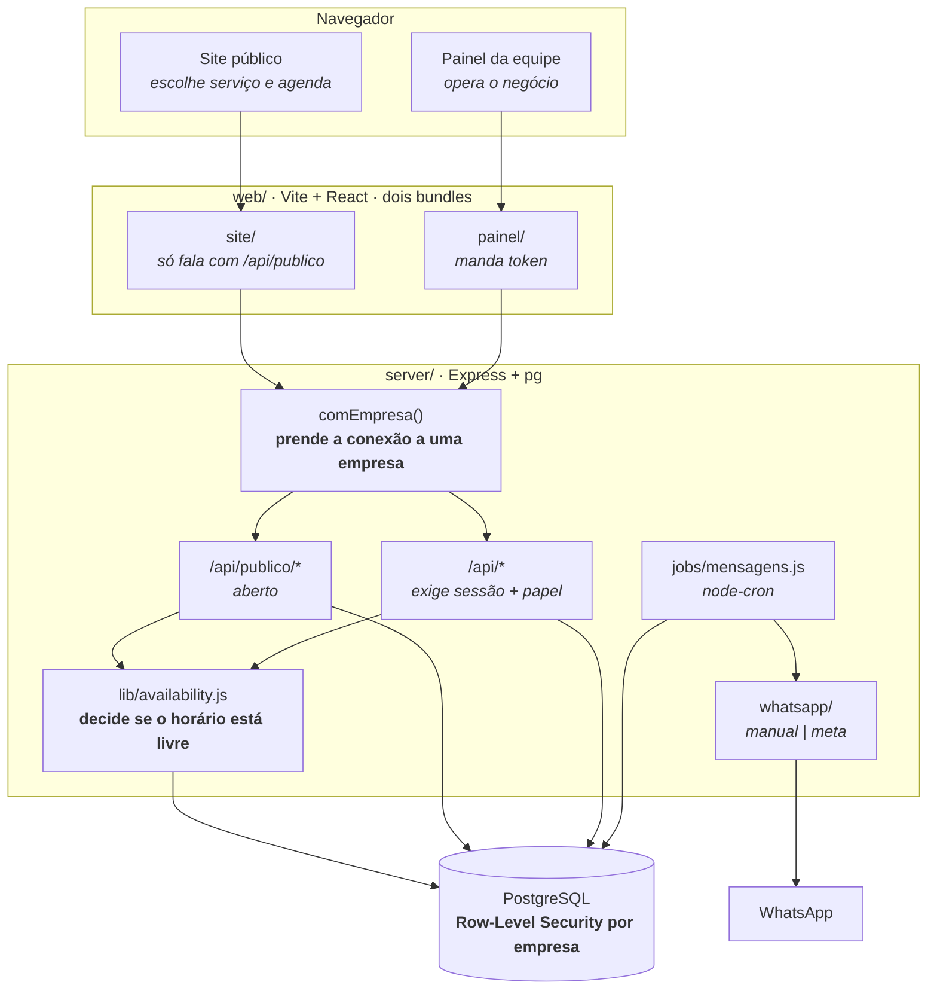
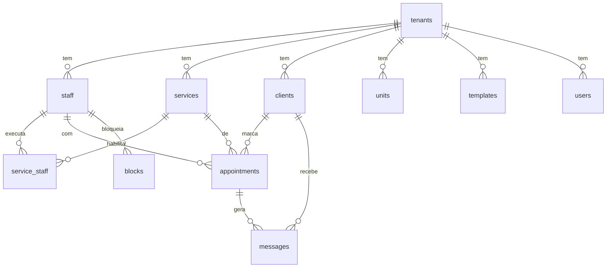

# Arquitetura

Como o sistema é montado hoje, e por quê. Para o que ainda vai mudar, veja
`ROADMAP.md`; para as regras de quem programa aqui, `CLAUDE.md`.

## Visão geral



**Site e painel são dois bundles separados**, com entradas próprias no Vite
(`index.html` e `painel.html`). O site carrega cerca de um terço do painel e
conversa só com `/api/publico/*`; o painel é o único que manda token. Antes os
dois saíam do mesmo `App.jsx`, então abrir o site baixava o financeiro junto e
levava a credencial do painel para o navegador de quem só queria marcar
horário.

## Pastas

```
server/            Express + PostgreSQL (driver `pg`). Fonte da verdade.
  db/migrations/   Esquema em migrations numeradas, versionadas em tabela.
  src/db.js        Pool de conexões, migrations no boot, linha ↔ objeto da API.
  src/reset.js     Zera o banco em desenvolvimento. Recusa rodar fora de localhost.
  src/senha-app.js Define a senha do papel vital_app a partir do .env (dev).
  src/lib/         availability.js (horários), templates.js (mensagens),
                   dates.js (datas como texto), migrate.js (migrations),
                   rota.js (erro em handler async), contexto.js (conexão da
                   requisição), tenant.js (resolve a empresa + config padrão)
  src/routes/      catalogo | clientes | agendamentos | publico | mensagens |
                   relatorios | uploads (imagens da empresa)
  src/jobs/        geração e despacho da fila de WhatsApp (node-cron)
  src/whatsapp/    provider trocável: 'manual' (links wa.me) ou 'meta' (Cloud API)
  uploads/         imagens enviadas, uma pasta por empresa. Fora do Git.
web/               Vite + React, sem framework de UI. CSS à mão.
  index.html       entrada do site da cliente
  painel.html      entrada do painel da equipe
  src/site/        App.jsx (home), Agendar.jsx (a janela de agendamento),
                   datas.js, tema.js (aplica a marca em runtime), styles.css
  src/painel/      App.jsx, styles.css e ConfigSite.jsx (a empresa edita o site)
  src/shared/      publico.js (API sem token), painel-api.js (API com token),
                   imagem.js (reduz a foto antes de subir)
```

## Decisões estruturais

**Datas são texto, não `Date`.** `'YYYY-MM-DD'` e `'HH:MM'` em todo lugar, banco
incluso. O negócio opera num fuso só; usar `Date` com UTC só cria bug de agenda
virando o dia. Helpers em `server/src/lib/dates.js`.

**Conflito de horário se valida no servidor, dentro da transação que grava.**
`lib/availability.js` é o único lugar que decide se um horário está livre. O
front tem uma cópia simplificada só para desenhar a grade rápido — ela nunca
autoriza gravação. Duas clientes clicam no mesmo horário no mesmo segundo, e a
conferência precisa acontecer na *mesma* transação do `INSERT`: fora dela, as
duas leriam "livre" antes de qualquer uma gravar, e as duas gravariam. Por isso
`conflita()` aceita o cliente da transação como argumento.

**Todo handler assíncrono passa por `lib/rota.js`.** O Express 4 não trata
Promise rejeitada: sem o embrulho, uma falha de banco vira "unhandled rejection"
no log e a requisição fica pendurada até o navegador desistir — sem status, sem
mensagem. Cai fora quando atualizarmos para o Express 5.

**Nada é apagado se tem histórico.** Excluir serviço ou profissional com
agendamentos vinculados apenas desativa (`ativo = 0`). O relatório do mês
passado precisa do nome.

**A fila de mensagens é uma tabela, não um efeito colateral.** `gerarFila()`
decide quem recebe o quê e grava em `messages` com `dedupe_key`. `despachar()`
entrega. Separado de propósito: dá para revisar antes de disparar, e nada se
perde se a API da Meta cair no meio.

**O front recarrega o estado inteiro depois de cada mutação.** `GET /api/estado`
devolve tudo numa chamada. Simples e sempre correto. Se um dia ficar lento, o
lugar de otimizar é aqui — não vale complicar antes.

## As duas telas

**Site da cliente** (`web/src/site/`) — capa, logo, nome, chamada para agendar e
os serviços por categoria, cada um com botão próprio. Mobile primeiro, porque
quase todo agendamento sai do celular.

**O agendamento é uma janela sobre a home**, não uma troca de tela — a cliente
não perde de vista onde estava. Os passos são categoria → serviço → adicionais
→ profissional → data → dados, e **passo sem o que perguntar é pulado**: uma
função só (`util`) decide isso, e a navegação anda por ela nos dois sentidos.
Com três passos opcionais, decidir com `if` espalhado já tinha produzido o bug
de "voltar" cair num passo que a ida havia pulado.

**A janela sempre abre no começo do fluxo**, mesmo quando a cliente clicou em
"Agendar" num serviço específico — o serviço apenas já vem marcado e a lista
abre filtrada na categoria dele. Antes ela pulava direto para o primeiro passo
com pergunta pendente, e sem adicionais cadastrados nem escolha de profissional
isso caía no calendário com as bolinhas quase cheias: parecia que a janela
tinha continuado de onde parou. A janela também remonta a cada abertura, então
não há estado sobrando de uma escolha anterior. Três colunas: em que passo está, o passo atual,
e o resumo do que já escolheu com o total. O resumo não é enfeite: é ele que dá
segurança para confirmar. No celular vira uma coluna só, com o resumo numa
barra no rodapé que mostra o total e abre ao toque.

Quem decide os horários livres é o servidor. São **duas rotas, de propósito**:
`/api/publico/dias-livres?mes=` diz quais dias do mês têm vaga, e
`/api/publico/horarios?data=` lista as horas de um dia. O calendário precisa de
trinta dias de uma vez; a lista de horas, de um dia só. Juntar as duas faria o
desenho do mês carregar horário que ninguém pediu — e pedir dia a dia seriam
trinta idas ao banco para pintar uma tela. `diasComVaga()` resolve o mês com uma
consulta e o resto em memória.

O front tem noção de jornada só para desenhar; se ele adivinhasse a
disponibilidade, mostraria horário já vendido e a cliente só descobriria ao
tentar confirmar.

**Painel da equipe** (`web/src/painel/`) — navegação lateral agrupada em
Calendário/Financeiro, Cadastros e Configurações. No computador a lateral é
fixa; no celular vira gaveta. A equipe abre isto do balcão e do próprio
telefone.

Em **Configurações → Site da cliente** (`painel/ConfigSite.jsx`) a empresa muda
identidade, cor, logo, capa, textos, contato e o que aparece ou não — tudo sem
programador. Grava no mesmo JSON que a vitrine lê, então salvar muda o site na
hora.

**A marca vem do banco, não do CSS.** `site/tema.js` recebe a config da empresa
e escreve as variáveis CSS em runtime — cor primária, fundo, texto, e uma
derivada de contraste para o texto sobre a cor da marca. Um CSS, N marcas,
nenhum rebuild por cliente. É o que permite a empresa escolher a própria paleta
em Configurações → Site da cliente.

**A home é uma pilha de blocos, cada um com o próprio fundo.** Separa os
assuntos sem linha divisória e dá ritmo à rolagem. O bloco de serviços usa um
tom bem lavado da cor da marca (`--marca-fundo`, 94% em direção ao branco): a
cor varia de cliente para cliente, e um tom saturado quebraria o contraste do
texto escuro para metade das marcas possíveis. O token também tem valor padrão
no CSS, porque `tema.js` só roda depois que a vitrine responde — sem isso o
bloco pisca sem fundo no primeiro quadro.

**A barra do topo flutua sobre a capa e se firma ao rolar.** Sobre a foto ela é
transparente com um véu escuro por baixo do texto: não dá para saber que imagem
a empresa vai subir, e texto branco sobre capa clara seria ilegível. Passados
120px, vira sólida. O acesso à conta da cliente entra aqui quando o login do
Bloco 5 existir — um botão que não leva a lugar nenhum seria pior que a
ausência dele.

**As linhas da grade são montadas no código, não deixadas para o navegador.**
`flex-wrap` enche cada linha até acabar o espaço e joga o resto na última: 13
itens onde cabem 6 viram 6 + 6 + 1, com um círculo sozinho no fim. Varrendo
larguras de 300 a 1400px e de 2 a 60 itens, a quebra automática deixa item
solitário em 547 de 3.304 combinações — não é caso raro.

`site/Grade.jsx` mede a largura disponível, escolhe o **menor número de linhas**
que comporta todos e divide os itens **por igual** entre elas, sobra nas
primeiras. Com espaço para 6: 7 → 4+3, 13 → 5+4+4, 17 → 6+6+5. Cada linha é
centralizada, inclusive a última. Um `ResizeObserver` refaz a conta quando a
janela muda ou o celular gira.

**Serviços em grade de círculos, com a foto na frente.** A foto é o que a
pessoa reconhece antes de ler — "unhas", "sobrancelha" — e reconhecer é mais
rápido que ler uma lista de nomes. Sem foto, entra a inicial sobre a cor da
marca, para o círculo não ficar vazio e a grade não desalinhar. A seção de
serviços é a única que usa o contêiner largo (`.env-largo`): a grade respira
melhor, e o resto do site continua estreito, que é o que se lê bem.

**Serviços adicionais: um extra vendido junto do principal.** Um adicional não
é entidade nova — é um `service` comum, marcado como extra de outro. Assim já
tem preço, duração, foto e quem executa, sem duplicar cadastro: depilação de
nariz pode ser vendida sozinha e como extra da limpeza de pele, com o mesmo
registro.

Consequência a saber: **o extra também aparece sozinho na vitrine**, porque é
um serviço como outro qualquer. Vender algo só como adicional ainda não é
possível — está anotado no `ROADMAP.md`.

A oferta vem de dois lugares e o site mostra a **união**. O cadastro é feito nas
duas direções, porque a empresa pensa das duas formas conforme o serviço que
tem na frente:

- Editando o **principal**: "quais extras a limpeza de pele oferece".
- Editando o **extra**: "em quais grupos a depilação de buço é oferecida".

As duas escrevem na mesma tabela `category_addons`, só que por lados opostos —
e cada uma apaga apenas as próprias linhas ao salvar, senão marcar um extra
derrubaria os outros do mesmo grupo. A segunda direção é a que serve para o que
quase nunca se vende sozinho, e foi a que faltava na primeira versão da tela.

Como categoria é texto livre na tabela `services`, renomear uma deixa as regras
dela órfãs — o estrago é uma oferta que some, não dado perdido.

Duas armadilhas resolvidas:

- **A duração soma os extras.** Sem isso a cadeira é reservada por menos tempo
  do que o atendimento leva e a agenda estoura em cima da próxima cliente. Por
  isso `/publico/horarios` e `/publico/dias-livres` aceitam a lista de extras:
  escolher adicionais muda o que cabe na agenda.
- **Preço e disponibilidade nunca vêm do site.** A lista escolhida é conferida
  contra a oferta real e os valores saem do banco. Sem isso, bastaria mandar o
  id de um serviço caro como "extra" para levá-lo por outro preço.

`appointments.service_id` continua sendo o serviço principal, e `valor` e
`duracao` já somam os extras. Foi de propósito: o motor de horários lê
`duracao` e o financeiro lê `valor`, então os dois continuam corretos sem uma
linha de mudança. Os itens ficam em `appointment_addons`, com nome e preço
congelados — o relatório do mês passado precisa do valor cobrado na época.

**A cliente pode deixar um recado no agendamento.** Campo opcional no último
passo, que grava em `appointments.obs` e aparece para a equipe no painel — "sou
alérgica a acetona", "vou levar minha filha". É texto livre vindo da internet:
o servidor corta em 500 caracteres em vez de recusar, porque devolver erro por
causa de um recado longo perderia o agendamento inteiro.

**A cliente escolhe a categoria antes de ver a lista.** Um estúdio com quarenta
serviços numa página só é uma parede de texto. A home mostra só as categorias,
na grade redonda, com a foto de um dos serviços do grupo; **tocar numa delas
abre a janela de agendamento já na lista daquele grupo**. A home não repete
essa lista — antes ela abria os serviços da categoria e a janela pedia o
serviço de novo logo depois, a mesma lista duas vezes com um toque a mais no
meio. A empresa desliga o agrupamento em Configurações → Site da cliente, se
tiver poucos serviços.

**Imagens: reduzidas no navegador, servidas pelo Express.** A foto que sai da
câmera tem 4000px e 8 MB, e vai aparecer num quadrado de 60px. `shared/imagem.js`
redimensiona por canvas antes de subir — economiza o pacote de dados de quem
cadastra, o disco do servidor e o carregamento do site. Sobe como data URL em
JSON, o que dispensa a dependência de multipart e já entrega o tamanho sob
controle.

O nome do arquivo é **sempre gerado no servidor**: nome vindo do cliente é
caminho para `../../` e para sobrescrever arquivo de outra empresa. Cada empresa
tem sua pasta em `server/uploads/<tenant>/`, então apagar tudo de um cliente que
saiu é apagar uma pasta.

**A vitrine publica campos escolhidos a dedo, não a config inteira.** Na config
também moram horários de disparo de mensagem e chave Pix; `/api/publico/vitrine`
monta um objeto explícito para não vazar nada por descuido quando um campo novo
aparecer.

## Banco

**PostgreSQL**, um banco só. Local para desenvolver (grátis, mesma versão da
produção), gerenciado quando for para o ar — a única diferença entre os dois é
`DATABASE_URL` no `.env`, nunca código.

Migrations numeradas em `server/db/migrations/`, aplicadas por `lib/migrate.js`
no boot da API e registradas na tabela `schema_migrations`. Cada arquivo roda uma
vez, na ordem do nome, dentro de uma transação — e o Postgres faz DDL
transacional, então migration que falha no meio não deixa tabela pela metade.
**Nunca edite uma migration já aplicada — crie a próxima.**

**Dinheiro é `NUMERIC`, nunca float.** `0.1 + 0.2` em ponto flutuante não dá
`0.3`, e isso vira centavo errado em comissão e fechamento de caixa. O `pg`
devolve `NUMERIC` e `COUNT()` como texto por padrão; `db.js` registra
conversores para os dois, senão preço voltaria como `"85.00"` e quebraria a
soma na tela.

**As consultas usam `?` como marcador, não `$1`.** `db.js` traduz antes de
enviar. Veio da troca de motor — permitiu manter as consultas do projeto
inteiro intactas — e continua valendo porque `?` é mais legível quando são seis
parâmetros.



### Isolamento entre empresas

Um banco só, várias empresas, separadas por `tenant_id` **mais uma política que
o próprio Postgres aplica** (Row-Level Security). A coluna sozinha dependeria de
alguém lembrar do `WHERE` em toda consulta; a política fecha isso no banco.

Três peças fazem funcionar:

1. **A aplicação não conecta como superusuário.** O Postgres ignora RLS para
   superusuário e para o dono da tabela — então existe o papel `vital_app`,
   sem `SUPERUSER` e sem `BYPASSRLS`, e as tabelas usam `FORCE ROW LEVEL
   SECURITY`. Migrations continuam saindo por uma conexão de administrador
   (`DATABASE_ADMIN_URL`), que precisa criar tabela.
2. **A empresa vive na conexão, não na consulta.** O middleware `comEmpresa()`
   pega uma conexão, marca `app.tenant_id` nela e roda a requisição inteira ali
   dentro, via `AsyncLocalStorage` (`lib/contexto.js`). Por isso `db.get/all/run`
   acham a conexão certa sozinhos e nenhuma rota precisa saber que isso existe.
   A conexão é devolvida ao pool **com `RESET`** — sem isso a próxima requisição
   herdaria o acesso da anterior.
3. **`tenant_id` se preenche sozinho.** O default da coluna é
   `current_setting('app.tenant_id', true)`. Nenhum `INSERT` informa a empresa,
   e não dá para informar a errada. Sem empresa na conexão o valor vira `NULL` e
   o `NOT NULL` derruba a gravação: falha fechada, que é o lado certo para
   errar.

Consequência prática: **fora de uma requisição HTTP não existe empresa**. Os
jobs de cron e o seed precisam de `db.comEmpresa(id, fn)` explícito — o cron
percorre as empresas ativas uma a uma.

O que **não** tem RLS: o schema `plataforma` (`tenants`, `usuarios`,
`auditoria`), que é cadastro da Vital, não dado de negócio de ninguém.

**A config da empresa mora em `plataforma.tenants.config`.** É JSON, e o banco guarda só o
que foi alterado: `getConfig()` mescla por cima de `configPadrao`. Campo novo de
personalização não precisa de migration. As chaves operacionais (`passoAgenda`,
`horaLembreteVespera`...) são planas porque o código já as lê assim; o que é
novo vem agrupado em `marca`, `textos`, `vocabulario` e `exibir`.

`units` (unidades), `blocks` (bloqueio de horário), `users` (equipe da empresa)
e o schema `plataforma` inteiro existem no esquema mas ainda não têm tela — foram
criados cedo para não exigir migração depois.

## Autenticação e papéis

**São dois logins diferentes, e é fácil confundi-los.**

| | Quem | Como entra | Existe hoje? |
|---|---|---|---|
| **Painel** | Equipe da empresa: dono, gerente, funcionário | E-mail e senha | Sim |
| **Site** | A cliente que agenda | Não entra: informa o WhatsApp na hora de marcar | Não há login |

A cliente **não cria conta**. Ela digita o WhatsApp, e se já agendou antes o
sistema a reconhece pelo número. É de propósito: exigir cadastro para marcar
horário perde agendamento, e a maioria não voltaria para confirmar e-mail.

**O login com Google é para a cliente, não para a equipe** — e ainda não existe
(Bloco 5). Quando existir, será um atalho para ela ver histórico e remarcar, e
não uma exigência: agendar só com o WhatsApp continua funcionando ao lado. A
equipe nunca entra por Google; o painel é e-mail e senha.

**Ninguém da equipe se cadastra sozinho.** O primeiro acesso cria o dono, e daí
em diante é o dono (ou o gerente) que convida os outros. Um painel onde
qualquer um cria conta é um painel aberto.

Login com senha (argon2id) e sessão em cookie `httpOnly`. Três decisões e o
motivo de cada uma:

**A senha nunca é guardada** — `users.senha_hash` guarda um hash argon2id, lento
de propósito: quem levar o banco embora não testa bilhões de senhas por segundo.

**O cookie é `httpOnly`**, então o JavaScript da página não o lê e um XSS não
consegue roubar a sessão. É por isso que o token não vai para `localStorage`.
`sameSite: lax` corta CSRF vindo de outro site.

**Sessão em tabela, não token assinado (JWT).** A Vital precisa conseguir
*derrubar* um acesso: suspender empresa que não pagou, tirar funcionária
demitida na hora, encerrar sessão de aparelho perdido. Token assinado vale até
expirar, aconteça o que acontecer; linha em tabela some quando a gente apaga. O
custo é uma consulta por requisição — barata e indexada. A tabela guarda o
**hash** do token, nunca o token.

`sessaoDe()` consulta pela conexão da requisição, não pelo pool cru: a consulta
faz `JOIN users`, que tem RLS, e numa conexão sem empresa definida o join volta
vazio — toda sessão pareceria inválida. Sessão de uma empresa também não vale em
outra, o que importa no dia do subdomínio.

**Primeiro acesso é aberto e se fecha sozinho.** Enquanto a empresa não tiver
nenhum usuário, a tela oferece criar o dono; havendo um, a rota passa a recusar.
É a única forma de a primeira pessoa entrar sem semear senha no código.

### Papéis

| | dono | gerente | funcionário |
|---|---|---|---|
| Configurar o site | sim | não | não |
| Financeiro | sim | sim | não |
| Cadastros (serviços) | sim | sim | não |
| Equipe e usuários | sim | sim | não |
| Agenda de outros | sim | sim | não |
| Agenda e clientes | sim | sim | sim |

A tabela vive em `lib/auth.js`, num objeto só, para a regra não se espalhar.

**Cada regra vale na tela e na rota.** Esconder o botão evita erro feio para
quem não pode; recusar na rota é o que impede a chamada direta. Um sem o outro
é enganoso — e o teste pegou exatamente isso: na primeira versão a funcionária
não via o menu do financeiro, mas acessava `/api/relatorios/resumo` à vontade.

## WhatsApp

Dois modos, trocados por variável de ambiente:

- **`manual`** (padrão) — monta a mensagem e gera um link `wa.me`; o atendente
  clica e o WhatsApp abre com o texto pronto. Sem custo, sem conta aprovada.
- **`meta`** — Cloud API oficial. Exige conta aprovada e cada template cadastrado
  no WhatsApp Manager, com o nome em `templates.meta_template_name`. Fora da
  janela de 24h desde a última mensagem da cliente, só sai template aprovado;
  texto livre é rejeitado.

Telefone é guardado só com dígitos, sem `+55`. A conversão para o formato da API
acontece em `foneE164()`.

## LGPD

O sistema guarda nome, telefone, endereço e data de nascimento — dado pessoal.
`clients.optin` controla mensagens de marketing (aniversário, campanhas) e é
respeitado em `jobs/mensagens.js` e nas campanhas. Lembretes de agendamento são
comunicação transacional e não dependem de opt-in. Ao adicionar qualquer disparo
novo, decida em qual das duas categorias ele cai.
