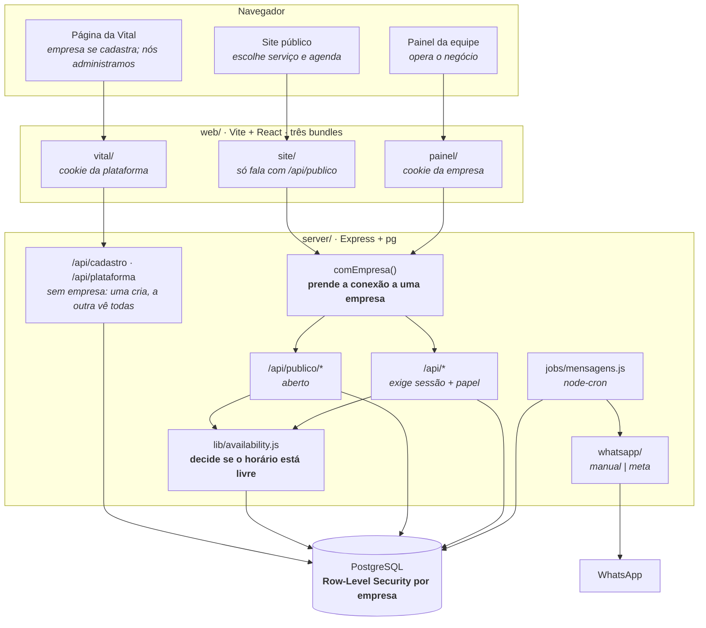
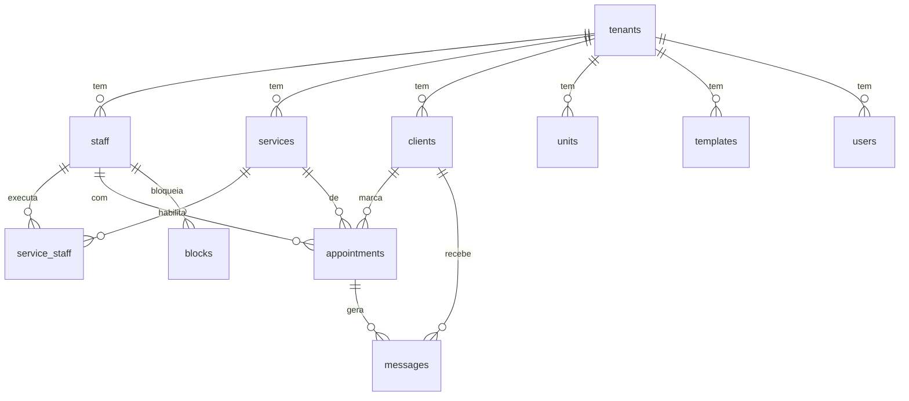

# Arquitetura

Como o sistema é montado hoje, e por quê. Para o que ainda vai mudar, veja
`ROADMAP.md`; para as regras de quem programa aqui, `CLAUDE.md`.

**Por onde começar.** Se você nunca viu este projeto: leia *Visão geral* e
*Decisões estruturais*, nesta ordem, e pare. Elas explicam as três telas, o
isolamento entre empresas e por que as datas são texto — que é o que faz o resto
do código parecer óbvio. O resto desta página é referência: leia a seção do que
você for mexer.

| Seção | Responde |
|---|---|
| [Visão geral](#visão-geral) | Como as peças se ligam, num diagrama |
| [Pastas](#pastas) | Onde mora cada coisa |
| [Decisões estruturais](#decisões-estruturais) | Por que Postgres, por que data é texto, por que três bundles |
| [As três telas](#as-três-telas) | Site, painel e página da Vital |
| [Banco](#banco) | Esquema, migrations e Row-Level Security |
| [Autenticação e papéis](#autenticação-e-papéis) | Login, sessão, dono × funcionário |
| [De quem é a requisição](#de-quem-é-a-requisição) | Como o endereço decide a empresa |
| [Como nasce uma empresa](#como-nasce-uma-empresa) | Cadastro self-service e o assistente |
| [Combos e promoções](#combos-e-promoções) | Pacote fechado e o rateio da comissão |
| [O que se vende junto](#o-que-se-vende-junto) | Adicionais e o ranking do financeiro |
| [Formulários de intake](#formulários-de-intake) | Anamnese, ficha, dado sensível |
| [A agenda do painel](#a-agenda-do-painel) | Semana, faixas e arrastar para remarcar |
| [Unidades](#unidades) | A empresa com mais de um endereço |
| [Onde as pessoas somem](#onde-as-pessoas-somem) | O funil de cinco passos, e por que ele não guarda dado pessoal |
| [O registro do painel](#o-registro-do-painel) | Quem fez o quê, dentro da empresa |
| [O back-office da Vital](#o-back-office-da-vital) | Ver todas as empresas sem ver o dado de nenhuma |
| [Testes](#testes) | O que a suíte cobre e como ela roda |
| [WhatsApp](#whatsapp) | Fila, provider manual e Cloud API |
| [LGPD](#lgpd) | Dado pessoal, optin, dado sensível |

## As migrations, em uma linha cada

Nunca se edita uma já aplicada — cria-se a próxima. O histórico abaixo é o que
elas fizeram, e cada arquivo explica o porquê no próprio cabeçalho.

| | O que mudou |
|---|---|
| `001_esquema_inicial` | Todas as tabelas de negócio, em PostgreSQL |
| `002_isolamento_por_empresa` | Row-Level Security, schema `plataforma`, papel `vital_app` |
| `003_servicos_adicionais` | Extras por serviço e por categoria |
| `004_sessoes` | Sessão em tabela, para dar para derrubar um acesso |
| `005_papeis_dono_funcionario` | Só dois papéis; o meio-termo saiu |
| `006_combos` | Pacote com preço fechado; agendamentos ligados por grupo |
| `007_cadastro_self_service` | A aplicação passa a poder criar empresa |
| `008_painel_da_plataforma` | Sessões da nossa equipe e a função de contagem |
| `009_vender_so_como_adicional` | O extra que não se vende sozinho |
| `010_registro_do_painel` | `logs`: quem fez o quê na empresa |
| `011_registro_e_so_leitura` | `REVOKE` no registro — GRANT adiciona, nunca tira |
| `012_formularios` | Intake: perguntas, respostas e o vínculo com serviços |
| `013_bloqueio_repetido` | `serie` em `blocks`: férias de três semanas são três linhas |
| `014_suporte` | `plataforma.tickets`: a empresa fala com a Vital de dentro do produto |
| `015_funil` | `funil`: em qual passo a visita some, sem guardar dado de ninguém |
| `016_funil_compactado` | `funil_diario`: o dia antigo vira uma linha, e o cru sai |
| `017_em_atendimento` | Sexto status: a cliente na cadeira, entre confirmada e atendida |
| `018_pagamento_parcial` | `pag_recebido`: quanto entrou, para a entrada caber no caixa |
| `019_observacao_do_bloqueio` | `obs` em `blocks`: o detalhe, separado do motivo que vira filtro |
| `020_comissao_por_servico` | Comissão no serviço e por pessoa no serviço; `obs` interna do serviço |
| `021_promocao_com_regras` | Começo, dias da semana, limite e pausa nas promoções; desconto gravado na venda |
| `022_comissao_fixa` | A comissão padrão da profissional pode ser valor fixo por atendimento |

## Visão geral


```mermaid
flowchart TB
    subgraph nav["Navegador"]
        site["Site público<br><i>escolhe serviço e agenda</i>"]
        painel["Painel da equipe<br><i>opera o negócio</i>"]
        vital["Página da Vital<br><i>empresa se cadastra; nós administramos</i>"]
    end

    subgraph front["web/ · Vite + React · três bundles"]
        site2["site/<br><i>só fala com /api/publico</i>"]
        painel2["painel/<br><i>cookie da empresa</i>"]
        vital2["vital/<br><i>cookie da plataforma</i>"]
    end

    subgraph back["server/ · Express + pg"]
        semEmp["/api/cadastro · /api/plataforma<br><i>sem empresa: uma cria, a outra vê todas</i>"]
        emp["comEmpresa()<br><b>prende a conexão a uma empresa</b>"]
        publico["/api/publico/*<br><i>aberto</i>"]
        privado["/api/*<br><i>exige sessão + papel</i>"]
        motor["lib/availability.js<br><b>decide se o horário está livre</b>"]
        fila["jobs/mensagens.js<br><i>node-cron</i>"]
        prov["whatsapp/<br><i>manual | meta</i>"]
    end

    db[("PostgreSQL<br><b>Row-Level Security por empresa</b>")]
    wa["WhatsApp"]

    site --> site2
    painel --> painel2
    vital --> vital2
    site2 --> emp
    painel2 --> emp
    vital2 --> semEmp
    semEmp --> db
    emp --> publico
    emp --> privado
    publico --> motor
    privado --> motor
    motor --> db
    publico --> db
    privado --> db
    fila --> db
    fila --> prov
    prov --> wa
```

**Cada tela é um bundle separado**, com entrada própria no Vite
(`index.html`, `painel.html`, `vital.html`). O site carrega cerca de um terço do
painel e conversa só com `/api/publico/*`; o painel e a página da Vital têm
cookies de nomes diferentes e nunca se aceitam. Antes site e painel saíam do
mesmo `App.jsx`, então abrir o site baixava o financeiro junto e levava a
credencial do painel para o navegador de quem só queria marcar horário.

## Pastas

```
server/            Express + PostgreSQL (driver `pg`). Fonte da verdade.
  db/migrations/   Esquema em migrations numeradas, versionadas em tabela.
  src/app.js       Monta o Express: middlewares, guardas e rotas. Não sobe nada.
  src/index.js     Roda as migrations, abre a porta, liga o cron.
  src/db.js        Pool de conexões, migrations no boot, linha ↔ objeto da API.
  src/reset.js     Zera o banco em desenvolvimento. Recusa rodar fora de localhost.
  src/senha-app.js Define a senha do papel vital_app a partir do .env (dev).
  src/lib/         availability.js (horários), combos.js (pacotes e rateio),
                   formularios.js (intake), registro.js (auditoria do painel),
                   provisionar.js (empresa nova nasce aqui),
                   templates.js (mensagens),
                   dates.js (datas como texto), migrate.js (migrations),
                   rota.js (erro em handler async), contexto.js (conexão da
                   requisição), tenant.js (resolve a empresa + config padrão)
  src/routes/      catalogo | clientes | agendamentos | publico | mensagens |
                   relatorios | uploads (imagens da empresa) | bloqueios
                   (horário fechado) | cadastro e plataforma (as duas rotas
                   sem empresa definida)
  test/            suíte automatizada (`npm test`), banco próprio
  src/jobs/        geração e despacho da fila de WhatsApp (node-cron)
  src/whatsapp/    provider trocável: 'manual' (links wa.me) ou 'meta' (Cloud API)
  uploads/         imagens enviadas, uma pasta por empresa. Fora do Git.
web/               Vite + React, sem framework de UI. CSS à mão.
  index.html       entrada do site da cliente
  painel.html      entrada do painel da equipe
  vital.html       entrada da página da Vital (cadastro + back-office)
  src/site/        App.jsx (home), Agendar.jsx (a janela de agendamento),
                   Clinica.jsx (as seções que só o modelo Clínica tem),
                   datas.js, tema.js (aplica a marca em runtime), styles.css
  src/painel/      App.jsx, styles.css, Entrar.jsx (login e primeiro acesso),
                   Resumo.jsx (o dia, as pendências e o mês de quem atende),
                   Financeiro.jsx (receita, custos e lucro por período),
                   IntervaloDatas.jsx (calendário de "de tal a tal dia"),
                   Cartoes.jsx (o cartão de número e o "!" que o explica),
                   ConfigSite.jsx (a empresa edita o site),
                   Combos.jsx (promoções), Unidades.jsx (endereços),
                   Usuarios.jsx (acesso),
                   Comecar.jsx (assistente de primeira configuração),
                   Formularios.jsx (monta), Ficha.jsx (responde no atendimento),
                   Registro.jsx (quem fez o quê)
  src/vital/       Cadastro.jsx (empresa nova), Equipe.jsx (back-office),
                   api.js (cookie próprio), styles.css (a marca da Vital)
  src/shared/      publico.js (API sem token), painel-api.js (API com token),
                   imagem.js (reduz a foto antes de subir), formato.js (moeda)
```

## Decisões estruturais

**Datas são texto, não `Date`.** `'YYYY-MM-DD'` e `'HH:MM'` em todo lugar, banco
incluso. O negócio opera num fuso só; usar `Date` com UTC só cria bug de agenda
virando o dia. Helpers em `server/src/lib/dates.js`.

**Jornada diz quando se atende; bloqueio diz quando, excepcionalmente, não.**
São as duas perguntas que o motor faz antes de oferecer qualquer vaga. A
jornada é a regra semanal do profissional; `blocks` guarda a exceção — almoço,
folga, feriado, reforma. Com `staff_id` nulo, o bloqueio fecha a equipe inteira,
que é como se marca feriado sem repetir a linha para cada pessoa.

Bloqueio e agendamento são tabelas separadas de propósito. Um agendamento pode
ser remarcado e sai da agenda; um bloqueio é a empresa dizendo que ali não se
atende. Guardar "almoço" como se fosse atendimento faria cancelar o almoço
aparecer como cancelamento no relatório.

Bloqueio que se repete, a porta única que cria um e por que a tela manda as
datas prontas: tudo em **[Horários fechados](#horários-fechados)**. Estava
escrito aqui também, palavra por palavra — e dois lugares com o mesmo assunto é
o começo de dois lugares com versões diferentes dele.

**Conflito de horário se valida no servidor, dentro da transação que grava.**
`lib/availability.js` é o único lugar que decide se um horário está livre. O
front tem uma cópia simplificada só para desenhar a grade rápido — ela nunca
autoriza gravação. Duas clientes clicam no mesmo horário no mesmo segundo, e a
conferência precisa acontecer na *mesma* transação do `INSERT`: fora dela, as
duas leriam "livre" antes de qualquer uma gravar, e as duas gravariam. Por isso
`conflita()` aceita o cliente da transação como argumento.

**Todo handler assíncrono passa por `lib/rota.js`.** O Express 4 não trata
Promise rejeitada: sem o embrulho, uma falha de banco vira "unhandled rejection"
no log e a requisição fica pendurada até o navegador desistir — sem status, sem
mensagem. Cai fora quando atualizarmos para o Express 5.

**Nada é apagado se tem histórico.** Excluir serviço ou profissional com
agendamentos vinculados apenas desativa (`ativo = 0`). O relatório do mês
passado precisa do nome.

**A fila de mensagens é uma tabela, não um efeito colateral.** `gerarFila()`
decide quem recebe o quê e grava em `messages` com `dedupe_key`. `despachar()`
entrega. Separado de propósito: dá para revisar antes de disparar, e nada se
perde se a API da Meta cair no meio.

**O front recarrega o estado inteiro depois de cada mutação.** `GET /api/estado`
devolve tudo numa chamada. Simples e sempre correto. Se um dia ficar lento, o
lugar de otimizar é aqui — não vale complicar antes.

## As três telas

Um público cada, e três bundles separados: quem abre o site não baixa o código
do painel, e nem o da nossa página.

**Site da cliente** (`web/src/site/`) — capa, logo, nome, chamada para agendar e
os serviços por categoria, cada um com botão próprio. Mobile primeiro, porque
quase todo agendamento sai do celular.

**O agendamento é uma janela sobre a home**, não uma troca de tela — a cliente
não perde de vista onde estava. Os passos são unidade → serviço → data e
horário → dados, e **passo sem o que perguntar é pulado**: uma função
só (`util`) decide isso, e a navegação anda por ela nos dois sentidos. Com
passos opcionais, decidir com `if` espalhado já tinha produzido o bug de
"voltar" cair num passo que a ida havia pulado.

**Serviço → data e horário → dados é o caminho inteiro** (decidido em
2026-09-19). Categoria, adicionais e "quem atende" já foram passos próprios:
sete telas, três delas pedindo decisão antes de a pessoa ver um horário. Hoje a
lista de serviços é uma só — agrupada por título de categoria quando a empresa
separa, e doze serviços cabem numa lista — e extras e profissional viraram duas
linhas de pílulas em cima do calendário, que consultam a agenda de novo ao
mudar. Quem não quer mexer neles não responde nada. O passo de unidade
continua, só quando há mais de um endereço para o que a cliente abriu.

**O cartão da home é a entrada do fluxo.** Quem clicou em "Limpeza de pele"
cai direto no calendário com o serviço escolhido; quem clicou numa categoria
cai na lista daquele grupo, com "ver todos" para trocar; o botão geral abre a
lista inteira. Já foi o contrário — a janela abria sempre do começo, com o
serviço só marcado, por medo de parecer que "continuou de onde parou" — e o
custo era refazer três escolhas que a home já tinha recebido. A janela remonta
a cada abertura, então não há estado sobrando de uma escolha anterior.

**A unidade escolhida recorta o catálogo, não só a equipe.** Um serviço só entra
na lista quando há, naquele endereço, alguém que o faça (a unidade é de quem
atende — ver [Unidades](#unidades)); categoria sem serviço some junto. Sem isso
a cliente escolhia o Centro, via "Facial", e atravessava cinco telas até um
calendário sem dia nenhum, porque só a Zona Sul tinha quem fizesse. Abrindo a
janela por um serviço ou combo, o passo de unidade só oferece os endereços onde
ele se faz — e, sobrando um, nem pergunta. A vitrine manda `unidadeId` de cada
profissional para o site poder fazer essa conta.

**Data e horário são uma tela só.** Calendário de um lado, horas do outro
quando o miolo da janela tem largura para os dois — decidido por *container
query* sobre `.jn-corpo`, não por largura da tela: a janela vira três colunas a
860px e o miolo encolhe justamente quando a tela cresce, e uma media query
punha as horas em cima dos dias. O primeiro dia com vaga já abre, e as horas
vêm agrupadas em manhã, tarde e noite. Separar em duas telas fazia a pessoa
escolher o dia sem saber se sobrava horário que servisse. O calendário tem
quatro estados com pista além da cor (sem vaga apagado, passado mais apagado,
com vaga preenchido em negrito, escolhido sólido) e hoje leva um ponto. **Toda
situação sem horário tem texto e saída** — mês cheio, dia sem vaga — com o
WhatsApp dentro da própria tela: calendário cinza sem uma palavra é o que uma
cliente de verdade vê toda vez que a agenda lota. A navegação de mês para em
`janelaDias`, porque além dele só haveria mês vazio atrás de mês vazio.

Três colunas: em que passo está, o passo atual, e o resumo do que já escolheu
com o total. O resumo não é enfeite: é ele que dá segurança para confirmar. No
celular vira uma coluna só, com o resumo numa barra no rodapé que mostra o
total e abre ao toque; entre 860 e 1100px a coluna-guia some (o título dela
já está no cabeçalho do passo) para o miolo caber.

Quem decide os horários livres é o servidor. São **duas rotas, de propósito**:
`/api/publico/dias-livres?mes=` diz quais dias do mês têm vaga, e
`/api/publico/horarios?data=` lista as horas de um dia. O calendário precisa de
trinta dias de uma vez; a lista de horas, de um dia só. Juntar as duas faria o
desenho do mês carregar horário que ninguém pediu — e pedir dia a dia seriam
trinta idas ao banco para pintar uma tela. `diasComVaga()` resolve o mês com uma
consulta e o resto em memória.

O front tem noção de jornada só para desenhar; se ele adivinhasse a
disponibilidade, mostraria horário já vendido e a cliente só descobriria ao
tentar confirmar.

### A página responde objeção, não só descreve

Uma vitrine que diz "um espaço para você se cuidar" não responde nada a quem
está decidindo. Três peças, todas alimentadas pela empresa:

**As perguntas frequentes** (`config.faq`, um `{pergunta, resposta}` por item)
viram uma seção nos quatro modelos. São `<details>`/`<summary>` nativos: abrem
sem JavaScript, o teclado anda por eles, o leitor de tela anuncia o estado, e o
texto da resposta existe no HTML mesmo fechado — que é o que um buscador lê.
**Sem pergunta cadastrada a seção não existe**, como o antes/depois. Não há
lista nossa de perguntas: a dúvida que trava uma venda muda de ramo para ramo, e
"dói?" não serve a uma oficina.

**A frase de abertura** (`textos.hero`) é campo próprio, separado do `sobre`. O
`sobre` descreve o negócio; esta fala com quem acabou de chegar, e é onde cabe
nomear um incômodo concreto. Vazia, o site cai na primeira frase do `sobre`,
como era antes.

**"Tirar dúvida" em cada serviço** abre o WhatsApp com a mensagem já escrita,
citando aquele serviço (ou aquela categoria, quando o cartão é de categoria).
Quem tem dúvida no meio do catálogo não tem que rolar até o rodapé, e do outro
lado ninguém recebe um "oi" sem assunto. É link, não botão: agendar continua
sendo a ação da vitrine. Some inteiro quando a empresa não cadastrou WhatsApp.

### O que os buscadores leem

O site é uma página só montada no navegador — sem ajuda, todas as empresas
dividiriam o `<title>` do `index.html`. `site/seo.js` escreve, depois que a
vitrine responde: título com nome, categorias e cidade; descrição; `og:` para
quem compartilha o link; e **JSON-LD `LocalBusiness`** com endereço, telefone,
horário de atendimento e catálogo de serviços, mais um `FAQPage` quando há
perguntas.

**Nada ali inventa dado.** Campo sem cadastro não entra no schema — busca com
endereço errado é pior que busca sem endereço. `LocalBusiness` genérico, e não
`HealthAndBeautySalon` ou parecido: o ramo é texto livre de cada empresa, e
escolher o tipo por palavra-chave erraria justamente em quem não é do ramo que
a gente conhece.

**`cidade` é campo à parte do `endereco`** porque é por cidade que se procura
serviço, e recortar a cidade do endereço por vírgula erraria na primeira
empresa que escrevesse o endereço de outro jeito.

**O horário de atendimento é derivado da jornada da equipe**, nunca um campo da
config (`lib/horarios.js`): o negócio está aberto quando há alguém trabalhando,
e um campo próprio nasceria contradizendo a agenda no dia em que a empresa
mudasse a jornada de alguém e esquecesse de mexer no site. Mesmo princípio do
endereço, em [Unidades](#unidades) — uma fonte de verdade só. A faixa de cada
dia vai da abertura mais cedo ao fechamento mais tarde de quem trabalha nele.

### A animação nunca esconde conteúdo

`.revela` entra com opacidade zero e sobe ao encostar na tela. Isso já deixou
seção inteira invisível, e três coisas impedem que volte a acontecer:

- o `opacity: 0` só vale com a classe `js` no `<html>` (escrita por
  `main.jsx`), então uma falha no bundle devolve a página inteira legível em
  vez de uma tela em branco com o texto dentro;
- o observador dispara ao **encostar** na tela (`threshold: 0`), e não com 12%
  do elemento visível — um bloco mais alto que a tela nunca chegava a 12% e
  ficava escondido para sempre;
- a margem é positiva embaixo, então o bloco começa a aparecer um quinto de
  tela antes de entrar e chega opaco mesmo para quem rola rápido. Uma rede de
  1,2s revela o que **já está na tela** e continuar escondido — só isso, porque
  revelar a página inteira por tempo mataria o efeito para quem está no topo.

**Painel da equipe** (`web/src/painel/`) — navegação lateral agrupada em
Agenda/Financeiro, Cadastros e Configurações. No computador a lateral é
fixa; no celular vira gaveta. A equipe abre isto do balcão e do próprio
telefone.

### A Agenda é uma tela só, com três formas de olhar

Havia **Calendário** e **Agendamentos** no menu: uma desenhava a agenda, a outra
listava a mesma agenda. Duas entradas para a mesma pergunta significavam decidir
por onde entrar antes de saber o que se queria — e, pior, dois lugares para
manter em pé o filtro de pessoa e de período. Hoje é **Agenda**, com um cabeçalho
só mandando em tudo o que está abaixo:

- **Período**: `Hoje`, setas e o rótulo do recorte. A seta anda no tamanho do
  que se está vendo — um dia, uma semana, um mês (`passoDaEscala`).
- **Escala**: Dia · Semana · Mês. Some na Recepção, que é sempre o dia.
- **Quem**: `SeletorPessoas`, que aceita **várias** marcadas. O filtro é na
  tela, não no servidor, e por isso aqui dá para somar duas ou três pessoas
  sem mexer em rota nenhuma.
- **Abas**: **Calendário** (a grade), **Lista** (o que era Agendamentos, com o
  filtro de estado) e **Recepção**.

As três visões do Calendário respondem perguntas diferentes: **Dia** é a grade
por profissional (`GradeDoDia`, a mesma do Resumo — lá sem clique, aqui com);
**Semana** é a grade de sete dias, com arrastar para remarcar; **Mês**
(`GradeDoMes`) mostra **contagem por dia**, não os atendimentos — trinta dias com
seis blocos cada não cabem numa tela —, e tocar num dia leva para a visão diária,
que é onde estão os nomes.

**Com uma profissional escolhida, a grade pinta o que está fechado.** Fora da
jornada dela vira uma faixa cinza listrada (`.fechado`, a partir de
`shared/jornada.js`); o bloqueio continua vermelho, com o motivo, porque é outra
coisa — alguém fechou aquele horário de propósito. Antes, quem atende das 13h às
19h tinha cinco horas de grade branca que não eram horário vago: eram horário
que não existe, e a diferença só aparecia ao tentar marcar, com o servidor
recusando o que a tela tinha oferecido.

**Só com uma.** Com a equipe inteira na mesma coluna, a faixa teria de ser a
interseção de jornadas diferentes — pintaria de fechado o horário em que alguém
atende, que é o oposto do que ela existe para dizer. Por isso a regra é
`pessoas.length === 1`, e não "quando dá".

A faixa é desenho: não recusa nada, e não tem eventos de ponteiro, para o
arrasto passar por cima dela sem tropeço. Quem recusa continua sendo
`shared/remarcar.js` na tela e `lib/availability.js` no servidor — a faixa só
antecipa a recusa, que é o que ninguém tinha como ver.

A visão **Dia** passou a mostrar bloqueio também. Ela não mostrava: quem abria o
dia de uma pessoa via uma hora livre onde havia almoço fechado, e a mesma hora
aparecia bloqueada na semana. Duas telas discordando sobre o que cabe na agenda.

**Recepção** (`Recepcao.jsx`) é o dia inteiro em uma coluna, por horário, com
uma marca de "agora" separando o que já passou. A grade por profissional
responde "como está a agenda da Bia"; esta responde "quem é a próxima", que é a
pergunta de quem recebe quem chega — e quem está no balcão lê de cima para baixo
em vez de cruzar três colunas.

**A Lista continua pedindo ao servidor**, e não ao estado do painel: o bootstrap
carrega 120 dias, e um mês mais antigo apareceria vazio como se nada tivesse
acontecido. Ela recebe período e pessoas de cima, e guarda só o próprio filtro
de estado.

**Abrir coisa por cima da agenda é gaveta; perguntar "tem certeza?" é modal.**
São duas intenções diferentes, e por isso duas formas (`Gaveta` e `Confirmar`,
em `Base.jsx`):

- A **gaveta** entra pela direita e deixa a agenda visível ao lado — abrir um
  atendimento com modal centrado escondia a grade que se estava lendo, e fechar
  virava a única forma de voltar a ver o dia. Vale para o detalhe do
  atendimento, o novo agendamento e o novo bloqueio (este, na tela de Horários
  fechados). No celular sobe de baixo, que é
  o gesto que o telefone já ensina, e para em 92% da altura: a faixa que sobra
  em cima é o que diz que aquilo é uma camada, não a tela inteira.
- O **modal de confirmação** continua no meio, pequeno, para excluir e
  cancelar. O que ele pede é que a pessoa **pare** — gaveta convida a seguir
  olhando a agenda, e aqui é o contrário. O texto diz o que se perde ("some do
  caixa e do histórico dela") e oferece a saída mais branda: marcar como
  cancelado em vez de apagar.

A animação da gaveta move **só a posição, nunca a opacidade**: animando opacidade
ela ficava translúcida ao entrar e a página aparecia por baixo do texto — bonito
parado, ilegível em movimento.

`Base.jsx` nasceu neste trabalho, com `Modal`, `Campo` e `Switch`: eram eles que
prendiam qualquer tela dentro do `App.jsx` — extrair um componente significava
arrastar o `App` junto (import circular) ou copiar o `Modal` de novo.

Em **Configurações → Site da cliente** (`painel/ConfigSite.jsx`) a empresa muda
identidade, cor, logo, capa, textos, contato, cidade, perguntas frequentes e o
que aparece ou não — tudo sem programador. Grava no mesmo JSON que a vitrine
lê, então salvar muda o site na hora.

**A marca vem do banco, não do CSS.** `site/tema.js` recebe a config da empresa
e escreve as variáveis CSS em runtime — cor primária, fundo, texto, e uma
derivada de contraste para o texto sobre a cor da marca. Um CSS, N marcas,
nenhum rebuild por cliente. É o que permite a empresa escolher a própria paleta
em Configurações → Site da cliente.

**O modelo do site é um atributo, não um bundle.** `marca.template` (`bandeja`,
`quadro`, `caderneta`, `clinica`) vira `data-template` no `<html>`, e cada
modelo é um bloco de tokens em `styles.css` — fundo, raio, sombra, fonte — por
cima da mesma árvore React. Só a Clínica tem marcação própria (`Clinica.jsx`:
hero em arco, serviços em cartão, equipe, antes/depois, avaliações, "agende",
grade do Instagram, mapa), porque a composição dela muda, não só a pele;
`App.jsx` desvia por `ehClinica` só onde a ordem ou a forma dos blocos difere. A cor da empresa continua sendo o eixo em qualquer
modelo; o dourado da Clínica é cor do modelo, não da empresa, porque a
referência que a cliente trouxe dependia dele e nenhuma paleta de cliente o
substitui. A descrição de cada modelo, com os valores, está em `DESIGN.md`;
para ver um modelo em qualquer empresa sem gravar, `?template=` na URL
(`ACESSOS-DEV.md`).

**A home é uma pilha de blocos, cada um com o próprio fundo.** Separa os
assuntos sem linha divisória e dá ritmo à rolagem. O bloco de serviços usa um
tom bem lavado da cor da marca (`--marca-fundo`, 94% em direção ao branco): a
cor varia de cliente para cliente, e um tom saturado quebraria o contraste do
texto escuro para metade das marcas possíveis. O token também tem valor padrão
no CSS, porque `tema.js` só roda depois que a vitrine responde — sem isso o
bloco pisca sem fundo no primeiro quadro.

**A barra do topo flutua sobre a capa e se firma ao rolar.** Sobre a foto ela é
transparente com um véu escuro por baixo do texto: não dá para saber que imagem
a empresa vai subir, e texto branco sobre capa clara seria ilegível. Passados
120px, vira sólida. O acesso à conta da cliente entra aqui quando o login do
Bloco 5 existir — um botão que não leva a lugar nenhum seria pior que a
ausência dele.

**As linhas da grade são montadas no código, não deixadas para o navegador.**
`flex-wrap` enche cada linha até acabar o espaço e joga o resto na última: 13
itens onde cabem 6 viram 6 + 6 + 1, com um círculo sozinho no fim. Varrendo
larguras de 300 a 1400px e de 2 a 60 itens, a quebra automática deixa item
solitário em 547 de 3.304 combinações — não é caso raro.

`site/Grade.jsx` mede a largura disponível, escolhe o **menor número de linhas**
que comporta todos e divide os itens **por igual** entre elas, sobra nas
primeiras. Com espaço para 6: 7 → 4+3, 13 → 5+4+4, 17 → 6+6+5. Cada linha é
centralizada, inclusive a última. Um `ResizeObserver` refaz a conta quando a
janela muda ou o celular gira.

**Serviços em grade de círculos, com a foto na frente.** A foto é o que a
pessoa reconhece antes de ler — "unhas", "sobrancelha" — e reconhecer é mais
rápido que ler uma lista de nomes. Sem foto, entra a inicial sobre a cor da
marca, para o círculo não ficar vazio e a grade não desalinhar. A seção de
serviços é a única que usa o contêiner largo (`.env-largo`): a grade respira
melhor, e o resto do site continua estreito, que é o que se lê bem.

**Na Clínica, cartões em vez de círculos** (`CartoesClinica`, em
`Clinica.jsx`, decidido em 2026-09-18 a pedido da cliente, a partir do site de
referência dela): foto larga em cima, rótulo pequeno, nome, descrição e, no
rodapé, duração e preço — duas colunas no desktop, uma no celular. O mesmo
cartão serve aos dois modos da vitrine: com "separar por categoria" ligado,
cada cartão é uma categoria (foto do primeiro serviço com foto, os nomes dos
serviços como descrição, "a partir de" o menor preço); desligado, cada cartão
é um serviço. Tudo que o cartão mostra é dado cadastrado — a referência tinha
uma frase de efeito por tratamento, e a empresa não tem onde escrever isso.
O botão de verdade é um `<button>` transparente esticado sobre o cartão
inteiro, com `aria-label`; título e parágrafo ficam fora dele porque não
podem morar dentro de um `<button>`.

**A grade do Instagram é uma lista na config, e o site não sabe quem a
preencheu.** `config.instagramPosts` guarda até seis `{ imagem, link, tipo }`;
a vitrine devolve só o que tem imagem, no máximo seis, só essas três chaves
(`server/test/instagram.test.js`). Hoje quem preenche é a empresa, em
Configurações → Site → Instagram: sobe a foto (o upload que já existe, com
`uso: 'instagram'`) e, se quiser, cola o link do post — sem link, o toque abre
o perfil. A seção do site (`SecaoInstagram`, só Clínica) mostra o cabeçalho de
perfil (logo como avatar, @, nome, "Seguir") e, embaixo, a grade 3×2; sem
publicação nenhuma, fica só o cabeçalho com o link real — nunca quadrado de
enfeite. O desenho é este de propósito: quando a conexão com a conta existir
(ver `ROADMAP.md`, "A faixa voltou à mesa"), um job vai escrever esta mesma
lista, com `tipo: 'video'` para o que for vídeo, e nem o site nem a vitrine
mudam. O que a conexão exige — conta profissional, app na Meta, token por
empresa fora da `config` — é problema do job, não da vitrine.

**Serviços adicionais: um extra vendido junto do principal.** Um adicional não
é entidade nova — é um `service` comum, marcado como extra de outro. Assim já
tem preço, duração, foto e quem executa, sem duplicar cadastro: depilação de
nariz pode ser vendida sozinha e como extra da limpeza de pele, com o mesmo
registro.

Consequência a saber: **o extra também aparece sozinho na vitrine**, porque é
um serviço como outro qualquer. Vender algo só como adicional ainda não é
possível — está anotado no `ROADMAP.md`.

A oferta vem de dois lugares e o site mostra a **união**. O cadastro é feito nas
duas direções, porque a empresa pensa das duas formas conforme o serviço que
tem na frente:

- Editando o **principal**: "quais extras a limpeza de pele oferece".
- Editando o **extra**: "em quais grupos a depilação de buço é oferecida".

As duas escrevem na mesma tabela `category_addons`, só que por lados opostos —
e cada uma apaga apenas as próprias linhas ao salvar, senão marcar um extra
derrubaria os outros do mesmo grupo. A segunda direção é a que serve para o que
quase nunca se vende sozinho, e foi a que faltava na primeira versão da tela.

Como categoria é texto livre na tabela `services`, renomear uma deixa as regras
dela órfãs — o estrago é uma oferta que some, não dado perdido.

Duas armadilhas resolvidas:

- **A duração soma os extras.** Sem isso a cadeira é reservada por menos tempo
  do que o atendimento leva e a agenda estoura em cima da próxima cliente. Por
  isso `/publico/horarios` e `/publico/dias-livres` aceitam a lista de extras:
  escolher adicionais muda o que cabe na agenda.
- **Preço e disponibilidade nunca vêm do site.** A lista escolhida é conferida
  contra a oferta real e os valores saem do banco. Sem isso, bastaria mandar o
  id de um serviço caro como "extra" para levá-lo por outro preço.

`appointments.service_id` continua sendo o serviço principal, e `valor` e
`duracao` já somam os extras. Foi de propósito: o motor de horários lê
`duracao` e o financeiro lê `valor`, então os dois continuam corretos sem uma
linha de mudança. Os itens ficam em `appointment_addons`, com nome e preço
congelados — o relatório do mês passado precisa do valor cobrado na época.

**A cliente pode deixar um recado no agendamento.** Campo opcional no último
passo, que grava em `appointments.obs` e aparece para a equipe no painel — "sou
alérgica a acetona", "vou levar minha filha". É texto livre vindo da internet:
o servidor corta em 500 caracteres em vez de recusar, porque devolver erro por
causa de um recado longo perderia o agendamento inteiro.

**A cliente escolhe a categoria antes de ver a lista.** Um estúdio com quarenta
serviços numa página só é uma parede de texto. A home mostra só as categorias,
na grade redonda, com a foto de um dos serviços do grupo; **tocar numa delas
abre a janela de agendamento já na lista daquele grupo**. A home não repete
essa lista — antes ela abria os serviços da categoria e a janela pedia o
serviço de novo logo depois, a mesma lista duas vezes com um toque a mais no
meio. A empresa desliga o agrupamento em Configurações → Site da cliente, se
tiver poucos serviços.

**Imagens: reduzidas no navegador, servidas pelo Express.** A foto que sai da
câmera tem 4000px e 8 MB, e vai aparecer num quadrado de 60px. `shared/imagem.js`
redimensiona por canvas antes de subir — economiza o pacote de dados de quem
cadastra, o disco do servidor e o carregamento do site. Sobe como data URL em
JSON, o que dispensa a dependência de multipart e já entrega o tamanho sob
controle.

O nome do arquivo é **sempre gerado no servidor**: nome vindo do cliente é
caminho para `../../` e para sobrescrever arquivo de outra empresa. Cada empresa
tem sua pasta em `server/uploads/<tenant>/` (disco) ou seu prefixo
`<tenant>/` (bucket) — mesma estrutura nos dois destinos, então apagar tudo de
um cliente que saiu é apagar uma pasta ou um prefixo.

**Disco por padrão, bucket quando configurado.** `POST /api/uploads`
(`routes/uploads.js`) grava em `server/uploads/<tenant>/` sempre que
`R2_ACCOUNT_ID`/`R2_ACCESS_KEY_ID`/`R2_SECRET_ACCESS_KEY`/`R2_BUCKET` não
existirem todas as quatro no ambiente — é o caso de `npm run dev` numa máquina
sem nenhuma credencial de nuvem, e o único motivo de o produto ainda depender
de disco persistir entre deploys (ver ROADMAP.md, "Hospedagem"). Com as quatro
presentes, `lib/r2.js` sobe direto para o bucket (R2 fala o protocolo do S3,
via `@aws-sdk/client-s3`) e a rota devolve `UPLOADS_BASE_URL/<tenant>/<arquivo>`
em vez de `/uploads/<tenant>/<arquivo>` — o resto do sistema não distingue os
dois: é sempre uma URL absoluta ou relativa que vai direto num ``.
`npm run uploads:subir` faz a migração de uma vez só do que já está em disco
para o bucket, na mesma chave — existe porque o adaptador só cobre o que sobe
*depois* de configurado.

**A vitrine publica campos escolhidos a dedo, não a config inteira.** Na config
também moram horários de disparo de mensagem e chave Pix; `/api/publico/vitrine`
monta um objeto explícito para não vazar nada por descuido quando um campo novo
aparecer.

## Banco

**PostgreSQL**, um banco só. Local para desenvolver (grátis, mesma versão da
produção), gerenciado quando for para o ar — a única diferença entre os dois é
`DATABASE_URL` no `.env`, nunca código.

Migrations numeradas em `server/db/migrations/`, aplicadas por `lib/migrate.js`
no boot da API e registradas na tabela `schema_migrations`. Cada arquivo roda uma
vez, na ordem do nome, dentro de uma transação — e o Postgres faz DDL
transacional, então migration que falha no meio não deixa tabela pela metade.
**Nunca edite uma migration já aplicada — crie a próxima.**

**Dinheiro é `NUMERIC`, nunca float.** `0.1 + 0.2` em ponto flutuante não dá
`0.3`, e isso vira centavo errado em comissão e fechamento de caixa. O `pg`
devolve `NUMERIC` e `COUNT()` como texto por padrão; `db.js` registra
conversores para os dois, senão preço voltaria como `"85.00"` e quebraria a
soma na tela.

**As consultas usam `?` como marcador, não `$1`.** `db.js` traduz antes de
enviar. Veio da troca de motor — permitiu manter as consultas do projeto
inteiro intactas — e continua valendo porque `?` é mais legível quando são seis
parâmetros.


```mermaid
erDiagram
    tenants   ||--o{ staff        : "tem"
    tenants   ||--o{ services     : "tem"
    tenants   ||--o{ clients      : "tem"
    tenants   ||--o{ units        : "tem"
    services  ||--o{ service_staff : "habilita"
    staff     ||--o{ service_staff : "executa"
    clients   ||--o{ appointments : "marca"
    services  ||--o{ appointments : "de"
    staff     ||--o{ appointments : "com"
    staff     ||--o{ blocks       : "bloqueia"
    clients   ||--o{ messages     : "recebe"
    appointments ||--o{ messages  : "gera"
    tenants   ||--o{ templates    : "tem"
    tenants   ||--o{ users        : "tem"
```

### Isolamento entre empresas

Um banco só, várias empresas, separadas por `tenant_id` **mais uma política que
o próprio Postgres aplica** (Row-Level Security). A coluna sozinha dependeria de
alguém lembrar do `WHERE` em toda consulta; a política fecha isso no banco.

Três peças fazem funcionar:

1. **A aplicação não conecta como superusuário.** O Postgres ignora RLS para
   superusuário e para o dono da tabela — então existe o papel `vital_app`,
   sem `SUPERUSER` e sem `BYPASSRLS`, e as tabelas usam `FORCE ROW LEVEL
   SECURITY`. Migrations continuam saindo por uma conexão de administrador
   (`DATABASE_ADMIN_URL`), que precisa criar tabela.

   **Onde o banco mora.** O banco de desenvolvimento é um branch da Neon (tier
   gratuito), não um Postgres em cada máquina — assim o esquema e os dados são os
   mesmos em qualquer computador, sem versão de banco divergindo entre máquinas.
   Três consequências: (a) a conexão é a **direta**, nunca a `-pooler`, porque a
   peça 2 abaixo usa `set_config` de sessão e um pooler em modo transação
   entregaria a conexão de uma empresa a outra requisição; (b) `reset`, `seed` e
   `senha-app` só rodam em `localhost` **ou** quando o `.env` declara
   `VITAL_BANCO_DESCARTAVEL=sim` (`lib/ambiente.js`) — a trava existe para que
   ninguém apague um banco de verdade nem crie conta de senha conhecida nele, e
   por isso a variável só existe no branch de desenvolvimento, nunca no de
   produção; (c) o TLS é ligado sempre que o host não é `localhost`.
2. **A empresa vive na conexão, não na consulta.** O middleware `comEmpresa()`
   pega uma conexão, marca `app.tenant_id` nela e roda a requisição inteira ali
   dentro, via `AsyncLocalStorage` (`lib/contexto.js`). Por isso `db.get/all/run`
   acham a conexão certa sozinhos e nenhuma rota precisa saber que isso existe.
   A conexão é devolvida ao pool **com `RESET`** — sem isso a próxima requisição
   herdaria o acesso da anterior.
3. **`tenant_id` se preenche sozinho.** O default da coluna é
   `current_setting('app.tenant_id', true)`. Nenhum `INSERT` informa a empresa,
   e não dá para informar a errada. Sem empresa na conexão o valor vira `NULL` e
   o `NOT NULL` derruba a gravação: falha fechada, que é o lado certo para
   errar.

Consequência prática: **fora de uma requisição HTTP não existe empresa**. Os
jobs de cron e o seed precisam de `db.comEmpresa(id, fn)` explícito — o cron
percorre as empresas ativas uma a uma.

O que **não** tem RLS: o schema `plataforma` (`tenants`, `usuarios`,
`auditoria`), que é cadastro da Vital, não dado de negócio de ninguém.

**A config da empresa mora em `plataforma.tenants.config`.** É JSON, e o banco guarda só o
que foi alterado: `getConfig()` mescla por cima de `configPadrao`. Campo novo de
personalização não precisa de migration. As chaves operacionais (`passoAgenda`,
`horaLembreteVespera`...) são planas porque o código já as lê assim; o que é
novo vem agrupado em `marca`, `textos`, `vocabulario` e `exibir`.

`units` (unidades), `blocks` (bloqueio de horário), `users` (equipe da empresa)
e o schema `plataforma` inteiro existem no esquema mas ainda não têm tela — foram
criados cedo para não exigir migração depois.

## Autenticação e papéis

**São dois logins diferentes, e é fácil confundi-los.**

| | Quem | Como entra | Existe hoje? |
|---|---|---|---|
| **Painel** | Equipe da empresa: dono e funcionário | E-mail e senha | Sim |
| **Site** | A cliente que agenda | Não entra: informa o WhatsApp na hora de marcar | Não há login |

A cliente **não cria conta** — mas o primeiro agendamento **pede três dados, uma
vez só**: nome, WhatsApp e nascimento. Sem nome não dá para atender; sem
nascimento não existe mensagem de aniversário, que é uma das campanhas do CRM.
Os três são exigidos no servidor também, porque validação de front se contorna.

Quem já agendou antes só digita o WhatsApp e é reconhecida pelo número. É aí que
mora o "sem burocracia": a segunda vez em diante não pede nada. Exigir conta e
confirmação de e-mail para marcar horário perderia agendamento, e o retorno
seria zero — a pessoa quer marcar unha, não virar usuária de um sistema.

**Número errado é o risco desse desenho.** Digitar o número de outra pessoa
levaria a agendar no cadastro dela, e o lembrete iria para o WhatsApp dela. Por
isso, ao reconhecer um cadastro, a tela mostra o primeiro nome e pede
confirmação — "Encontramos um cadastro em Amanda. É você?" — em vez de seguir
em silêncio. O nome exposto é o preço de conseguir conferir; a solução completa
é código por WhatsApp, que custa por mensagem e está anotada no `ROADMAP.md`.

**O login com Google é para a cliente, não para a equipe** — e ainda não existe
(Bloco 5). Quando existir, será um atalho para ela ver histórico e remarcar, e
não uma exigência: agendar só com o WhatsApp continua funcionando ao lado. A
equipe nunca entra por Google; o painel é e-mail e senha.

**Ninguém da equipe se cadastra sozinho.** O primeiro acesso cria o dono, e daí
em diante é o dono que convida os outros, em Configurações → Acesso ao painel.
Um painel onde
qualquer um cria conta é um painel aberto.

Login com senha (argon2id) e sessão em cookie `httpOnly`. Três decisões e o
motivo de cada uma:

**A senha nunca é guardada** — `users.senha_hash` guarda um hash argon2id, lento
de propósito: quem levar o banco embora não testa bilhões de senhas por segundo.

**O cookie é `httpOnly`**, então o JavaScript da página não o lê e um XSS não
consegue roubar a sessão. É por isso que o token não vai para `localStorage`.
`sameSite: lax` corta CSRF vindo de outro site.

**Sessão em tabela, não token assinado (JWT).** A Vital precisa conseguir
*derrubar* um acesso: suspender empresa que não pagou, tirar funcionária
demitida na hora, encerrar sessão de aparelho perdido. Token assinado vale até
expirar, aconteça o que acontecer; linha em tabela some quando a gente apaga. O
custo é uma consulta por requisição — barata e indexada. A tabela guarda o
**hash** do token, nunca o token.

`sessaoDe()` consulta pela conexão da requisição, não pelo pool cru: a consulta
faz `JOIN users`, que tem RLS, e numa conexão sem empresa definida o join volta
vazio — toda sessão pareceria inválida. Sessão de uma empresa também não vale em
outra, o que importa no dia do subdomínio.

**Primeiro acesso é aberto e se fecha sozinho.** Enquanto a empresa não tiver
nenhum usuário, a tela oferece criar o dono; havendo um, a rota passa a recusar.
É a única forma de a primeira pessoa entrar sem semear senha no código.

### Papéis

Dois, de propósito. Um "gerente" existiu como meio-termo e saiu: estúdio pequeno
não tem essa pessoa, e cada papel a mais é uma regra a manter coerente entre
tela e rota. Voltar a criar um é barato se o caso aparecer.

| | dono | funcionário |
|---|---|---|
| Configurar o site | sim | não |
| Cadastros, equipe e acesso | sim | não |
| Agenda | de todos | **a própria** |
| Financeiro | do negócio | **o próprio** |

**Funcionário TEM financeiro — o dele.** A própria produção e a própria
comissão, não o caixa da empresa. É informação que ele tem direito de
acompanhar sem ver o faturamento alheio, e negar isso empurraria a conversa
para o WhatsApp toda vez.

Quem decide o recorte é `escopoDe(usuario)`, num lugar só: devolve `null` para
quem vê tudo, ou o id do profissional para quem vê só o próprio. As rotas de
agenda e de relatório passam por ele em vez de decidir cada uma. Um funcionário
sem vínculo com a equipe recebe um id impossível — **falha fechada**: devolver
`null` ali abriria o negócio inteiro por um cadastro incompleto.

**O Resumo (tela inicial) responde três perguntas, de cima para baixo, na ordem
em que alguém abre o painel de manhã**: *como está o dia agora* (saudação pelo
nome, os atalhos, e o bloco **Hoje** — barra de quantos atendimentos já foram
concluídos, próximo cliente, recebido e previsto do dia), *o que precisa de mim*
(as **pendências**) e *como vai o negócio* (cartões do mês, gráfico de lucro por
mês, ranking, e a grade do dia por profissional).

Cartões do mês: faturamento, atendimentos, ticket médio e faltas / cancelados —
mais o **lucro do mês, só para o dono**. Lucro é o recebido (concluído e pago, a
mesma base do faturamento) menos as comissões, cada uma arredondada em centavos
**por atendimento**; a sobra do arredondamento fica com a empresa. Para o
funcionário o servidor manda `lucro: null`: a comissão dos colegas não é dado
dele. "Faturamento do ano" saiu dos cartões quando o gráfico de doze meses
passou a mostrar o ano inteiro logo abaixo.

**De quanto é a comissão: três níveis, o mais específico vence** (migration
020). A exceção daquela pessoa naquele serviço (`service_staff.comissao`), senão
a comissão do serviço (`services.comissao`), senão a padrão da pessoa
(`staff.comissao`). Nulo em cada nível quer dizer "não decide aqui"; zero é zero.
Assim o salão paga 10% num procedimento caro e 40% num corte, e a sênior pode
ganhar mais que a colega no mesmo serviço, sem cadastrar tabela nenhuma para o
caso comum.

**O padrão da pessoa pode ser valor fixo** (migration 022): R$ 15 por
atendimento, o jeito comum de barbearia. O fixo existe só nesse nível. A
comissão do serviço e a exceção da pessoa continuam em percentual e, quando
preenchidas, passam por cima do padrão, fixo ou não. Com pagamento parcial, o
fixo é proporcional ao que entrou (pagou metade, sai metade), pela mesma razão
do percentual incidir sobre o recebido. O fixo mora em `staff.comissao_fixo`,
com `staff.comissao_tipo`; `staff.comissao` continua sendo só o percentual, para
nenhuma consulta antiga ler "R$ 15" como 15%.

A regra mora em `comissaoCentavos()`, no topo de `routes/relatorios.js`, que
calcula a comissão de um atendimento em centavos com `TAXA` e `COM_TAXA`. As
quatro contas de comissão (resumo, série, mês e produção por profissional) usam
essa função, e **nenhuma tela refaz a conta**: a tela de Profissionais lê a
produção e a comissão de cada pessoa do `/relatorios/resumo`, como o Financeiro.
Antes ela calculava no navegador e discordava do Financeiro.

Edita-se pelos dois lados: na tela de Serviços (comissão do serviço e a de cada
pessoa habilitada) e na ficha da profissional, que liga e desliga os serviços
dela e grava a exceção em cada um de uma vez
(`PUT /api/profissionais/:id/servicos`). Os dois escrevem em `service_staff`.

A taxa é a do serviço **principal** e vale para o atendimento inteiro, extras
incluídos; dividir um pagamento parcial entre principal e extras pediria decidir
qual parte foi paga primeiro. A comissão também não é congelada no atendimento:
mudar a taxa hoje muda o lucro dos meses passados. Os dois limites estão em
`ROADMAP.md`, em "Achados".

`services.obs` é nota interna. A vitrine pública copia o serviço inteiro, então
`comissao`, `comissoes` e `obs` são tirados pelo nome em `comPrecoEExtras`
(`routes/publico.js`), e um teste confere que não aparecem no site.

**Dinheiro vem do servidor; contagem de agenda vem do estado.** Valor sempre sai
de `/api/relatorios/*`, onde a conta já existe recortada por `escopoDe` —
refazê-la no navegador seria a segunda versão da mesma regra. Já quantos
atendimentos há hoje, quem é o próximo, o que está sem confirmar e quem faz
aniversário na semana sai de `dados.agendamentos` e `dados.clientes`, que a tela
já tem na memória: pedir ao servidor o que está aqui do lado só deixaria a tela
mais lenta.

**As pendências são botões, não avisos.** Confirmação pendente e pagamento
pendente levam para Agendamentos, aniversariante leva para Clientes, mensagem na
fila leva para Mensagens — avisar sem dizer onde resolver empurra o trabalho de
volta para quem leu. Só aparece o que existe (alerta com zero é ruído com cara de
aviso), e sem nenhuma a tela diz "Nada pendente por aqui". Os **atalhos** do topo
seguem a mesma ideia: levam para a tela onde a coisa se faz, em vez de repetir o
formulário aqui — um "novo agendamento" em duas telas vira duas regras
diferentes na primeira mudança. Dois deles (novo agendamento, bloquear horário)
mandam um *pedido* junto da navegação, e a Agenda já monta com a janela certa
aberta; o pedido é consumido na montagem e some, senão voltar para a Agenda
depois reabriria a janela sozinha.

**Não há atalho de "registrar pagamento", de propósito.** O fechamento
automático (`jobs/fechamento.js`, a cada 5 minutos e a cada abertura do painel)
marca como **pago** o que passou da hora, na forma `local`. Registrar pagamento
não é rotina, é conserto — e conserto tem o caminho dele nas pendências, que só
aparecem quando existe algo a consertar. Pelo mesmo motivo a pendência "pagamento
pendente" olha `pag_status = 'aberto'` e não "diferente de pago": um estornado é
dinheiro devolvido, não pagamento esperando.

**O ranking do mês é a única rota de relatório que mostra a equipe inteira a um
funcionário** (`/api/relatorios/ranking`), porque ranking em que a pessoa só vê
a si mesma não é ranking. A exceção tem um limite: sob `escopoDe` a rota devolve
só contagem de atendimentos — `producao` em dinheiro só sai para o dono — e
ordena por atendimentos, não por valor, para a ordem não denunciar o
faturamento de quem está abaixo. O dono vê os dois.

**O gráfico do Resumo mostra sempre 12 colunas: o mês atual e os 11 anteriores**
(`/api/relatorios/mensal`, uma consulta agrupada por mês). A rota devolve os 12
meses mesmo os sem venda, com zero — quem desenha não inventa o mês que faltou e
o eixo nunca pula. Mede o lucro para o dono e, para o funcionário (que recebe
`lucro: null`), o faturamento dele; mesma base e mesmo recorte do `/resumo`
(concluído e pago, `escopoDe`, `profissionalId` só para quem vê tudo). É desenhado
com CSS, sem biblioteca de gráfico: são doze retângulos. No celular os meses
viram inicial, porque doze nomes não cabem lado a lado.

**O Financeiro abre em quatro números — Receita, Lucro, A receber, Ticket médio
—, o gráfico do período, e então os quadros**: serviços mais lucrativos,
comissão e faltas empilhados ao lado; pagamentos e profissionais embaixo. Cada
quadro traz a porcentagem ao lado do valor, pequena e recuada: o valor é a
resposta, a porcentagem é o tamanho dele dentro do todo.

Comissão e faltas ficam **empilhados numa coluna só** porque sozinhos, ao lado
de uma lista de serviços, eram dois cartões baixos com um vão embaixo. E a lista
de serviços **rola dentro do próprio cartão** (`.fin-servicos`, altura máxima
fixa): uma empresa com quarenta serviços empurraria o resto da tela para baixo e
deixaria a coluna vizinha com um vazio do tamanho de uma página. Sobrando espaço
a lista se estica, faltando ela rola — é o que mantém a linha alinhada tanto para
quem tem dois serviços quanto para quem tem quarenta.

*Lucro é receita menos as comissões da equipe, e só elas*: não há cadastro de
despesa (aluguel, produto, luz), e o "!" do cartão diz isso — chamar de lucro
contábil o que não é seria mentira numa tela de dinheiro. Para o funcionário o
segundo cartão vira "Sua comissão" (`custos` recortado por `escopoDe` é
justamente o que ele recebe, e `lucro` vem `null`), e o quadro "Comissão"
some, para o mesmo número não aparecer duas vezes na tela.

**"A receber" é `aReceberNoPeriodo`, uma consulta à parte**: o que está marcado
ou já foi atendido e não foi pago, dentro do período. Não sai de
`previsto - recebido` porque ali a falta entra — e a tela prometeria dinheiro
que não vem. O campo antigo `aReceber` (dívida em aberto acumulada até hoje,
independente do período) continua, agora como a linha pequena de "em atraso"
dentro do mesmo cartão.

**O período são cinco chips e duas setas** (Hoje · Semana · Mês · Ano ·
Personalizado). Todos são recortes do **calendário**, não janelas deslizantes:
"Semana" é a semana em que se está, de domingo a sábado — o mesmo recorte da
agenda semanal do painel —, e não os últimos sete dias. É assim que a dona
compara ("esta semana contra a passada"), e foi por isso que "últimos 30 dias"
saiu: ao lado de "Mês", eram duas respostas ligeiramente diferentes para a mesma
pergunta. A seta anda no tamanho do próprio filtro — um dia, uma semana, um mês,
um ano — e nunca passa do período atual. Personalizado abre um calendário de
intervalo (`IntervaloDatas.jsx`) e as setas param, porque ali o intervalo é
escolhido, não uma janela que desliza. A mecânica toda vive em
`shared/periodo.js`, **fora do React e sem `Date`** (texto `'YYYY-MM-DD'`, como
todo o resto do sistema): é o lugar onde moram os erros que só aparecem na
virada do ano e em 31 de janeiro, e assim são testados sem abrir tela —
`server/test/periodo-financeiro.test.js` (o único teste da suíte que importa do
`web/`, de propósito: a regra é do produto, não da tela).

**O gráfico muda de degrau com o filtro**: Hoje vira horas, Semana e Mês viram
dias, Ano vira meses; Personalizado escolhe pelo tamanho do intervalo. Os dados
vêm de `/api/relatorios/serie?por=hora|dia|mes`, que devolve todos os degraus do
período (zerados onde não houve venda, para o eixo não pular) e recusa o que
daria um gráfico ilegível. Cada coluna é a receita do degrau, partida em lucro
(embaixo) e custos (em cima). **O valor vem escrito em cima da coluna enquanto as
colunas COM VALOR forem até doze** — e é isso, não o total de colunas, que decide:
um mês de trinta dias em que se vendeu em cinco tem cinco números para escrever,
com folga. Numa empresa que vende quase todo dia eles se encavalariam, e aí o
valor fica a um toque, na leitura do topo. O rótulo é irmão da barra e se posiciona na mesma porcentagem
dela, com o respiro vindo de um `padding-top` no corpo inteiro do gráfico —
encolher as barras para abrir espaço faria elas não baterem mais com o eixo. A série guardada na tela carrega junto o `por` a
que pertence, e o gráfico só desenha quando os dois batem: sem isso, trocar de
"Hoje" para "Ano" desenhava os pontos de hora com o degrau de mês e quebrava.

**Cada regra vale na tela e na rota.** Esconder o botão evita erro feio para
quem não pode; recusar na rota é o que impede a chamada direta. Um sem o outro
é enganoso — e o teste pegou exatamente isso duas vezes: a funcionária acessando
`/api/relatorios/resumo` sem ver o menu, e depois `/api/estado` devolvendo a
agenda inteira que a rota filtrada escondia. Rota nova que devolve dado de
agenda ou de dinheiro precisa passar por `escopoDe`.

## De quem é a requisição

`lib/tenant.js` é o único lugar que decide isso. Três caminhos, nesta ordem:
domínio próprio (`agenda.laurafaust.com.br`), subdomínio nosso
(`laurafaust.vital.app`), e por último a empresa padrão — que é o caso de `localhost`
e do apex.

**Endereço que nomeia empresa inexistente devolve 404, não cai no padrão.**
Cair seria servir o site de uma empresa no endereço de outra. E empresa
suspensa para de responder na porta, no middleware, e não em cada rota: assim
não há rota nova nascendo sem a checagem.

O host resolvido fica num cache de 60 segundos — sem ele, cada imagem do site
consultaria `plataforma.tenants`. O prazo é curto porque suspender uma empresa
precisa surtir efeito sem reiniciar nada.

**Atrás de proxy é preciso `TRUST_PROXY`.** Vercel e nginx entregam o host real
em `X-Forwarded-Host`; sem a variável, o Express lê o host do proxy e toda
requisição vira a empresa padrão. Ela fica desligada por padrão de propósito:
ligada sem proxy na frente, qualquer cliente manda o cabeçalho e escolhe de qual
empresa quer ser.

### A armadilha do `plataforma.tenants`

É a única tabela do sistema **sem** Row-Level Security — é cadastro nosso, não
dado de negócio de ninguém, e a consulta que resolve a empresa acontece antes de
existir empresa definida na conexão. O preço é que ali o banco não protege
ninguém: uma consulta que erre a empresa lê e escreve a linha errada calada.

Foi o que aconteceu enquanto havia uma empresa só. `getConfig()` e `setConfig()`
tinham `TENANT_PADRAO` como valor padrão do argumento, e nenhum chamador passava
nada; `listarServicos()`, `listarUnidades()` e `listarBloqueios()` traziam
`WHERE tenant_id = ?` escrito à mão, com o mesmo padrão. Inofensivo com um
cliente. Com dois, o site da segunda empresa mostraria a marca da primeira e
**zero serviços** — porque o RLS já recortava para ela e o filtro escrito
recortava de novo para a outra —, e `PUT /api/config` de uma reescreveria o site
da outra.

Hoje a config vem da empresa da conexão (`empresaAtual()`), e a falta dela é
erro em vez de palpite. É também a razão da regra do `CLAUDE.md`: `tenant_id`
não se escreve em consulta. Quem filtra é o banco.

Nada disso deu erro em momento algum — o teste de isolamento é que achou, e por
isso ele existe.

## Como nasce uma empresa

`lib/provisionar.js`. Antes, isso morava dentro do `seed.js`, misturado com o
estúdio de exemplo — o que significa que empresa nova nascia com serviço de
manicure ou não nascia.

O que ela recebe: a linha em `plataforma.tenants`, o endereço (slug tirado do
nome, com sufixo quando já existe outro igual), a config com o nome, os textos
de WhatsApp e o dono. **Catálogo, equipe e clientes ficam de fora de propósito.**
Serviço inventado por nós é serviço que a empresa vai ter de apagar antes de
cadastrar o dela — e, enquanto não apagar, está no ar, no site, para agendarem.

`POST /api/cadastro` é a única rota montada **antes** do middleware de empresa:
todas as outras precisam saber de quem é a requisição antes de tocar no banco, e
esta é a que decide isso. Ela não abre sessão — cookie é preso ao host que o
emitiu, e um cookie de `vital.app` não chega a `lume.vital.app`. Dar domínio
amplo ao cookie resolveria e faria o token de uma empresa trafegar pelo endereço
de todas as outras; não vale o troco por poupar um login que a pessoa acabou de
digitar a senha para fazer. A resposta traz o endereço do painel dela.

Criar empresa também esquece o cache de resolução de host. Sem isso, quem espia
o endereço antes de cadastrar guarda um 404, e o próprio site responderia "não
existe uma agenda neste endereço" pelo primeiro minuto de vida.

### A porta do painel

A tela de entrada mostra **o nome da empresa** em que se está entrando. Passou a
importar quando cada empresa ganhou endereço próprio: abrir o endereço errado e
cair numa empresa vazia, sem entender por que a tela pede para criar uma conta,
virou um erro fácil de cometer.

Quando a empresa daquele endereço ainda não tem ninguém, a tela abre no primeiro
acesso — mas oferece o caminho de volta para o login, e avisa que nenhuma senha
vai funcionar ali porque a empresa está vazia. Assim que existir um usuário, o
primeiro acesso se fecha e a troca some: oferecer um caminho que o servidor
recusa é pior do que não oferecer.

### O preço da tela vazia, e quem paga

Nascer sem nada é a decisão certa e tem um custo: a primeira tela não tem o que
mostrar, e fala em "profissional", "serviço" e "cliente" — palavras que uma
clínica, um petshop e uma oficina não usam do mesmo jeito.

`Comecar.jsx` paga esse custo. Três perguntas — nome, ramo, e o primeiro
atendente e serviço — e nenhuma resposta é definitiva. O ramo sugere um
vocabulário pronto, porque preencher seis campos de vocabulário à mão é coisa
que ninguém faz, e aí o produto fala errado para sempre. A lista de ramos é
sugestão, não escolha fechada: o campo continua sendo texto livre.

O serviço criado ali já nasce vinculado a quem acabou de entrar. Serviço sem
ninguém que o execute não aparece no site, e a empresa sairia do assistente
achando que configurou, com a agenda vazia.

O assistente aparece enquanto `config.configurado` for falso **e** não houver
equipe nem catálogo, e só para quem pode configurar o site. `ramo` é texto livre
guardado na config, e serve para sugerir vocabulário e textos — nunca para ligar
ou desligar funcionalidade: ramo não é plano.

### Vocabulário de estética

Foi varrido do que é comportamento. O que sobrou de "unhas" e "cílios" no
repositório está em comentário explicando história, e no `seed.js`, que é o
estúdio de exemplo do desenvolvimento e não participa do produto.

Os três achados que eram código, não texto: um mapa fixo de cor por categoria
(`Unhas`, `Olhar`, `Facial`, `Corpo`) que deixava qualquer outro ramo cinza — a
cor agora sai de um resumo do nome, estável e sem cadastro; a variável de fuso
`TZ_ESTUDIO`, hoje `TZ_EMPRESA`; e a variável de mensagem `{estudio}`, hoje
`{empresa}` — a antiga continua valendo, porque os textos que as empresas já
escreveram estão no banco e trocar o nome sem isso apagaria o nome delas das
mensagens.

Os textos padrão de WhatsApp eram de estética, no feminino e falando de esmalte.
Uma barbearia apagaria tudo antes do primeiro disparo, e "editável" não conserta
um texto que já saiu errado por descuido.

## Combos e promoções

Pacote de serviços com preço fechado, mais barato que a soma dos avulsos. Serve
para vender o serviço parado junto do que já tem procura.

**Um combo vira vários agendamentos, não um só.** O caminho óbvio era pendurar
os serviços num agendamento como o Bloco 6c faz com os adicionais — mas um
agendamento tem um `staff_id`, e combo executado por duas pessoas é justamente o
caso que a regra de comissão precisa cobrir. Aqui cada serviço do pacote vira um
agendamento normal, em sequência, ligados por `combo_grupo`. O ganho é que nada
mais mudou: o motor de horários continua reservando uma cadeira por vez, a
agenda desenha os blocos reais, e o financeiro soma `valor` por profissional como
sempre somou.

**O desconto é rateado na venda, e o resultado vira o `valor` de cada linha.**
A regra: o desconto do pacote é dividido entre as profissionais envolvidas na
proporção do preço de tabela do serviço de cada uma — quem leva o serviço mais
caro absorve a maior parte. Com uma pessoa só, ela absorve tudo, que é a mesma
conta com um item só, não um caso à parte.

A conta acontece em `ratearCombo()`, em centavos inteiros, e o que sobra da
divisão vai para quem perdeu a maior fração no arredondamento. Se cada parte
arredondasse por conta própria, a soma não bateria com o que a cliente pagou e o
caixa fecharia com centavos órfãos todo mês. Há teste percorrendo milhares de
combinações para garantir que a soma das partes é exatamente o preço do pacote.

Ratear na hora de fechar a comissão, em vez de na venda, daria outra resposta a
cada mudança na tabela de preços — e comissão paga não se recalcula.

**A situação é conferida na leitura, não por um job.** `situacao()` (em
`lib/combos.js`) responde, toda vez que o combo é lido, em que pé ele está:
*arquivada*, *pausada*, *encerrada* (passou o fim), *esgotada* (bateu o
limite), *agendada* (o começo ainda não chegou) ou *ativa*, nessa ordem. Só a
ativa vende, no site e no balcão, e a tela recebe a situação pronta para nunca
discordar da venda. Assim a promoção entra e sai do site sozinha no dia certo,
sem depender de nada ter rodado.

**Período e dias da semana olham a data do atendimento** (migration 021), não a
do dia em que a cliente agenda: "Terça da beleza" vale para quem é atendida na
terça. `valeNoDia()` confere na venda, e as rotas públicas de dias livres e
horários usam a mesma função para o calendário do site só oferecer os dias
certos. O texto que descreve a regra para a cliente ("Às terças · até 15/10")
sai de `shared/promocao.js`, o mesmo no site e no painel.

**O limite conta vendas não canceladas, com trava.** Uma venda é um
`combo_grupo`; a falta conta, porque ocupou a vaga. A conferência acontece
dentro da transação da venda, depois de `pg_advisory_xact_lock` na chave do
combo: sem a trava, duas clientes no mesmo segundo leriam "49 de 50" e as duas
levariam a última vaga. Há teste com as duas vendas em paralelo.

**Pausar não é arquivar.** `ativo` é o liga e desliga da tela; `arquivado` é o
"apagar" de quem já vendeu, porque os agendamentos apontam para o combo e a
linha não pode sumir. Arquivada sai da lista do painel; pausada continua à vista.

**O desconto é gravado na venda** (`appointments.desconto`): preço de tabela do
dia menos o `valor` rateado, pelo mesmo motivo do rateio, que é o relatório de
amanhã não refazer a conta com a tabela de hoje. É dele que sai o "desconto
concedido" de `GET /api/combos/desempenho`, que também devolve vendas e receita
(sem faltas) por data de atendimento, recortado por `escopoDe`. As vendas
anteriores à 021 receberam o desconto pela tabela do dia da migração.

**Quem vende o pacote é uma profissional só, do começo ao fim.** É o caso comum
do balcão e mantém a reserva sendo uma pergunta só — "cabem 90 minutos seguidos
na agenda dela?". O rateio e o banco já suportam mais de uma pessoa; falta a tela
que deixa escolher por serviço. A consequência que a vitrine respeita: **combo
que ninguém faz inteiro não sai para o site** — cada serviço de uma pessoa
diferente é cadastro que o painel aceita, e no site viraria um calendário sem
dia nenhum no fim do fluxo.

**Criar promoção não tem guarda de papel**, ao contrário do resto dos cadastros:
foi decisão do negócio, porque é quem está no balcão que sabe qual serviço está
parado e vale empurrar junto.

## O que se vende junto

### O extra que não se vende sozinho

No Bloco 6c um adicional virou um `service` comum indicado como extra de outro —
decisão certa: ele já tem preço, duração, foto e quem executa, sem duplicar nada.
Faltava o outro caso. Cadastrar "depilação de buço" para oferecer junto da
limpeza também a colocava na vitrine, na lista da categoria dela, agendável.

Desligar `ativo` não resolvia: `ativo = 0` quer dizer arquivado, e o motor recusa
arquivado como extra — a empresa perderia as duas coisas. Daí
`services.somente_adicional`, uma coluna que responde uma pergunta só, em vez de
dar um segundo sentido a um campo que já tem um.

Ele continua chegando na vitrine, com a marca: o passo de adicionais precisa do
nome e do preço. Quem filtra é a tela, na lista de venda. E a recusa como serviço
principal vive na gravação, não só na tela — id de serviço circula.

### O ranking deixou de creditar o extra ao principal

`appointments.valor` traz os adicionais somados, de propósito: o motor de
horários e o caixa leem um número só. O efeito colateral aparecia no "o que mais
dá dinheiro" — a limpeza de pele levava o crédito do buço vendido junto, e o
ranking dizia que ela rendia mais do que rende.

Agora cada extra vale pelo próprio serviço e o principal fica com o que sobra. É
atribuição, não conta nova: **a soma das linhas continua batendo com o caixa**, e
há teste exigindo isso — sem ele, o ranking passaria a discordar do recebido sem
ninguém perceber. Combos já saíam certos, porque cada parte é um agendamento com
o rateio no `valor`.

### O balcão vende o que o site vende

O agendamento pelo painel não oferecia adicionais nem combos: quem marcava por
ali lançava o valor na mão, e o que digitasse não batia com o que o site cobraria
pelo mesmo atendimento — duas verdades para a mesma venda. Hoje o formulário
alterna entre serviço e promoção, oferece os extras daquele serviço, e mostra
duração e total calculados. O botão do Calendário e o atalho do Resumo abrem a
mesma janela (`NovoAgendamento`).

O que continua diferente de propósito é o `forcar: true`: a marcação pelo balcão
pode furar a jornada, porque é manual e quem está ali sabe o que faz. O que ela
**não** fura é conflito — outro atendimento da mesma pessoa, ou um horário
bloqueado. A conferência vive **dentro da transação que grava**
(`criarAgendamento` → `conflita`), e não na tela: duas pessoas podem clicar no
mesmo segundo, e fora da transação as duas leriam "livre" antes de qualquer uma
gravar. `agendado`, `confirmado` e `concluido` ocupam a cadeira; `falta` e
`cancelado` a liberam. Coberto em `test/rotas-agendamento.test.js`.

**Data que já passou pergunta, não bloqueia.** Marcar no passado quase sempre é
erro de digitação, mas às vezes é o caso real: atendeu quem chegou sem agendar e
quer registrar. Bloquear obrigaria a inventar outro caminho para esse caso — e é
assim que nasce planilha paralela. Então o botão de criar vira uma pergunta, no
lugar dele (não uma janela sobre a janela, que no celular esconde justamente o
que se estava conferindo), dizendo o que vai acontecer de verdade: o fechamento
automático trata como feito e pago o que já passou da hora. Trocar a data desfaz
a confirmação.

**Todo aviso precisa aparecer por cima da janela aberta.** O sucesso e o erro
saem no mesmo `.p-aviso` do rodapé, que nascia com `z-index: 60` — abaixo do véu
do modal (`.ovl`, 100). Quem clicava em "Criar agendamento" e batia numa recusa
do servidor (ficha por responder, horário ocupado) não via nada, clicava de novo
e de novo. Hoje é 120. Campo de aviso que não aparece é pior que aviso nenhum:
ensina a pessoa a desconfiar do botão.

**Data se escreve e se lê em dd/mm/aaaa** (`CampoData.jsx`, com a conversão em
`shared/datas-br.js`). O `<input type="date">` do navegador desenha no formato
da **língua do navegador**, não da página: num Windows em inglês o mesmo campo
mostra `09/25/2026`, e `lang="pt-BR"` não muda isso — testado. Numa tela de
agenda, ler 09/05 como 9 de maio quando era 5 de setembro é um agendamento no
dia errado, então o campo é nosso: texto com máscara mais um calendário. O valor
que entra e sai continua `'YYYY-MM-DD'`; o formato brasileiro só existe na tela.
Data que não existe (31/02, ano pela metade) não sobe para o formulário — e é a
conversão, não o `Date`, que garante isso: `new Date(2026, 1, 31)` vira 3 de
março caladamente.

**A cliente se escolhe escrevendo, não rolando** (`SeletorCliente.jsx`): filtra
por nome — ignorando acento e caixa — ou pelos dígitos do WhatsApp, que é o que
separa duas "Marias". Um `<select>` com a lista inteira funciona com trinta
clientes e vira uma parede de nomes com trezentas, e o produto é feito para a
empresa que cresce, não para a do `seed`. Feito à mão, e não com `<datalist>`:
este mostra o telefone embaixo do nome, desenha igual em todo navegador e abre
no celular. Escolhida, some a busca e fica quem é, com um "Trocar" — deixar o
nome dentro do campo faria a próxima letra digitada apagar a escolha sem avisar.

**Ela não é a tela do site, e isso é escolha.** A do site identifica a cliente
pelo WhatsApp, respeita a jornada e nasce com `origem: 'site'`; a do painel
escolhe de uma lista de clientes já cadastradas, encaixa fora do horário e
registra que veio do balcão. Reaproveitar a do site custaria as três coisas —
decidido em set/2026, com a janela do painel à vista.

## A agenda do painel

**Os dias vão no eixo X, não os profissionais.** Com uma coluna por pessoa, a
tela cabia um dia só e a semana virava sete cliques; e o número de colunas mudava
conforme quem estava em jornada, então a agenda tinha uma largura diferente a
cada dia. Com os dias fixos, a quem pertence cada atendimento é dito dentro do
próprio bloco — cor e primeiro nome.

O preço dessa troca é que atendimentos passam a colidir: com pessoas nas colunas,
dois nunca se cruzavam. `emFaixas()` resolve como um calendário resolve — agrupa
quem se sobrepõe e divide a largura do grupo. Empilhar um sobre o outro
esconderia atendimento, que é o pior defeito que uma agenda pode ter.

A grade é de meia em meia hora e a legenda, de hora em hora, centrada na própria
linha. A meia hora é o passo em que a agenda é vendida; sem a linha, não dá para
ver a olho se um bloco começa às 10h ou às 10h30. A constante `TOPO` reserva a
folga acima da primeira linha para a legenda das 08:00 não sair cortada.

### Arrastar para remarcar

Eventos de ponteiro, não de mouse: o mesmo código atende dedo e cursor, e o
painel vai virar app. **No toque o arrasto só começa depois de segurar** — sem
isso ele brigaria com a rolagem, e a agenda ficaria impossível de percorrer no
celular. No cursor, basta mexer cinco pixels.

Onde o ponteiro está sai de `elementsFromPoint`, e não de medir a grade: assim a
conta continua certa com a semana rolando na horizontal, a página rolando na
vertical e qualquer largura de coluna — nada disso precisa ser previsto.

**Três grades arrastam, com um motor só** (`painel/useArrastar.js`). A da semana
(coluna é dia), a do Dia na Agenda e a do Dia no Resumo (coluna é profissional).
A mecânica é a mesma e a geometria não: cada grade diz a sua faixa de horas e a
sua régua (56px por hora na semana, 34 no dia), e a coluna se identifica sozinha
nos `data-dia` / `data-prof` do próprio elemento — é o que deixa
`elementsFromPoint` servir às duas sem saber qual está desenhada. O motor ficou
fora das telas porque três cópias dele seriam três cópias de um código que já
custou quatro defeitos difíceis, dos quais dois estão descritos logo abaixo.

**Na grade do dia, a coluna é uma pessoa: arrastar para o lado troca quem
atende.** É a leitura natural de colunas lado a lado, e a validação acompanha —
jornada, conflito e bloqueio conferidos passam a ser os de **quem recebe**, não
os de quem larga. Entra também uma regra que a semana não precisava: a
profissional de destino tem de fazer aquele serviço (`servico.profissionais`;
lista vazia quer dizer "qualquer uma", que é como o cadastro representa serviço
sem restrição). Sem ela, arrastar uma coluna para o lado marcava a manicure para
fazer limpeza de pele. A confirmação mostra a troca — "de 15:00 · Bia para
16:30 · Karen" — e só manda `profissionalId` quando ela existe, senão toda
remarcação apareceria como troca no registro.

**No Resumo não há beirada.** A grade ali mostra hoje e só hoje: não existe para
onde virar a página, e por isso o `virarPagina` não é passado. Tocar sem
arrastar leva para a Agenda — bloco que não faz nada ao ser clicado parece
defeito, e é lá que mora a gaveta do atendimento.

**O arrasto é só a intenção.** Quem decide se o horário novo vale é o servidor,
que confere conflito e jornada dentro da mesma transação que grava — é o único
lugar onde duas pessoas arrastando para o mesmo buraco no mesmo segundo podem
ser separadas. Atendimento concluído ou com falta não se arrasta: mexer no
passado é pelo detalhe, de propósito.

**A tela responde antes de soltar** (`shared/remarcar.js`, testada em
`server/test/remarcar.test.js`). Enquanto o dedo está em cima, uma **sombra**
ocupa o lugar de destino e o rótulo flutuante diz dia e hora — ou, em vermelho
nos dois, por que não dá: já passou, fora do horário de trabalho, horário
ocupado, horário bloqueado.

A sombra é **o próprio atendimento, esmaecido**: mesma marcação `.appt`, mesma
cor de quem atende, nome da cliente e serviço dentro. Era um retângulo
pontilhado, que dizia "vai cair aqui" mas não dizia *o quê* — e mostrar o bloco
inteiro resolve as duas perguntas de uma vez: o **tamanho** (meia hora a mais
muda o que ainda cabe depois) e a **identidade** (é essa cliente mesmo que estou
movendo?). Ela sai do atendimento arrastado, e não da lista à vista: virando a
página, o bloco de origem já não está mais nela — na semana isso vinha de
`agendamentos` inteiro, e na grade do dia a tela passa o próprio atendimento
(`arrastado`), porque ali a lista é de um dia só e o dedo pode estar levando
alguém para o dia seguinte. Sem isso a pessoa
arrastava até um lugar impossível e só descobria depois de soltar, e tentava de
novo no mesmo lugar. **Isso não substitui o servidor**, e o arquivo diz isso no
alto: é palpite de tela, feito com o que o painel já tem na memória.

**Soltar não remarca: pergunta.** Arrastar move o dinheiro de dia e muda a hora
que a cliente combinou — perto demais de um tapa na tela para valer sozinho. A
janela mostra de onde para onde, e avisa que a cliente não é avisada
automaticamente (a mensagem sai pela fila). Soltar num destino recusado vira
aviso com o motivo, porque não acontecer nada faz parecer que o arrasto quebrou.

**Segurar na beirada anda no período, nas duas grades.** Com o dedo parado a
menos de 48px da borda da grade, uma **faixa aparece e vai enchendo** — o mesmo
aviso que o celular dá quando se arrasta para o canto —, e a cada volta a página
vira: uma semana na grade da semana, um dia na do dia. É a mesma `andar`, que já
sabe a escala à vista. A faixa é desenhada por quem desenha a grade, porque ela
se posiciona dentro dela e a calha das horas tem largura diferente nas duas. Sem
ela a agenda pulava sozinha e parecia defeito. O primeiro salto vem 750ms depois
de chegar ali e os seguintes a cada 1,1s: passar raspando não vira a agenda,
quem fica atravessa o mês sem pressa, e sair da faixa para o relógio na hora. É
um `setTimeout` que se remarca, e não um `setInterval`, justamente porque os
dois tempos são diferentes.

**Virar a semana desmonta o bloco que está sendo arrastado** — ele fica na
semana que passou —, e isso quebrou a coisa toda de dois jeitos que valem ficar
escritos:

- **Ouvintes no bloco morriam com ele.** `pointerup` nunca chegava, o arrasto
  não terminava, e o relógio da borda seguia empurrando a agenda para sempre:
  a tela travava na semana seguinte sem deixar voltar. Hoje `pointermove`,
  `pointerup` e `pointercancel` ficam na **janela**, e um `useEffect` de
  desmonte encerra o arrasto se alguém trocar de aba no meio dele.
- **O navegador prende o ponteiro sozinho em quem recebeu o toque** e, quando
  esse elemento sai do DOM, dispara `pointercancel`. O arrasto acabava calado na
  primeira virada: a sombra sumia e soltar não perguntava nada. Por isso o
  ponteiro é preso **na grade** (`.agenda` na semana, `.eq-timeline` no dia),
  que não desmonta.

Os dois só aparecem quando a virada acontece no meio do arrasto — o caminho que
a funcionalidade da beirada criou.

O destino encaixa no passo da empresa (`config.passoAgenda`, 30 minutos por
padrão), e não em minuto solto: a agenda é vendida nesse passo, e deixar o
arrasto parar às 10h07 criaria horário que nenhum outro caminho do sistema cria.

## Unidades

Os endereços em que a empresa atende. A tabela `units` existia desde o Bloco 0 e
**nenhuma rota a usava**: uma empresa com duas lojas conseguia cadastrá-las por
SQL e mais nada. É o mesmo tipo de buraco que os bloqueios de horário tinham.

**A unidade é de quem atende, não do serviço.** É a profissional que ocupa uma
cadeira num endereço; um serviço é oferecido onde houver alguém que o faça. A
consequência boa é que o motor de horários **não mudou uma linha**: ele já
raciocina por profissional, então filtrar por unidade virou filtrar a equipe, na
consulta que já buscava quem faz o serviço.

`staff.unit_id` nulo quer dizer **"atende em qualquer unidade"**, e é o estado de
toda profissional que já existia. Sem isso, cadastrar a primeira unidade sumiria
com a equipe inteira das telas de quem já usa o sistema — o tipo de estreia que
faz a empresa desligar a funcionalidade e não voltar.

O agendamento congela `unit_id` no momento da venda, a partir de quem atende:
mover a pessoa de loja depois não reescreve onde o atendimento passado ocorreu.

**Empresa de um endereço só não paga nada por isso.** Sem unidade cadastrada, o
passo some do agendamento, o campo some da ficha da profissional, e tudo funciona
como antes. A funcionalidade só aparece quando há o que perguntar.

**Uma fonte de verdade para o endereço.** Com mais de uma unidade, os endereços
que o site mostra — hero, rodapé, mapa, resumo e confirmação — são os das
unidades, e `config.endereco` deixa de aparecer; com uma ou nenhuma, vale a
config, como sempre valeu. O limiar é o mesmo que decide se o passo de unidade
aparece, para a página e a janela concordarem sempre (`lugares()`, em
`web/src/site/enderecos.js`). Nasceu de um caso concreto: o hero dizendo "Rua
Félix Heinzelmann" e a janela oferecendo "Centro" e "Zona Sul" — cliente que vê
dois endereços diferentes desconfia do negócio inteiro.

Arquivar uma unidade (`ativo = 0`) não apaga: a agenda antiga aponta para ela. E
não desvincula a equipe sozinho — a resposta devolve quem ficou sem endereço,
porque mover gente de loja é decisão de quem administra, não efeito colateral.

## Formulários de intake

Anamnese de estética, ficha de saúde da clínica, preferências do pet, dados do
veículo na oficina. **A pergunta é linha, não coluna:** cada ramo pergunta uma
coisa, e nenhuma delas caberia num campo que a gente escolhesse por eles.

### A resposta é histórico, não cadastro

Ela fica presa ao **atendimento**, não à cliente, e o rótulo vai congelado junto.
Duas razões, e as duas doem quando ignoradas:

1. A resposta muda com o tempo — "está grávida?", "usa qual medicação?" — e a que
   importa é a do dia. Guardar só a mais recente apagaria a razão pela qual um
   procedimento foi feito de um jeito.
2. A pergunta em si pode mudar. Se a resposta apontasse para a pergunta viva,
   editar o rótulo reescreveria o passado.

Por isso `respostas` é JSONB com rótulo e valor, e não uma tabela de pares
apontando para `form_fields`. E por isso editar as perguntas de um formulário
apaga e recria as linhas: casar id a id daria a ilusão de que renomear corrige o
histórico, e não corrige.

**O rótulo gravado vem do banco, nunca do que o cliente enviou.** Sem isso,
qualquer um escreveria a própria pergunta no prontuário de outra pessoa.

**A validação acontece antes da transação.** Recusar por resposta faltando não
pode deixar meio agendamento gravado.

### Dado sensível

Resposta de anamnese é dado pessoal sensível pela LGPD — saúde. Fica atrás do
RLS, e três limites valem além dele:

- **Nada de formulário sai por `/api/publico`** — nem a pergunta. O site não
  pergunta anamnese (ver abaixo), então nem a lista de perguntas precisa
  atravessar a fronteira do que é público.
- Quem lê a ficha é quem atende. Funcionário lê e responde a de seus
  atendimentos, e a rota recusa o resto.
- No painel, a ficha é carregada **sob demanda**, ao abrir o agendamento. Trazê-la
  junto da agenda colocaria a ficha de saúde de todo mundo no navegador de quem
  só queria ver os horários do dia. Na ficha da cliente vale o mesmo, com um
  passo a mais: só sai depois de clicar em **"Ver fichas de saúde"** — abrir o
  cadastro para conferir um telefone não baixa o histórico clínico de ninguém.
- **Esse acesso deixa rastro.** `GET /clientes/:id/fichas` grava
  `ficha.consultar` em `logs` (quem abriu, de quem, quando — nunca o conteúdo).
  Leitura do painel não é registrada em geral, porque o ruído afogaria a lista
  útil; esta é a exceção, e existe porque a LGPD pede saber quem leu dado de
  saúde de quem. Copiar a resposta para o log seria espalhar o dado sensível
  numa segunda tabela para "proteger" a primeira.

Resposta dada não se edita (`REVOKE UPDATE`): é o registro do que a cliente
declarou naquele dia. Corrigir é responder de novo.

### A ficha não é perguntada pelo site

**Quem pergunta é a profissional, presencialmente** (decidido em 2026-09-23).
A anamnese é dado de saúde: sensível na LGPD, com regra própria, consentimento
destacado e responsabilidade que acompanha o dado por anos. Coletá-la num
formulário web aberto, de alguém que ainda nem é cliente e só quer marcar um
horário, é risco desproporcional ao que se ganha — e o ganho era conveniência,
não segurança do atendimento.

Antes disso, o site tinha um passo entre o horário e o WhatsApp, e havia uma
rota `GET /api/publico/formularios/:servicoId` que entregava as perguntas.
Os dois saíram. Hoje **nada de formulário sai por `/api/publico`**, e há teste
que confere isso.

O caminho que sobrou tem três peças:

- **Pelo site**, o agendamento nasce com a ficha pendente. `criarAgendamento`
  pula a validação quando `origem === 'site'`; `POST /api/publico/agendar` nem
  repassa `respostas`. São duas guardas para a mesma coisa, de propósito.
- **Pelo balcão**, nada mudou: quem marca no painel responde na hora, e o
  servidor continua recusando agendamento com pergunta obrigatória em branco.
- **No atendimento**, `POST /api/agendamentos/:id/respostas` grava a ficha de
  um agendamento que já existe — é por aqui que a anamnese do site é
  preenchida, no detalhe do atendimento. Mesma guarda da leitura: funcionário
  responde a de quem ele atende, e nada mais.

**Sem essa terceira peça a mudança teria apagado a ficha do produto**, porque a
resposta só era gravada no momento da criação e a maioria dos agendamentos vem
do site.

**O botão de preencher só aparece em serviço que pede ficha** — a gaveta do
atendimento pergunta ao servidor (`/formularios/servico/:id`) antes de oferecer.
Aparecia em todos: num corte de cabelo, clicar abria um espaço vazio com "Gravar
ficha" e nada para responder. Botão que promete uma tela inexistente é pior que
botão ausente, porque ensina a desconfiar dos outros.

Responder de novo **acrescenta**; não reescreve (`REVOKE UPDATE` na migration
012). As duas versões ficam no histórico, cada uma com a sua data — corrigir uma
ficha é registrar o que se sabe agora, não apagar o que se declarou antes.

No painel a cliente já foi escolhida numa lista, então dá para trazer o que ela
respondeu da última vez como sugestão — ficha de saúde não muda a cada visita, e
obrigar a redigitar tudo faz a pessoa responder qualquer coisa para se livrar. A
sugestão casa por rótulo, porque é o rótulo que a resposta guarda; pergunta
renomeada simplesmente não sugere nada.

### Onde a profissional lê o que já foi respondido

Em dois lugares, e os dois carregam sob demanda:

- **No atendimento** (Calendário → o bloco): as respostas daquele dia,
  acima do botão de responder.
- **Na cliente** (Clientes → Ficha → "Ver fichas de saúde"): o histórico
  inteiro, da mais recente para a mais antiga, cada uma com a data e o serviço
  de onde veio. Antes disso, ler a anamnese de alguém exigia lembrar em qual
  dia ela foi respondida e abrir aquele atendimento — e ficha que ninguém
  consegue achar não protege ninguém.

**A data ao lado de cada ficha não é enfeite.** É ela que diz se você está
lendo a resposta de ontem ou a de dois anos atrás, e é o motivo de a resposta
ficar presa ao atendimento em vez de virar campo no cadastro: no `seed`, a
mesma cliente aparece como "pele mista, sem ácido" numa visita e "pele
sensível, usando ácido salicílico" na seguinte. Guardar só a mais recente
apagaria por que o procedimento de julho foi feito de um jeito.

O recorte por papel é o mesmo dos dois lados: funcionário vê as fichas dos
atendimentos que ele atendeu, e **quem filtra é a consulta**, não a tela —
o que ele não pode ver nem chega a atravessar a rede.

## Horários fechados

Almoço, folga, feriado, férias, reforma. É o outro lado da jornada: a jornada
diz quando se atende em geral, o bloqueio diz quando, excepcionalmente, não se
atende — e o motor consulta os dois antes de oferecer qualquer vaga.
`staff_id` nulo fecha para a empresa inteira, que é como se marca feriado sem
repetir a linha para cada pessoa.

**Repetir cria uma linha por data, não uma regra de recorrência.** A
alternativa seria guardar "toda terça, por 3 semanas" numa coluna e o motor
expandir isso ao montar a grade. Foi descartada por três motivos:

1. `lib/availability.js` é o código mais testado do projeto e o que decide se
   uma cliente consegue marcar. Um erro ali não aparece como erro — aparece
   como horário oferecido que não existe.
2. **Cancelar uma ocorrência só é o caso normal.** "Viajo três semanas, mas na
   segunda eu volto para atender a Dona Marta" precisa apagar uma terça sem
   desfazer as outras duas. Com regra, isso vira uma tabela de exceções à
   regra.
3. Conflito com agendamento existente se confere por data. Com regra, a
   conferência teria de expandir antes — o mesmo trabalho, num lugar onde
   esquecer passa calado.

O custo é escrever N linhas; para um mês de férias são vinte e poucas. A coluna
`serie` (migration 013) é só o laço que liga as irmãs, para "apagar as três
semanas" ser um comando e não três. `?serie=1` no DELETE apaga o grupo — e a
rota confere que o laço existe antes, senão pedir série num bloqueio avulso
rodaria `WHERE serie IS NULL` e levaria junto todo avulso da empresa.

**Uma porta só.** Até outubro de 2026 a Agenda tinha a própria gaveta de
**Bloquear horário** (um dia, um intervalo e um *Repetir* de quatro opções), e
a tela de Horários fechados era a segunda porta, para o caso composto. As duas
divergiam: cada uma tinha seus campos, sua prévia e seu jeito de repetir. Hoje o
botão **Bloquear horário** da Agenda e o atalho do Resumo levam para Horários
fechados com o formulário já aberto (`irPara('bloqueios', { novo: true, data })`),
no dia que se estava olhando. Perde-se ver a grade ao lado enquanto se bloqueia;
ganha-se um formulário só para manter, e a pessoa vê a lista do que já está
fechado logo atrás da gaveta.

Como a grade da Agenda lê os bloqueios do estado geral do painel, a tela de
Horários fechados recarrega esse estado (`acao`) depois de criar ou liberar.
Sem isso, o bloqueio só apareceria na Agenda depois de recarregar a página.

**O formulário segue o modelo de agenda de celular, e manda as datas prontas.**
Abre numa gaveta com profissional, data inicial e final, horário ou *dia
inteiro*, motivo e observação. Só cresce se a pessoa escolher repetição
(todos os dias, semanal com os dias da semana marcados, ou mensal), e então pede
quando termina: *nunca*, *em uma data* ou *após N ocorrências*. Com repetição a
data final some, para não haver dois campos dizendo até quando vale.

*Dia inteiro* vai como `00:00`–`23:59`, sem coluna nova: o motor de horários já
entende intervalo. *Nunca* fecha os próximos 12 meses, e a tela diz isso: com
uma linha por data não existe "para sempre". Uma linha de resumo mostra quantas
datas serão fechadas, e a tela recusa antes de passar de 400, o teto em que o
servidor corta sem avisar.

A **observação** (migration 019) é separada do motivo de propósito: o motivo é o
rótulo curto que vira o filtro de tipo, e "volta dia 15, a Bia cobre" ali faria
cada bloqueio virar um tipo diferente.

O desenho anterior montava uma lista de faixas (dias + horas) para criar de uma
vez "segunda e quarta das 8 às 10, sexta das 14 às 16". O semanal com vários
dias cobre o caso comum (mesma faixa em vários dias); horas diferentes por dia
viram duas criações.

Por isso o `POST` aceita `datas: [...]` além de `data` + `repetir`: o calendário
já foi calculado na tela para a pessoa conferir na prévia, e refazer a conta no
servidor seria uma segunda versão da mesma regra, livre para divergir do que ela
viu antes de clicar. O servidor valida cada data, recusa a criação inteira se
uma estiver torta (metade gravada seria pior que nada) e descarta repetidas.

**A tela deduz o tipo pela forma das datas, sem coluna nova.** A visão geral
separa *bloqueios de hoje*, *próximos* e *recorrentes*, mas o banco só conhece
ocorrências ligadas por `serie`. Data única é avulso; dias seguidos fechando o
dia inteiro são um período (férias: um cartão com começo e fim); qualquer outra
série é recorrente (almoço de segunda a sexta: uma linha de regra, fora dos
"próximos" para não afogar a lista com um cartão por dia útil). "Dia inteiro"
também é conta da tela: o bloqueio cobre a jornada de quem ele fecha. O período
exige o dia inteiro porque um almoço de todo dia também é sequência sem buraco.
Uma coluna `tipo` teria de ser preenchida na criação e poderia
contradizer as datas. O custo é que "a cada duas semanas" aparece como "Todas as
terças", porque a tela lê o dia da semana e não o intervalo. O filtro de tipo
usa os motivos que a empresa já escreveu: não há lista fixa.

**Bloquear não desmarca ninguém.** Se já havia cliente no intervalo, a resposta
devolve quem é, em todas as datas da repetição, e a tela avisa. Furar a agenda
de alguém em silêncio seria pior que o conflito.

## Quem veio, quem faltou

**Passou a hora do fim, o atendimento vira concluído e pago, sozinho.** Um cron
a cada cinco minutos (`jobs/fechamento.js`) fecha o que ficou em `agendado`,
`confirmado` ou `em_atendimento` depois do horário. A exceção — falta e
cancelamento — é que se registra, na gaveta do atendimento ou na aba Lista da
Agenda.

**Por que o padrão é "veio".** Quase toda cliente aparece. Exigir um clique por
atendimento fazia registrar a *regra* muitas vezes ao dia para que a *exceção*
ficasse implícita, que é o inverso do que sai barato num balcão cheio. E o custo
de esquecer era invisível: `concluido` comanda o dinheiro, a mensagem de
pós-atendimento, o `{{ultimo_atendimento}}` dos modelos e a reativação. Sem
ninguém marcar, o CRM inteiro parava — sem erro, sem log, sem sintoma.

**O pagamento entra junto, e isso é uma troca consciente.** Dinheiro passa a
aparecer no caixa sem ninguém ter confirmado que entrou. Em troca, o caso comum
não custa clique nenhum. A forma fica em `local` — o padrão da coluna, que quer
dizer "pago no balcão" e é exatamente o que se sabe quando ninguém informou
nada; chutar pix ou cartão seria inventar dado.

**O caminho de volta desfaz tudo.** Marcar falta ou cancelado tira do
`recebido`, tira da divisão por forma de pagamento, e faz a cliente deixar de
contar como atendida para o CRM. Cancelar ainda devolve o horário: nem `falta`
nem `cancelado` estão em `STATUS_OCUPA`, então o encaixe de outra cliente passa
a caber ali.

Um detalhe que só aparece quando se olha: `porForma` filtrava apenas por
`pag_status='pago'`, sem olhar o status. Um atendimento fechado como pago e
depois corrigido para falta continuava somando lá, e a divisão por forma passava
a discordar do recebido logo acima. Hoje as duas consultas pedem
`status='concluido'`.

**O rastro é a contrapartida.** O fechamento automático grava uma linha em
`logs` como `sistema`, com `user_id` nulo — sem isso o dono veria faturamento
aparecer sem autor. E toda correção feita à mão passa pelo `PUT` de sempre, que
registra quem fez, quando, e de qual estado para qual. É o que torna aceitável
o sistema mexer no caixa por conta própria: nada acontece sem ficar escrito.

### Seis estados, e um caminho só entre eles

O banco guarda `agendado`, `confirmado`, `em_atendimento`, `concluido`, `falta`
e `cancelado` — a migration 017 documenta a lista, porque a coluna é TEXT livre
desde a 001 e não há CHECK para consultar. Os quatro primeiros são um
**percurso**, e a gaveta do atendimento mostra **só o passo seguinte**, nunca os
seis de uma vez:

| Estado | Cor | Ação que a gaveta oferece |
|---|---|---|
| Agendado | amarelo | Confirmar |
| Confirmado | verde | Cliente chegou |
| Em atendimento | azul | Concluir |
| Concluído | verde escuro | — |
| Faltou | roxo | — |
| Cancelado | cinza | — |

**Um botão por etapa, e não uma lista de estados.** A lista inteira transfere
para quem está no balcão a pergunta "qual destes seis?", quando a resposta certa
é quase sempre uma só: quem clica está reagindo a algo que acabou de acontecer
na sala. "Marcar falta" fica ao lado, como a exceção que é, e a lista completa
continua alcançável pelo "Alterar" dentro da caixa de situação — para quem
adiantou um passo por engano e precisa voltar.

**Mudar a situação não fecha a gaveta.** Quem confirma a chegada de uma cliente
costuma fazer mais uma coisa ali mesmo (receber, ver a ficha, olhar o
telefone), e fechar a cada clique obrigava a reabrir. A gaveta lê o agendamento
do estado recarregado — `agendamentos.find(...)` a cada render, não a cópia que
abriu —, então a etiqueta troca sozinha depois do `PUT`.

**As cores de status são a exceção à paleta de um tom só.** O resto do painel
varia tom da mesma cor de propósito (ver `DESIGN.md`), mas status é o único eixo
em que a distinção precisa sobreviver à visão periférica: numa grade cheia, a
diferença entre "está aqui agora" e "já foi" tem de aparecer sem leitura. Cor
diferente por estado é informação, não enfeite.

**`em_atendimento` ocupa a cadeira e entra no fechamento.** Está em
`STATUS_OCUPA` (`lib/availability.js`), na consulta de conflito de
`routes/bloqueios.js` e no `WHERE` de `jobs/fechamento.js`. Os três se esquecem
separadamente, e cada esquecimento tem seu próprio estrago: encaixe marcado em
cima de cliente presente, bloqueio por cima de atendimento em curso, e
atendimento que nunca fecha — este último silencioso, porque o dinheiro
simplesmente não aparece no caixa.

**Cancelar não apaga.** O botão vermelho no fim da gaveta grava
`status='cancelado'` e devolve o horário para a agenda; apagar de verdade é só o
`DELETE`, que a tela não oferece mais. A diferença importa no registro: linha
apagada não tem como ser explicada depois.

**Na Lista, `confirmado` aparece como "Agendado".** Para quem opera é a mesma
coisa — tem hora marcada e ainda não foi atendida —, e duas abas dizendo isso
seriam duas abas para conferir toda vez; a aba "Agendado" pede os dois status ao
servidor. `em_atendimento` tem aba própria, porque é o único que responde "quem
está aqui agora"; na Recepção o mesmo estado aparece como "na cadeira".

### Pagamento: quanto entrou, e não se entrou

`appointments.pag_recebido` guarda **quanto já foi pago**; `pag_status` continua
existindo, mas virou consequência — `aberto`, `parcial` ou `pago`, derivado do
valor por `lib/pagamento.js` e por mais ninguém. Dois lugares dizendo a mesma
coisa é um lugar para divergir, e a divergência de dinheiro aparece no fim do
mês, quando já não dá para reconstruir.

A gaveta mostra **Valor total · Pago · Falta receber**, um campo "Receber agora"
e as três formas. Vazio, o campo vale o que falta — o clique de sempre. Com um
número menor, é a entrada: "recebi 20 no pix, o resto ela paga na saída".

**O painel manda o total recebido, nunca um incremento.** Clique duplo, retry de
rede e dois atendentes na mesma tela mandariam o mesmo número de novo; com
incremento, cada repetição cobraria outra vez. Mandar "recebido: 45" duas vezes
é o mesmo estado duas vezes, e o servidor ainda corta no valor do atendimento —
não se recebe mais do que se vendeu.

**Clicar na forma já marcada desfaz o recebimento** (volta a zero e larga a
forma); clicar em outra forma, com o atendimento quitado, troca só o método e
não recebe nada de novo. Trocar de pix para cartão nunca registrou um segundo
pagamento: há uma linha por atendimento, e a forma é uma coluna dela.

**Receber não conclui o atendimento.** Sinal pago na marcação acontece dias
antes de a cliente sentar, e concluir por causa do dinheiro faria o atendimento
nascer atendido. Quem conclui é o botão do fluxo — ver "Seis estados".

**Toda consulta de caixa passou a somar `pag_recebido`**: `recebido`, a divisão
por forma, o gasto da cliente e a comissão. A comissão é a que mais muda de
sentido: sai do que entrou, e não do que foi vendido. Comissão cheia sobre quem
pagou metade tira da empresa dinheiro que ainda não chegou — e receita, custo e
lucro lado a lado precisam contar a mesma coisa. "A receber" também deixou de
cobrar o valor inteiro de quem já adiantou parte: cobra o que falta.

**O fechamento automático quita a entrada esquecida.** Passada a hora, o
atendimento vira concluído e `pag_recebido` vira o valor cheio, mantendo a forma
da entrada — que diz mais do que o `local` genérico. É a mesma aposta do
fechamento: no balcão, o caso comum é a cliente ter pagado.

**O histórico está no registro, não numa tabela de pagamentos.** Entrada,
quitação e estorno viram três ações distintas em `logs`
(`agendamento.entrada`, `agendamento.pago`, `agendamento.pagamento_desfeito`),
cada uma com o valor na frase. O que uma tabela de pagamentos daria a mais é
**duas formas no mesmo atendimento** — entrada em pix, resto em dinheiro: hoje
`pag_forma` guarda a última, e a divisão por forma credita a ela o valor
inteiro. O caixa total continua certo; só o recorte por forma erra. Está em
"Achados", no `ROADMAP.md`.

## O registro do painel

Quem fez o quê, dentro da empresa. A plataforma tinha auditoria desde o Bloco 2;
a empresa-cliente, nada — e com funcionários no painel, botão de excluir e
arrastar para remarcar, "sumiu um agendamento e ninguém sabe" era questão de
tempo. A resposta seria "não dá para saber".

**Não é middleware, e isso é a decisão principal.** Gravar toda requisição de
escrita soa mais seguro e dá um registro pior: o painel chama
`POST /api/mensagens/gerar-fila` a cada carregamento, e a lista útil afogaria em
ruído. Pior, o middleware só sabe `PUT /api/agendamentos/abc123` — nunca
"cancelou o horário da Maria". Quem chama é a rota, no ponto em que já sabe o
que mudou e consegue escrever uma frase que uma pessoa entende.

O preço dessa escolha é que uma rota nova pode esquecer de registrar. É um preço
aceitável: o registro existe para ser lido por gente, e um registro ilegível não
é lido — logo não serve para nada.

**Grava antes de a resposta sair**, na mesma conexão da requisição. Depois seria
fora do `comEmpresa`, sem empresa definida, e o RLS recusaria — além de registrar
coisa que talvez não tenha acontecido. E falhar ao gravar nunca derruba a
operação: perder o histórico é ruim, fazer o cancelamento falhar porque o
histórico falhou é pior.

**O nome de quem fez fica congelado.** `user_id` referencia `users`, mas o nome
vai copiado. Acesso se apaga — a funcionária que sai perde o login —, e o
registro precisa continuar dizendo quem cancelou aquele horário justamente no dia
da demissão, que é quando ele importa.

**Só o que mudou entra no detalhe.** `mudancas()` compara antes e depois e devolve
`{ campo: [antes, depois] }`. Guardar o objeto inteiro nas duas pontas encheria a
tela de campo que não mudou, e quem abre para entender uma alteração teria de
procurar.

Funcionário vê o próprio rastro; dono vê o de todos. O recorte é imposto no
servidor, como na agenda e no financeiro.

### O registro não se reescreve

`logs` recebe `SELECT` e `INSERT`, e nada mais. Corrigir uma operação é inserir a
linha que diz o que foi corrigido, não apagar a que estava errada.

Isso quase não funcionou, e o teste é que pegou. A migration 002 deixou um
`ALTER DEFAULT PRIVILEGES ... GRANT SELECT, INSERT, UPDATE, DELETE ON TABLES`,
que vale para **toda tabela criada depois** — então `logs` nasceu com UPDATE e
DELETE liberados, e o `GRANT` restrito da migration que a criou só repetiu parte
do que ela já tinha. GRANT adiciona; nunca tira. Foi preciso um `REVOKE`
explícito.

A armadilha não é de `logs`: **qualquer tabela nova em `public` nasce com os
quatro verbos liberados para a aplicação.** É o padrão certo para tabela de
negócio e o errado para tabela que só cresce.

## Suporte

Dois caminhos, e o segundo é o que interessa: **e-mail** (`vital.automations@gmail.com`)
para quando o próprio painel é o problema — se a pessoa não consegue entrar, o
formulário não adianta — e **chamado de dentro do aplicativo** para o resto.

O chamado chega à página da Vital já sabendo de qual empresa veio e quem
escreveu, sem a pessoa ter de contar. É o que separa um chamado útil de um
e-mail dizendo "não está funcionando".

**Ele mora em `plataforma.tickets`, fora do Row-Level Security.** Chamado não é
dado do negócio da empresa: é uma conversa entre ela e nós, e quem precisa ler é
a nossa equipe atravessando todas as empresas — exatamente o que o RLS existe
para impedir. Pôr em `public` obrigaria o back-office a furar o RLS para
ler.

**O preço é que o filtro vira responsabilidade do código.** Sem RLS, errar a
empresa numa consulta não dá erro: devolve o chamado da outra, calado. E não
adianta esperar separação do banco — painel e back-office atendem pela mesma
conexão, `vital_app`; quem separa é a rota, como já acontece com
`plataforma.tenants`. Então `routes/suporte.js` amarra `tenant_id` a
`empresaAtual()` em toda consulta e nunca aceita a empresa vindo do corpo, e
`test/suporte.test.js` prova isso com duas empresas de verdade — inclusive
mandando o id da outra no corpo de propósito.

**Esta é a única rota de `/api/plataforma` que devolve texto escrito por gente
da empresa**, e não contagem. Não fura a regra do isolamento: a diferença é o
consentimento. A regra existe para a nossa equipe não enxergar a agenda e as
clientes de quem assina; um chamado é uma mensagem que a empresa escreveu *para
nós*, sabendo que vamos ler. É a mesma natureza de `plataforma.auditoria`, não a
de `appointments`.

`DELETE` não é concedido a ninguém: chamado é histórico.

## Onde as pessoas somem

Até o Bloco do funil, o produto media **resultado** — quantos agendamentos,
quanto faturou — e nada de **percurso**. Com isso, toda conversa sobre a tela de
agendamento era opinião: ninguém sabia dizer se a pessoa desiste na escolha do
serviço, no calendário ou na hora de dar o WhatsApp, e dava para reformar o
calendário por um mês e descobrir depois que a perda estava noutro lugar.

Cinco passos respondem isso:

```
site  →  agendamento  →  horário  →  confirmou  →  compareceu
```

**Uma linha é uma visita que chegou a um passo, não um clique.** A chave
primária de `funil` é `(tenant_id, sessao, etapa)`, e o `INSERT` usa
`ON CONFLICT DO NOTHING`: quem recarrega a página cinco vezes continua valendo
uma. Quem deduplica é o banco, não a aplicação — um `SELECT` antes abriria
corrida entre duas abas. Isso também é o que limita o tamanho da tabela: no
máximo quatro linhas por visita, para sempre.

**A contagem é de sessões, não de agendamentos.** Quem marca dois horários na
mesma visita conta uma vez, e o `appointment_id` guardado é o do primeiro. É o
certo para medir queda entre telas, e é a razão de o número daqui não bater com
o total de agendamentos do mês — que é outra pergunta.

### Sem dado pessoal, de propósito

`sessao` é um número sorteado pelo navegador (`site/medir.js`), guardado em
`sessionStorage` e esquecido ao fechar a aba. Não há IP, não há user-agent, não
há cookie, nada sai para terceiro. É contagem de percurso, e é por isso que não
precisa de banner de consentimento nem vira base de dado pessoal na LGPD. Quem
for acrescentar coluna aqui: **contagem e percurso, nunca identificação.**

Quando `sessionStorage` falha — aba anônima, webview com dado de site bloqueado
— o id fica só em memória e vale enquanto a página estiver aberta. A visita
continua medida; o que se perde é ligá-la a uma volta futura, que não existe no
escopo de uma sessão mesmo.

### Quem grava cada passo

Os três primeiros vêm do navegador, por `POST /api/publico/evento`. A rota é
aberta porque o site é aberto, e o que a impede de virar depósito de lixo é a
forma: etapa de lista fechada, sessão com o formato exato de um id nosso (32
hexadecimais), e a chave primária fazendo o resto.

**`confirmou` é gravado pelo servidor**, dentro de `POST /api/publico/agendar`,
e o navegador não consegue declará-lo — `etapaDoNavegador()` o recusa. É o
único passo com consequência (o que separa "quase marcou" de "marcou"), e front
não é fonte confiável para isso.

**`compareceu` não é evento nenhum.** Já existe em `appointments.status`;
gravá-lo de novo criaria duas verdades sobre a mesma coisa. O funil junta as
duas pelo `appointment_id`, e por isso cancelado e faltou não entram — o funil
precisa mostrar quem some *depois* de marcar também.

**Medir nunca derruba quem está agendando.** `marcar()` engole o próprio erro e
o front dispara sem esperar resposta: se a medição falhar, o agendamento segue.

### A tabela só cresce, e por isso é compactada

Como `logs`, `funil` nasce com `REVOKE UPDATE, DELETE` para a aplicação — sem
isso viria com os quatro verbos por causa do `ALTER DEFAULT PRIVILEGES` da
migration 002, a armadilha que a 011 documenta. Registro de visita não se
reescreve. É por isso que os testes limpam a tabela por `comoAdmin`.

Só que visita é muito mais frequente que ação no painel: com duzentas empresas,
`funil` vira a maior tabela do banco em um ano. **Podar e perder a série
histórica seria o conserto errado** — a pergunta "a mudança de março melhorou a
conversão?" precisa do ano passado. O que ela não precisa é da linha de cada
visita.

Então o dia antigo vira **uma linha em `funil_diario`** com as cinco contagens,
e o cru dele sai. Quem faz isso é `plataforma.compactar_funil()`, chamada pelo
cron às 4h17 (`jobs/funil.js`). A função é `SECURITY DEFINER` por dois motivos:
atravessar o RLS, como as outras, e porque **`vital_app` não tem DELETE em
`funil`** — ela é a única porta que apaga, e só apaga o que já somou, na mesma
transação.

**Um dia só fecha quando o "compareceu" dele parou de mudar.** Este é o detalhe
que o desenho esconde: `compareceu` vem de `appointments.status`, e status muda
depois. Uma visita que confirmou hoje pode virar atendimento concluído daqui a
trinta dias — ou mais, porque `janelaDias` é da empresa. Fechar cedo gravaria
para sempre um comparecimento que ainda ia acontecer, e o número do ano passado
ficaria menor que a verdade sem ninguém descobrir por quê. Por isso a regra tem
duas condições: o dia precisa ser mais velho que a retenção (90 dias) **e**
nenhum agendamento nascido dele pode estar no futuro. Um dia com agendamento
marcado para daqui a seis meses simplesmente espera, ocupando espaço, até poder
fechar com o número certo. Dá para ver isso no próprio `seed`: a Laura fecha
menos dias que a Barbearia justamente porque tem agenda futura pendurada.

**Ler soma os dois.** `funil_por_empresa()` e `funilDaEmpresa()` leem `funil` e
`funil_diario` e somam. Um dia está num ou no outro, nunca nos dois — e é essa
garantia que torna a soma segura. Se ela cair, a conta passa a dobrar sem
nenhum erro aparecer, e é o que o teste "a conta da tela não muda ao compactar"
existe para pegar.

### O limite das rotas abertas

Três rotas de `/api/publico` escrevem ou respondem sobre dado que existe, e
nenhuma pede login — é o site, tem de ser assim. `lib/limite.js` põe um teto
por IP **e por empresa** em cada uma, com balde próprio: abusar do funil não
pode travar o agendamento de quem está tentando marcar horário, e uma empresa
não pode derrubar a medição da vizinha.

O mais apertado é `/identificar` (30 por 10 min), e não é por capacidade: ela
responde se um telefone tem cadastro, e sem limite vira varredura de quem é
cliente de quem — o risco mais grave dos três, porque não custa nada a quem faz
e não deixa rastro na empresa. `/agendar` são 10; `/evento`, 120, porque uma
visita gera três chamadas e escritório, salão e shopping saem todos pelo mesmo
IP.

A janela é fixa, não deslizante: deixa passar até o dobro na virada, e os
limites já são escolhidos com folga sabendo disso. O preço é um Map por janela
em vez de uma lista de horários por chave — numa rota pública, a diferença
entre lembrar de quem chamou e lembrar de cada chamada. Trocar o Map inteiro na
virada também é o que impede o vazamento de memória.

**A contagem é do processo.** Com várias instâncias, o teto real vira N vezes o
configurado: segura script solto, não segura ataque distribuído — essa proteção
mora na borda, e está no ROADMAP. `RATE_LIMIT=off` desliga tudo, que é como a
suíte roda (`limite.test.js` é o único arquivo que liga).

### No back-office, contagem e só

`plataforma.funil_por_empresa(dias)` é `SECURITY DEFINER` pelo mesmo motivo de
`numeros_por_empresa()` (migration 008): a aplicação é barrada pelo RLS, e
contar empresa por empresa com `comEmpresa` seria uma consulta por linha da
tela. O acordo é o mesmo — **devolve número, nunca linha** —, e não há coluna
ali capaz de carregar o nome, o telefone ou o horário de ninguém. Há teste que
confere a lista de colunas exatamente por isso.

O período é fechado em 7, 30 ou 90 dias: `dias` vira `make_interval` dentro da
função, e aceitar número livre da query string abriria varredura de anos a cada
F5.

A tela mostra a barra proporcional ao **topo** (é assim que o afunilamento vira
forma) e, ao lado de cada passo, quanto sobrou do **anterior** — que é onde o
buraco aparece. "80% do total" esconde uma etapa que segurou 30% logo antes. A
maior queda é apontada em **gente perdida, não em porcentagem**: perder metade
de dez é menos urgente que perder um quinto de mil.

## O back-office da Vital

Terceiro bundle, `vital.html`, com duas coisas nossas: a página onde uma
empresa se cadastra sozinha e o painel onde a nossa equipe vê as
empresas-cliente. Nunca é servido no endereço de uma empresa, e a cor é fixa —
o site e o painel aplicam a marca do negócio em runtime porque são dele; esta
página é nossa.

**A identidade da nossa equipe é outra coisa.** `plataforma.usuarios`,
`plataforma.sessoes` e o cookie `sessao_vital` — nenhuma referência cruzada com
`public.users`. O que separa de verdade são as tabelas: um token de uma nunca é
encontrado na outra, então cruzar as identidades é impossível, não só proibido.
O nome diferente do cookie compra outra coisa — que as duas sessões caibam no
mesmo navegador. Com o mesmo nome, entrar na plataforma derrubaria em silêncio
quem estivesse no painel de uma empresa, que é o caso normal de quem dá suporte.

Dois papéis: `admin` mexe no contrato (suspender, mudar plano) e `suporte` só
enxerga.

### Ver todas as empresas sem ver o dado de nenhuma

São duas verdades que puxam em direções opostas, e a saída é
`plataforma.numeros_por_empresa()`. A aplicação conecta como `vital_app`, que o
RLS barra — e é por isso que o isolamento funciona. Contar empresa por empresa
com `db.comEmpresa` daria certo e não escala: quatro consultas por linha da
tela, oitocentas idas ao banco com duzentas empresas.

A função é `SECURITY DEFINER`, roda como o dono do banco e ignora o RLS. **O
acordo é ela devolver só contagens.** Não há coluna que carregue nome, telefone
ou e-mail de ninguém; devolver linha ali seria furar o isolamento por dentro do
back-office, que é exatamente onde ninguém iria procurar. `search_path` fixo
impede que alguém plante um `public` falso, e a permissão de execução é revogada
de PUBLIC antes de ser dada a `vital_app`. Há teste que lê a assinatura da
função e falha se aparecer coluna de dado pessoal.

### Suspender

Muda `status` em `plataforma.tenants`, e o efeito é imediato porque a checagem
vive no middleware que resolve a empresa — o site e o painel dela passam a
responder 403, e nenhuma rota nova nasce sem a verificação. Nada é apagado, e
reativar traz tudo de volta. A ação esquece o cache de host, senão a suspensão
só valeria depois de um minuto.

Toda ação nossa sobre uma empresa vai para `plataforma.auditoria` antes de a
resposta sair. Abrir o dado de alguém para dar suporte é legítimo; fazer isso sem
deixar rastro, não.

**O nascimento de uma empresa também é registrado**, com `usuario_id` nulo — não
foi a nossa equipe que fez, foi ela mesma. Faltava: o evento mais importante da
vida da plataforma não deixava traço nenhum. A empresa `default`, que vem da
migration 001, continua sem registro de criação, e nenhum foi inventado para
ela — log de auditoria com fato construído depois vale menos que log nenhum.
A tela diz isso em vez de deixar o vazio no ar.

A chave estrangeira de `auditoria` para `tenants` impede apagar uma empresa e
deixar o histórico dela órfão. É o comportamento desejado: apagar empresa é
operação de plataforma, com backup, e o rastro sai junto de propósito ou não sai.

### Desenvolvimento com mais de uma empresa

O navegador resolve qualquer `*.localhost` para 127.0.0.1 sozinho, então
`barbearia.localhost:5173` chega ao Vite sem DNS nenhum. Para funcionar, duas
coisas: o Vite escuta em todas as interfaces (`server.host: true`), e o proxy usa
**`changeOrigin: false`** — com `true`, ele reescreve o `Host` para o do destino,
e o `Host` é justamente quem diz de qual empresa é a requisição. Toda chamada
viraria a empresa padrão.

O `seed` cria duas empresas de exemplo, de ramos diferentes, porque com uma só
nada na tela mostra que o sistema é multiempresa — e o erro que o RLS previne
precisa de duas para aparecer.

**As jornadas do cenário se ajustam ao dia em que o `reset` roda.** Elas são
diferentes de propósito — a Karen só atende à tarde, a Bia não abre segunda —,
mas os atendimentos de exemplo caem em hoje, amanhã e depois, e "hoje" é
qualquer dia da semana. Sem o ajuste, metade das máquinas nascia com atendimento
marcado em dia de folga: a agenda pinta a coluna inteira de fechada, arrastar
responde "ela não trabalha nesse dia", e o painel parece quebrado quando o que
se contradiz é o dado.

## Testes

`cd server && npm test`. Roda com o `node:test` nativo — sem framework, sem
dependência a mais. Um arquivo por assunto: as contas puras (horários, combos,
período, datas, remarcação, pagamento, jornada na grade) chamadas direto; as
rotas faladas por HTTP, como o navegador falaria; o isolamento entre empresas; e
a fila de WhatsApp. Contar quantos são aqui só garante um número errado na
próxima semana — `ls server/test` responde melhor.

**A fila tem teste porque é o único código que roda sozinho e alcança gente de
verdade.** O cron chama, e a mensagem sai para o telefone da cliente de um
cliente nosso — um defeito ali não aparece em tela nenhuma, aparece no celular de
alguém, e o que se manda não volta. Três garantias mandam nesses testes: não
mandar duas vezes (o cron roda a cada dez minutos), não mandar marketing para
quem desligou o `optin`, e não mandar lembrete para quem cancelou.

**Montar a aplicação e subir a aplicação são coisas separadas.** `app.js`
exporta o Express montado; `index.js` roda as migrations, abre a porta e liga o
cron. Importar `app.js` num teste não abre porta nem dispara job, então o teste
entra pelo `fetch`, numa porta que o sistema escolhe — passando pelo middleware
de empresa, pelo cookie de sessão e pela guarda de papel, na ordem real. Testar
a função exportada pularia justamente as três camadas onde os vazamentos deste
projeto apareceram.

**Banco de verdade, não simulação.** O motor de horários concilia jornada,
agendamentos e bloqueios em SQL, com RLS por baixo; um banco simulado testaria o
simulador. A suíte usa um banco à parte — o nome do de trabalho mais `_teste`
(`neondb_teste` na Neon) —, criado sozinho na primeira execução, no mesmo projeto,
e apagado e repovoado a cada teste. `test/ambiente.js` recusa rodar se o **nome do
banco** não terminar em `_teste` (olha o caminho da URL, não o fim dela, que agora
traz `?sslmode=require`), porque um dia alguém vai rodar `npm test` apontando para
o banco de trabalho. Pela rede a suíte leva uns 4 minutos.

**Uma exceção, e só uma: `periodo-financeiro.test.js` importa de `web/`.** É
conta pura sobre texto de data — que período cada chip do Financeiro cobre, e o
que as setas fazem —, sem banco e sem tela. A regra é do produto, não do
navegador, e testá-la aqui é o que faz a virada do ano e o 31 de janeiro serem
verificados a cada `npm test` em vez de na mão. Regra de produto que caiba em
função pura pode morar no `web/` e ser testada assim; qualquer coisa que toque
em dado continua sendo teste de rota, com banco de verdade.

A limpeza entre testes é `DELETE`, não `TRUNCATE`: `vital_app` não tem esse
direito de propósito, e `TRUNCATE` ignora RLS — apagaria também o que é de outra
empresa.

**Por que o motor primeiro.** É a parte que quebra em silêncio: um erro ali não
derruba nada, só vende um horário que não existe, e a conta chega no balcão com
a cliente na frente. Hoje ele tem quatro fontes de verdade para conciliar
(jornada, agendamentos, bloqueios, duração com adicionais e limpeza) e três
caminhos que precisam concordar entre si — `horariosLivres` desenha a grade,
`conflita` autoriza a gravação e `diasComVaga` pinta o calendário do mês, cada
um com sua própria implementação da mesma regra. Há teste cruzando os três: o
que a grade oferece, o gravar tem de aceitar; o dia que o calendário promete, a
grade tem de entregar.

**A suíte foi conferida quebrando o código de propósito.** Seis defeitos
plantados um a um — a grade ignorando bloqueio, sobreposição virando `<=`,
cancelado voltando a ocupar, o feriado sumindo do calendário, `conflita`
deixando de olhar bloqueio, a limpeza saindo da conta. Cinco falharam de cara; o
sexto passou, e passou por culpa do teste, que somava a duração à mão e pulava
justamente o lugar onde o motor faz essa soma. O teste foi refeito para entrar
por `horariosPorServico` e `diasComVaga`. Teste verde que continua verde com o
código quebrado não prova nada — vale repetir esse exercício ao cobrir uma parte
nova.

## WhatsApp

Dois modos, trocados por variável de ambiente:

- **`manual`** (padrão) — monta a mensagem e gera um link `wa.me`; o atendente
  clica e o WhatsApp abre com o texto pronto. Sem custo, sem conta aprovada.
- **`meta`** — Cloud API oficial. Exige conta aprovada e cada template cadastrado
  no WhatsApp Manager, com o nome em `templates.meta_template_name`. Fora da
  janela de 24h desde a última mensagem da cliente, só sai template aprovado;
  texto livre é rejeitado.

Telefone é guardado só com dígitos, sem `+55`. A conversão para o formato da API
acontece em `foneE164()`.

## LGPD

O sistema guarda nome, telefone, endereço e data de nascimento — dado pessoal.
`clients.optin` controla mensagens de marketing (aniversário, campanhas) e é
respeitado em `jobs/mensagens.js` e nas campanhas. Lembretes de agendamento são
comunicação transacional e não dependem de opt-in. Ao adicionar qualquer disparo
novo, decida em qual das duas categorias ele cai.
